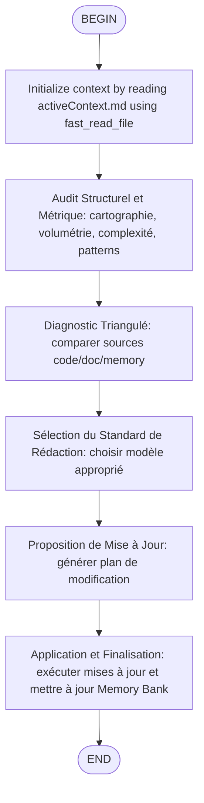

# Workflow: Docs Updater — Standardized & Metric-Driven

> Ce workflow harmonise la documentation en utilisant l'analyse statique standard (`cloc`, `radon`, `tree`) étendue avec fast-filesystem et ripgrep pour la précision technique et les modèles de référence pour la qualité éditoriale. Couvre désormais l'ensemble du codebase incluant docs/, et tests pour éviter les lacunes de documentation.



## 🚨 Protocoles Critiques
1.  **Outils autorisés** : MCP fast-filesystem (`fast_read_file`, `fast_read_multiple_files`, `fast_list_directory`, `fast_get_directory_tree`, `fast_search_files`, `edit_file`, `fast_write_file`, `fast_move_file`, `fast_create_directory`), MCP ripgrep (`search`, `advanced-search`, `count-matches`, `list-files`, `list-file-types`), et `Shell` tool limité aux audits (`tree`, `cloc`, `radon`, `find`, `ls`).
2.  **Contexte** : Initialiser le contexte en appelant l'outil fast_read_file du serveur memory-bank pour lire UNIQUEMENT activeContext.md. Ne lire les autres fichiers de la Memory Bank que si une divergence majeure est détectée lors du diagnostic.
3.  **Source de Vérité** : Le Code (analysé par outils) > La Documentation existante > La Mémoire.
4.  **Sécurité Memory Bank** : Utilisez les outils fast-filesystem (fast_*) pour accéder aux fichiers memory-bank avec des chemins absolus.

### Migration filesystem → fast-filesystem

| Aspect | Outils filesystem | Outils fast-filesystem | Trade-offs |
|--------|------------------|------------------------|------------|
| **Performance** | Appels individuels | Traitement par lot avec chunking auto | ✅ + Optimisé pour gros volumes |
| **Fiabilité** | Risque d'erreurs manuelles | Vérification intégrée + backup automatique | ✅ + Sécurité renforcée |
| **Fonctionnalités** | Base standard | Fonctionnalités avancées (compression, sync, recherche avancée) | ✅ + Capacités étendues |
| **Maintenance** | Outils génériques | Spécialisés MCP avec verrous | ✅ + Cohérence architecture |

## Étape 1 — Audit Structurel et Métrique
Lancer les commandes suivantes pour ignorer les dossiers de données (ex: "Camille...", "assets") et cibler le cœur applicatif, étendu avec scanning large pour couvrir les répertoires scripts potentiellement manqués.

1.  **Cartographie (Filtre Bruit)** :
    - `Shell "tree -L 2 -I '__pycache__|venv|node_modules|.git|logs|debug|assets|*_output|*Camille*|transnet*|test*'"`
    - *But* : Visualiser uniquement l'architecture logicielle (`services`, `routes`, `utils`, `workflow_scripts`).

2.  **Cartographie Étendue (Fast-Filesystem)** :
    - `fast_get_directory_tree(path="/home/kidpixel/workflow_mediapipe", max_depth=3, include_files=false, exclude_patterns=["__pycache__", "venv", "node_modules", ".git", "logs", "debug", "assets", "*_output", "*Camille*", "transnet*", "test*", ".shrimp_task_manager"])`
    - *But* : Explorer récursivement la structure complète avec focus sur docs/, tests/, et sous-répertoires de scripts/.

3.  **Scan des Scripts Manqués** :
    - `fast_list_directory(path="/home/kidpixel/workflow_mediapipe/scripts", pattern="*.py|*.sh", show_hidden=false)`
    - `fast_list_directory(path="/home/kidpixel/workflow_mediapipe/workflow_scripts", pattern="*.py", show_hidden=false)`
    - *But* : Identifier tous les scripts exécutables dans scripts/ et workflow_scripts/ pour couverture complète.

4.  **Volumétrie (Code Source)** :
    - `Shell "cloc services routes utils config scripts workflow_scripts static templates --md"`
    - *But* : Quantifier le code réel (Python vs JS) sans scanner les backups ou CSV.

5.  **Volumétrie Étendue (Documentation & Tests)** :
    - `Shell "cloc docs tests --md"`
    - *But* : Mesurer la volumétrie des zones documentation et tests pour équilibrer les efforts de mise à jour.

6.  **Complexité Cyclomatique (Python Core)** :
    - `Shell "radon cc services routes utils workflow_scripts -a -nc"`
    - *But* : Repérer les points chauds (Score C/D/F).
    - **Règle** : Si Score > 10 (C), la doc DOIT expliquer la logique interne, pas juste les entrées/sorties.

7.  **Analyse Patterns Large (Ripgrep)** :
    - `advanced-search(pattern="class|def|function", path="/home/kidpixel/workflow_mediapipe", file_pattern="*.py", context=1, exclude_patterns=[".shrimp_task_manager"])`
    - `advanced-search(pattern="TODO|FIXME|HACK", path="/home/kidpixel/workflow_mediapipe", file_pattern="*.py|*.js|*.md", context=0, exclude_patterns=[".shrimp_task_manager"])`
    - *But* : Détecter les patterns architecturaux et marqueurs de dette technique à travers le codebase élargi.

8.  **Fichiers Récemment Modifiés** :
    - `Shell "find /home/kidpixel/workflow_mediapipe -name '*.py' -o -name '*.js' -o -name '*.md' -mtime -30 -type f | head -20"`
    - *But* : Identifier les fichiers modifiés récemment (30 derniers jours) pour prioriser les zones nécessitant des mises à jour documentation.

## Étape 2 — Diagnostic Triangulé
Comparer les sources pour détecter les incohérences :

| Source | Rôle | Outil |
| :--- | :--- | :--- |
| **Intention** | Le "Pourquoi" | `fast_read_file` (via MCP) |
| **Réalité** | Le "Quoi" & "Comment" | `radon` (complexité), `cloc` (volume), `fast_search_files` |
| **Existant** | L'état actuel | `fast_search_files` (sur `docs/workflow`), `fast_read_file` |

**Action** : Identifier les divergences. Ex: "Le service `transnetv2_library.py` est complexe (Radon C) mais absent de la doc technique."

## Étape 3 — Sélection du Standard de Rédaction
Choisir le modèle approprié (inspiré des best-practices `doc-generate`) :

- **Documentation API** (`routes/`, `services/`) :
  - Entrées/Sorties précises.
  - Gestion des erreurs et codes HTTP.
- **Documentation Pipeline** (`workflow_scripts/`) :
  - **Flux de données** : Quel fichier entre ? Quel fichier sort ? (ex: `step3` -> JSON).
  - **Dépendances** : GPU requis ? Modèles chargés ?
- **Architecture & Utils** (`utils/`, `config/`) :
  - Diagrammes textuels (Mermaid) si interactions complexes.
  - Raison d'être des classes utilitaires.

## Étape 4 — Proposition de Mise à Jour
Générer un plan de modification avant d'appliquer :

## 📝 Plan de Mise à Jour Documentation
### Audit Métrique
- **Cible** : `services/workflow_service.py`
- **Métriques** : 450 LOC, Complexité max C (12).

### Modifications Proposées
#### 📄 docs/workflow/.../target.md
- **Type** : [API | Pipeline | Architecture]
- **Diagnostic** : [Obsolète | Incomplet | Manquant]
- **Correction** :
```
  [Contenu proposé respectant le standard choisi]
```

## Étape 5 — Application et Finalisation
1.  **Exécution** : Après validation, utiliser `edit_file`.
2.  **Mise à jour Memory Bank** :
    - Mettre à jour la Memory Bank en utilisant EXCLUSIVEMENT l'outil edit_file.

### Sous-protocole Rédaction — Application de documentation/SKILL.md

#### 5.1 Point d'Entrée Explicite
- **Mode Rédaction** : Déclenché après validation du plan de mise à jour.
- **Lecture obligatoire** : `.agents/skills/documentation/SKILL.md` (si disponible, sinon chercher dans `.windsurf/skills/documentation/SKILL.md`).
- **Modèle à appliquer** : Spécifié dans le plan (article deep-dive, README, fiche technique, etc.).

#### 5.2 Checkpoints Obligatoires
**Avant rédaction** :
- [ ] TL;DR présent (section 1 du skill)
- [ ] Problem-first opening (section 2 du skill)

**Pendant rédaction** :
- [ ] Comparaison ❌/✅ (section 4 du skill)
- [ ] Trade-offs table si applicable (section 7 du skill)
- [ ] Golden Rule (section 8 du skill)
- [ ] Éviter les artefacts AI (section 6 du skill)

**Après rédaction** :
- [ ] Validation checklist « Avoiding AI-Generated Feel »
- [ ] Vérification ponctuation (remplacer " - " par ;/:/—)

#### 5.3 Traçabilité
Dans la proposition de mise à jour (Étape 4), ajouter :
#### Application du skill
- **Modèle** : [Article deep-dive | README | Technique]
- **Éléments appliqués** : TL;DR ✔, Problem-First ✔, Comparaison ✔, Trade-offs ✔, Golden Rule ✔

#### 5.4 Hook d'Automation
- **Validation Git** : Commentaire de commit « Guidé par documentation/SKILL.md — sections: [liste] »
- **Blocking** : Le workflow ne peut pas se terminer si les checkpoints ne sont pas cochés
- **Audit trail** : Chaque fichier modifié contient une note de validation interne