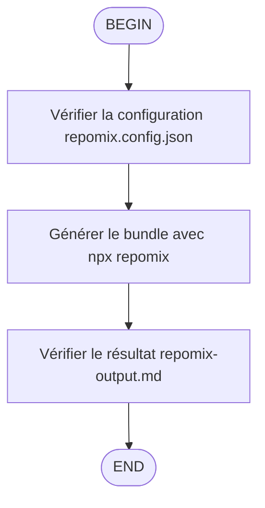

# /repomix-bundle — Générer le bundle Repomix

## Objectif
Créer un bundle optimisé du codebase pour analyse par LLMs externes (Claude, ChatGPT, etc.) en utilisant Repomix avec la configuration existante.

## Résultat attendu

- **Fichier généré**: `repomix-output.md`
- **Taille cible**: ~384k tokens (config actuelle)
- **Contenu**: Code core + docs essentielles, sans gros assets
- **Usage**: Partage avec LLMs externes pour analyse/review

## Notes

- Le bundle exclut automatiquement: archives, modèles, logs, assets volumineux
- La configuration utilise `.gitignore` et patterns par défaut pour la sécurité
- Le header inclut référence aux `codingstandards.md` obligatoires (vérifier avec `read_text_file`)
- Régénérer après modifications significatives du codebase (utiliser `search` pour détecter les changements)

**Locking Instruction:** Utilisez les outils fast-filesystem (fast_*) pour accéder aux fichiers memory-bank avec des chemins absolus.
