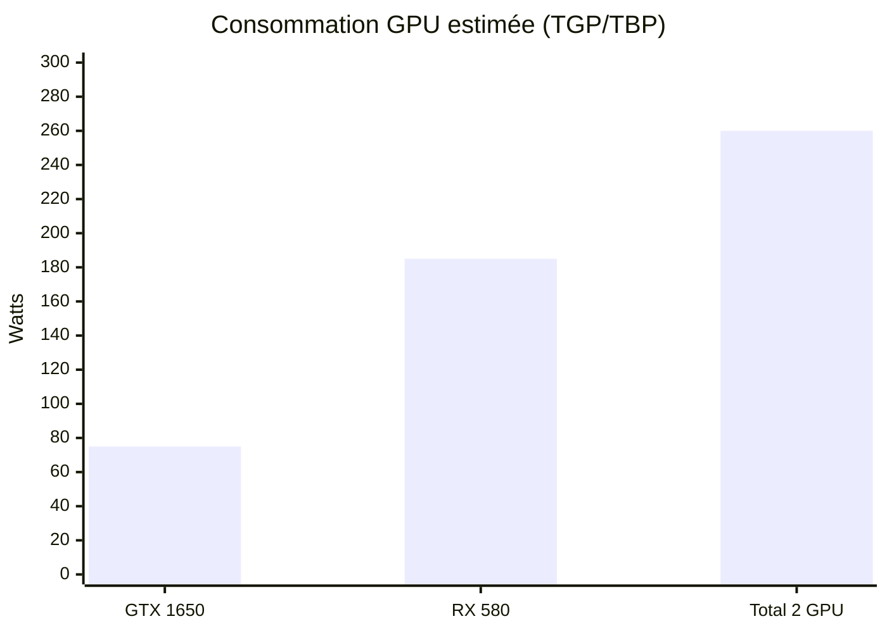

# Étude de faisabilité et compatibilité matérielle : ajouter une AMD Radeon RX 580 en plus d’une NVIDIA GeForce GTX 1650 sur Gigabyte X399 AORUS Gaming 7

## Résumé exécutif

Ajouter une **AMD Radeon RX 580** en plus d’une **NVIDIA GeForce GTX 1650** sur une **Gigabyte X399 AORUS Gaming 7 (TR4 / X399)** est **globalement faisable sur le plan matériel**, car la carte mère offre **5 emplacements PCIe “longs” (format x16 mécanique)** dont **2 en PCIe 3.0 x16**, **2 en PCIe 3.0 x8**, et **1 en PCIe 2.0 x4**. citeturn43view0turn29view2turn24view0

En revanche, **l’intérêt en jeu “classique” est limité** : vous ne pourrez pas “additionner” les performances via SLI/CrossFire (et de toute façon la GTX 1650 n’est pas SLI/NVLink-ready dans la génération GTX 16, et NVIDIA a cessé d’ajouter de nouveaux profils SLI côté drivers depuis 2021 au profit d’intégrations natives par les jeux). citeturn9view0turn12search5turn13search14turn13search3  
Les scénarios où un double-GPU hétérogène reste pertinent sont plutôt : **multi-écrans**, **séparation des usages** (un GPU pour l’affichage/encodage, l’autre pour une appli spécifique), **compute multi-device** via API (OpenCL multi-plateformes, ou DX12 explicite), ou **virtualisation/passthrough**. citeturn11search2turn13search14turn13search3turn11search1

Les **conditions clés de succès** sont :  
- **Choisir les bons slots** (idéalement **PCIEX16_1 + PCIEX16_2**, qui sont les deux x16 Gen3 et donnent aussi le plus d’espacement), et éviter si possible des combinaisons qui ont posé problème à certains utilisateurs (POST bloqué “code 94” observé dans un thread). citeturn43view0turn24view0turn42search1  
- **Avoir une alimentation adaptée** : la RX 580 est typiquement autour de **185 W** et AMD recommande **500 W** mini pour la carte seule; la GTX 1650 est typiquement **75 W** (carte) et NVIDIA indique **300 W** mini système (référence). citeturn34view0turn9view0turn25view0  
- **Gérer le refroidissement** (la RX 580 chauffe nettement plus), et **anticiper la cohabitation de pilotes AMD + NVIDIA** (souvent OK, mais prévoir une procédure “clean” en cas de conflits). citeturn34view0turn36view0turn37search1turn37search17

Conclusion opérationnelle : **oui, c’est faisable**, si (1) vous avez **au moins un PCIe 8-pin disponible** pour la RX 580 (et éventuellement un 6-pin pour la GTX 1650 selon modèle), (2) un **PSU de qualité** (650 W recommandé “confort” sur plateforme Threadripper), (3) un boîtier et un airflow corrects, et (4) une configuration BIOS/slots soignée. citeturn25view0turn9view0turn43view0turn42search2

## Hypothèses et périmètre

Le modèle exact de PSU et de boîtier n’étant pas fourni, ce rapport raisonne par scénarios **500 W / 650 W / 750 W** et **boîtier ATX mid‑tower / full‑tower**.

Le périmètre couvre : compatibilité PCIe/physique, OS/pilotes sous Windows 10/11, limites “multi‑GPU” modernes, puissance/câblage, refroidissement, BIOS/UEFI et une checklist d’installation. La carte mère est **ATX (30,5 × 24,4 cm)**. citeturn43view0

## PCIe et contraintes physiques sur la X399 AORUS Gaming 7

### Inventaire PCIe et topologie des slots

La X399 AORUS Gaming 7 expose les emplacements suivants :  
- **PCIEX16_1 : PCIe 3.0 x16 (électrique x16)**  
- **PCIEX8_1 : PCIe 3.0 x16 (électrique x8)**  
- **PCIEX4 : PCIe 2.0 x16 (électrique x4)**  
- **PCIEX16_2 : PCIe 3.0 x16 (électrique x16)**  
- **PCIEX8_2 : PCIe 3.0 x16 (électrique x8)** citeturn43view0turn24view0turn29view2

Autrement dit : **5 connecteurs “longs”**, avec une répartition “(du haut vers le bas)” couramment décrite comme **x16, x8, x4, x16, x8**. citeturn29view2turn24view0turn43view0

Implication pratique pour votre duo RX 580 + GTX 1650 :  
- Les **deux meilleurs slots** pour deux GPU “principaux” sont généralement **PCIEX16_1 + PCIEX16_2** (x16 Gen3 chacun). citeturn43view0turn24view0  
- Mettre un GPU dans **PCIEX4** est possible mécaniquement, mais c’est un lien **PCIe 2.0 x4** (beaucoup plus contraignant en bande passante qu’un slot Gen3 x16), donc à réserver plutôt à un usage secondaire (affichage additionnel, GPU “d’appoint”, certains workloads). citeturn43view0turn29view2

### Lanes CPU vs chipset X399

Côté plateforme, AMD indique pour X399/TR4 :  
- **64 lanes PCIe Gen3** au niveau du CPU Threadripper, dont **4 lanes réservées** à la communication avec le chipset X399; jusqu’à **60 lanes** pour des périphériques PCIe côté système. citeturn45view0  
- Le chipset X399 ajoute **8 lanes PCIe Gen2** pour des contrôleurs/expansions (réseau, WLAN, etc.). citeturn45view0

La carte mère, elle, annonce utiliser **48 lanes CPU** en design “premium 4‑way/3‑way graphics” (cohérent avec 16+16+8+8 = 48 sur les 4 slots Gen3 principaux), ce qui laisse de la marge pour les autres périphériques (M.2 NVMe, etc.). citeturn42search5turn43view0turn45view0

### Contraintes d’emplacement/espacement (cartes double-slot et accès boutons)

Sur cette carte, le placement des 5 slots “longs” est très favorable aux configurations multi-cartes, mais il reste des contraintes concrètes :  
- Les slots sont empilés, et **deux cartes double‑slot** peuvent gêner l’accès à certains headers/boutons en bas de carte (Tom’s Hardware note que l’ensemble **Reset/Clear CMOS/Power** est sous le dernier slot et peut devenir difficile d’accès avec une carte double‑slot en bas). citeturn29view2  
- Pour l’airflow, l’intérêt de **PCIEX16_1 + PCIEX16_2** est aussi de **séparer** physiquement vos deux GPU (au lieu de les coller en x16 + x8 adjacent). citeturn24view0turn29view2

### Retours utilisateurs : POST code 94 et choix du slot

Un fil Reddit (Gigabyte/X399 Gaming Aorus 7) rapporte un comportement “POST code 94” dépendant des slots : la combinaison **slot #1 @ x16 + slot #4 @ x16** fonctionnerait, alors que **slot #1 @ x16 + slot #2/slot #5 @ x8** bloquerait au POST “code 94” sur la configuration de l’auteur. citeturn42search1  
Même si c’est un retour isolé, il pousse à une recommandation prudente : **préférer PCIEX16_1 + PCIEX16_2** plutôt que d’utiliser un des x8, au moins pour le premier essai.

Dans un thread Reddit dont le post initial est supprimé, un commentateur suggère aussi d’activer **“Above 4G Decoding”** si des soucis apparaissent avec plusieurs GPU (default souvent désactivé selon les BIOS). citeturn27view0

## Compatibilité multi‑GPU hétérogène AMD + NVIDIA

### Support OS (Windows 10/11) et pilotes : coexistence possible, mais à gérer proprement

Sur le volet drivers, les deux cartes sont encore couvertes :  
- AMD propose des pilotes Adrenalin pour **RX 580** sous **Windows 11 64‑bit** et **Windows 10 64‑bit** et liste ces OS dans “OS Support”. citeturn34view0  
- NVIDIA publie des pilotes GeForce Game Ready pour **Windows 10 64‑bit et Windows 11**, incluant explicitement **GeForce GTX 1650** dans la liste des produits supportés. citeturn36view0  

La carte mère, côté constructeur, annonce officiellement **Windows 10 64‑bit** (époque X399), ce qui n’empêche pas Windows 11 de fonctionner en pratique, mais indique que vous devez surtout vous reposer sur les pilotes AMD/NVIDIA et chipset AMD. citeturn43view0

Point important : **coexistence ≠ coopération**. Windows peut voir deux GPU, mais les applications doivent être conçues pour exploiter deux adaptateurs de façon coordonnée (voir plus bas). citeturn13search14turn13search3

### SLI/CrossFire “classique” : non pertinent pour GTX 1650 + RX 580

Dans votre cas :  
- La **GTX 1650** n’est pas positionnée comme carte SLI/NVLink (dans les specs comparatives NVIDIA de la série GTX 16, la ligne “NVLink (SLI‑Ready)” est absente pour ces modèles). citeturn9view0  
- NVIDIA a officialisé la fin de l’ajout de **nouveaux profils SLI côté driver** à partir du **1er janvier 2021** pour RTX 20 et antérieurs, en basculant vers des intégrations natives par les jeux (DX12/Vulkan, etc.). citeturn12search5turn12search1  
- Les technologies “multi‑GPU driver‑level” (CrossFire/SLI) reposent sur des conditions de compatibilité strictes. Le manuel Gigabyte (repris en ligne) rappelle des prérequis typiques : cartes **CrossFire/SLI-ready** et **de marque/puce identiques** (logique : CrossFire = AMD↔AMD, SLI = NVIDIA↔NVIDIA). citeturn42search2turn43view0

Donc, **RX 580 + GTX 1650 ne formeront pas une paire multi-GPU accélératrice en jeu DX11 “classique”**.

### Jeux et rendu : ce qui marche réellement en double GPU en 2026

Pour les jeux / rendu 3D, il faut distinguer :

1) **DirectX 12 explicit multiadapter**  
DirectX 12 exige que l’application **implémente explicitement** le support multi‑GPU en gérant plusieurs devices (donc possible en théorie en hétérogène). citeturn13search14turn13search3  
Microsoft publie d’ailleurs un **sample “heterogeneous multiadapter”** illustrant la répartition de charge entre GPU hétérogènes (rendu sur un GPU puis post‑process/presentation sur un autre). citeturn13search3  
En pratique, très peu de jeux grand public exploitent bien ce modèle, et lorsqu’ils le font, c’est souvent optimisé pour des topologies spécifiques.

2) **Vulkan multi‑GPU**  
Vulkan fournit des mécanismes de multi‑GPU (device groups), mais la documentation Vulkan Guide souligne que les “device groups” représentent plusieurs devices comme un seul **dans un contexte “single‑vendor”** (ex. deux GPU identiques avec interconnexion). citeturn10search0turn10search1  
Pour un duo AMD + NVIDIA, il est plus réaliste de considérer que l’application gérera **deux devices séparés**, avec une orchestration et des copies mémoire explicites (rare en jeu).

3) **AMD MGPU (côté AMD uniquement)**  
AMD rappelle que le support multi‑GPU varie selon les applications et API, et donne des conditions (par ex. plein écran exclusif sur d’anciennes API) dans sa doc “Configure AMD MGPU”. citeturn13search9  
Mais cela concernent des configurations **AMD↔AMD**, pas votre duo hétérogène.

### Compute : OpenCL (multi‑vendor), CUDA (NVIDIA), et réalité de l’usage

- **CUDA** : l’écosystème CUDA est explicitement une “feature standard” des GPU NVIDIA (GeForce/Quadro/Tesla/GRID), donc **exploitable uniquement sur la GTX 1650**. citeturn11search1  
- **OpenCL** : l’extension **cl_khr_icd** décrit un mécanisme pour que le loader OpenCL expose **plusieurs ICD de vendeurs** (donc coexistence AMD + NVIDIA dans le même OS, côté OpenCL). citeturn11search2turn11search9  

En clair : vous pouvez souvent utiliser les deux GPU **en parallèle**, mais plutôt en les affectant à des tâches différentes (process séparés, jobs séparés, ou code explicitement multi‑device), pas en espérant une “fusion” transparente.

## Alimentation électrique : consommation, connecteurs, PSU 500/650/750 W

### Consommation typique des deux cartes et connecteurs

Références de puissance :  
- **Radeon RX 580** : AMD liste une **Typical Board Power (Desktop) de 185 W** et une **Minimum PSU Recommendation de 500 W**; et donne des pilotes Win10/Win11 (utile pour valider la continuité support). citeturn34view0  
- Un exemple concret de RX 580 (MSI Radeon RX 580 8G) indique **Power consumption 185 W**, **Power connectors 8‑pin ×1**, et **Recommended PSU 500 W**. citeturn25view0  
- **GeForce GTX 1650** : dans la table comparative NVIDIA (série GTX 16), “Graphics Card Power (W)” est à **75 W** et “Minimum System Power (W)” à **300 W** (référence). citeturn9view0  

Connecteurs :  
- RX 580 : très souvent **1×8‑pin PCIe** (mais certains modèles AIB peuvent différer; l’exemple MSI est 8‑pin). citeturn25view0  
- GTX 1650 : certains modèles sont alimentés entièrement via le slot, d’autres demandent un **6‑pin**; la fiche NVIDIA “compare” mentionne un 6‑pin pour les versions GTX 1650 listées. citeturn9view0  

Côté carte mère : prévoir aussi l’alimentation CPU, la X399 AORUS Gaming 7 demandant **24‑pin ATX + 8‑pin ATX12V + 4‑pin ATX12V**. citeturn43view0

### Rappels utiles sur les limites de puissance des connecteurs (pour dimensionner sans bricolage risqué)

Pour raisonner proprement :  
- AMD rappelle qu’à défaut d’AUX, une carte PCIe se base “au minimum” sur la **puissance du slot PCIe 75 W**, et donne un tableau 75 W / 150 W / 225 W selon câbles auxiliaires (utile comme repère d’ordre de grandeur). citeturn40view0  
- Corsair résume les spécifications PCI‑SIG : **PCIe 6‑pin = 75 W**, **PCIe 8‑pin = 150 W**. citeturn39search0  

Implication : évitez autant que possible les adaptateurs type SATA→PCIe pour une RX 580 : une RX 580 vise une enveloppe ~185 W et un vrai **8‑pin PCIe PSU** est le chemin normal. citeturn25view0turn34view0turn39search0

### Scénarios PSU : 500 W vs 650 W vs 750 W

Ci‑dessous, on parle **uniquement** des GPU (sans compter CPU, carte mère, périphériques) :  
- Estimation “typique” GPU : **75 W (GTX 1650) + 185 W (RX 580) = 260 W**. citeturn9view0turn34view0  

Ensuite, n’oubliez pas qu’une plateforme Threadripper/X399 peut être énergivore (CPU + VRM + RAM + stockage). AMD qualifie X399 de plateforme haut de gamme et rappelle que des mises à jour BIOS peuvent être requises selon CPU (donc on est bien sur une cible “workstation/enthousiaste”, fréquemment plus gourmande qu’un PC entrée de gamme). citeturn45view0

Recommandation pragmatique par scénario :

**PSU 500 W (qualité “premium”, câblage PCIe natif, CPU raisonnable, pas d’OC)**  
Possible dans certains cas, car AMD annonce 500 W mini pour RX 580 et MSI confirme 500 W recommandé (pour la carte). citeturn34view0turn25view0  
Mais avec deux GPU + Threadripper, la marge devient faible : ce scénario est à réserver si vous savez que votre CPU est modéré en conso et que le PSU est excellent (tension stable, bons câbles).

**PSU 650 W (recommandation “équilibrée”)**  
C’est le point de confort le plus réaliste pour : marge thermique, pics de charge GPU, et stabilité globale. Même si chaque carte séparément “passe” sur moins, le cumul + la plateforme suggèrent ce palier dès qu’on veut éviter les redémarrages / black screens liés à l’alimentation.

**PSU 750 W (confort maximal / évolutif)**  
Recommandé si : CPU Threadripper haut TDP, beaucoup de disques, ventilateurs/pompe, ou si vous voulez une marge forte pour éviter de tirer près des limites.

Bonnes pratiques de câblage :  
- Utiliser des **câbles PCIe dédiés** depuis le PSU (éviter de surcharger un seul faisceau si votre RX 580 a un modèle plus gourmand ou si vous avez des extensions). Corsair rappelle notamment des considérations de surcharge/courant et déconseille certaines topologies “split” au‑delà d’un certain draw. citeturn39search1turn39search0  

### Graphique : consommation estimée (ordre de grandeur)

Les valeurs ci‑dessous utilisent les puissances “board power”/référence : RX 580 ≈ 185 W (AMD), GTX 1650 ≈ 75 W (NVIDIA). citeturn34view0turn9view0



## Refroidissement, dégagement thermique et contraintes boîtier

### Charge thermique et airflow

Une RX 580 à ~185 W + une GTX 1650 à ~75 W implique ~260 W dissipés côté GPU en charge “typique”. citeturn34view0turn9view0  
Concrètement, cela impose : admission frontale correcte, extraction arrière/haut, et idéalement un placement des cartes qui évite que la RX 580 recycle l’air chaud de la GTX 1650.

La carte mère offre une disposition favorable (5 slots), et Tom’s Hardware confirme le routage x16/x8/x4/x16/x8 qui rend possible un espacement intéressant (notamment en utilisant les deux x16). citeturn29view2turn43view0

### Mid‑tower ATX vs full‑tower ATX : recommandations

- **Mid‑tower ATX** : généralement OK si vous avez 7 slots d’équerres à l’arrière, une bonne profondeur GPU, et un airflow frontal. Le risque principal est l’**étouffement** si les ventilateurs GPU sont trop proches d’une vitre/panneau ou si le GPU du haut manque d’air.  
- **Full‑tower** : plus confortable (volume d’air, ventilation, possibilité de montage vertical/riser), mais attention : les risers peuvent nécessiter d’ajuster le mode PCIe (Gen2/Gen3) pour la stabilité.

Sur la X399 AORUS Gaming 7, le BIOS/manuel mentionne une option de configuration du mode des slots PCIe (Gen1/Gen2/Gen3) — utile si vous rencontrez de l’instabilité avec un riser ou un périphérique qui négocie mal le lien. citeturn42search2

## BIOS/UEFI, procédure d’installation et synthèse finale

### Points BIOS/UEFI pertinents sur X399

- Compatibilité plateforme : AMD rappelle que le chipset X399 supporte les Threadripper Gen1 & Gen2 et qu’une **mise à jour BIOS peut être requise**. Même si cela ne vise pas directement le multi‑GPU, un BIOS à jour améliore souvent la compatibilité PCIe/initialisation. citeturn45view0  
- Réglage de mode PCIe : le manuel (repris en ligne) mentionne la possibilité de forcer le mode PCIe des slots (Gen1/Gen2/Gen3), ce qui peut aider en dépannage (riser/câble, GPU récalcitrant, instabilités). citeturn42search2  
- “Above 4G Decoding” : en multi‑GPU, des utilisateurs suggèrent l’activer si des problèmes surviennent (détection incomplète, drivers qui ne se lancent pas, POST erratique). citeturn27view0  

Enfin, tenez compte des retours “POST code 94” liés à certains slots sur une carte très proche (X399 Gaming Aorus 7) : premier essai recommandé en **PCIEX16_1 + PCIEX16_2**, avant de tenter les x8. citeturn42search1turn24view0turn43view0

### Étapes pratiques d’installation : checklist avant / pendant / après

Avant (préparation) :  
- Vérifier que le boîtier accepte bien une carte ATX et que vous avez de la place pour deux GPU (la carte mère est ATX 30,5 × 24,4 cm). citeturn43view0  
- Vérifier les connecteurs PSU : au minimum **1×8‑pin PCIe** pour la RX 580 (typique) et potentiellement **1×6‑pin** si votre GTX 1650 le demande. citeturn25view0turn9view0  
- Télécharger à l’avance : pilotes AMD RX 580 (Win11/Win10) et pilotes NVIDIA (Win11/Win10) pour GTX 1650. citeturn34view0turn36view0  
- Recommandé : préparer un plan de “recovery” pilotes (outil AMD Cleanup Utility, et/ou stratégie de réinstallation propre). AMD définit AMD Cleanup Utility comme un outil destiné à retirer d’anciens drivers AMD et préparer une nouvelle installation. citeturn37search1  
- Recommandé : lire les conseils d’installation NVIDIA (désinstaller les anciens pilotes NVIDIA avant d’installer de nouveaux, éviter antivirus pendant l’installation, etc.). citeturn37search17

Pendant (hardware) :  
- Couper l’alimentation, décharger l’électricité statique.  
- Installer idéalement :  
  - GTX 1650 sur **PCIEX16_1** (GPU principal/affichage),  
  - RX 580 sur **PCIEX16_2** (second GPU), pour garder x16 Gen3 et une meilleure respiration. citeturn43view0turn24view0  
- Brancher le(s) câble(s) PCIe PSU : 8‑pin sur RX 580; 6‑pin éventuel sur GTX 1650. citeturn25view0turn9view0  
- Vérifier que les ventilateurs tournent librement, et que les câbles ne touchent pas les pales.

Après (software) :  
- Démarrer, vérifier que l’UEFI/BIOS poste correctement. Si POST instable : essayer d’abord de passer sur la combinaison de slots la plus “safe” (**x16 + x16**), car des retours indiquent des soucis avec certains x8. citeturn42search1turn29view2  
- Sous Windows : installer les drivers un par un (ordre variable selon les cas), redémarrer, puis vérifier dans le gestionnaire de périphériques que les deux GPU sont opérationnels.  
- Si conflits/pannes de drivers :  
  - désinstaller proprement les composants AMD via Apps & Features + envisager AMD Cleanup Utility (AMD le recommande pour préparer une nouvelle installation). citeturn37search1turn37search5  
  - appliquer les recommandations NVIDIA de réinstallation propre (désinstallation préalable des drivers NVIDIA, etc.). citeturn37search17  

### Schéma simple : slots PCIe et câblage d’alimentation

Le schéma ci‑dessous illustre une configuration “recommandée” (GTX 1650 en haut, RX 580 sur le second x16) et rappelle la présence du slot x4 Gen2. Les caractéristiques des slots viennent des specs Gigabyte et de la disposition du manuel (ordre des slots). citeturn43view0turn24view0turn29view2

```mermaid
flowchart TB
  PSU["PSU (500 / 650 / 750 W)"] --> ATX24["24-pin ATX -> carte mère"]
  PSU --> EPS8["8-pin ATX12V -> carte mère"]
  PSU --> EPS4["4-pin ATX12V -> carte mère"]
  PSU --> PCIE8["PCIe 8-pin -> RX 580 (typique)"]
  PSU --> PCIE6["PCIe 6-pin -> GTX 1650 (selon modèle)"]

  CPU["CPU Ryzen Threadripper (PCIe Gen3 lanes)"] -->|x16 Gen3| S1["PCIEX16_1"]
  CPU -->|x8 Gen3|  S2["PCIEX8_1"]
  Chipset["Chipset X399"] -->|x4 Gen2| S3["PCIEX4"]
  CPU -->|x16 Gen3| S4["PCIEX16_2"]
  CPU -->|x8 Gen3|  S5["PCIEX8_2"]

  S1 --> GTX["GeForce GTX 1650"]
  S4 --> RX["Radeon RX 580"]
```

## Tableau comparatif synthétique et conclusion claire

### Tableau — exigences, risques, probabilité de succès

| Point | Exigence / vérification | Valeurs de référence | Risques / limitations | Probabilité de succès (qualitative) |
|---|---|---|---|---|
| Slots PCIe disponibles | 2 slots “longs” libres, idéalement x16 Gen3 | 2× PCIe 3.0 x16 (PCIEX16_1/PCIEX16_2) + autres slots x8/x4 citeturn43view0turn24view0 | Si vous devez utiliser PCIEX4 (Gen2 x4), possible baisse de perf GPU et cas d’usage limité | Élevée si PCIEX16_1 + PCIEX16_2 |
| Conflits POST/initialisation | Démarrage stable avec 2 GPU | Retours “code 94” selon slots; x16+x16 OK dans un retour citeturn42search1 | POST bloqué / debug code; peut demander changement de slot et/ou options BIOS (ex. Above 4G Decoding) citeturn27view0 | Moyenne → élevée si x16+x16 + BIOS propre |
| Pilotes Windows 10/11 | Drivers AMD + NVIDIA installés et cohabitants | RX 580 supporte Win11/Win10 via AMD; GTX 1650 supportée Win11/Win10 via NVIDIA citeturn34view0turn36view0 | Conflits de services/overlays; nécessite parfois nettoyage (AMD Cleanup Utility / réinstall propre NVIDIA) citeturn37search1turn37search17 | Élevée, mais dépannage parfois nécessaire |
| “Multi‑GPU” en jeux | Attentes réalistes (pas de perf cumulée) | DX12 multi‑GPU doit être implémenté explicitement; exemple Microsoft “heterogeneous multiadapter” citeturn13search14turn13search3 | SLI (profils driver) en retrait depuis 2021; GTX 1650 non SLI/NVLink; CrossFire ≠ AMD+NVIDIA citeturn12search5turn9view0turn42search2 | Faible (pour gain FPS en jeu “standard”) |
| Calcul / compute | Affectation par API (CUDA/OpenCL) | CUDA est une fonctionnalité des GPU NVIDIA; OpenCL peut exposer plusieurs vendor ICD citeturn11search1turn11search2 | Les applis doivent gérer multi‑device; pas de “pool” mémoire magique | Moyenne à élevée selon logiciel |
| Alimentation | PSU + connecteurs PCIe natifs | RX 580 : 185 W, PSU mini 500 W, souvent 8‑pin; GTX 1650 : 75 W citeturn34view0turn25view0turn9view0 | PSU 500 W souvent limite sur TR; absence de 8‑pin PCIe ou câbles inadéquats = risque | Élevée avec 650–750 W de qualité |
| Thermique / boîtier | Airflow suffisant + espacement des cartes | 185 W (RX 580) + 75 W (GTX 1650) citeturn34view0turn9view0 | Throttling, bruit, chauffe VRM/boîtier; accès boutons du bas gêné si carte en bas citeturn29view2 | Moyenne à élevée si boîtier ventilé et slots espacés |

### Conclusion finale

**Faisable : oui**, l’ajout d’une **RX 580** en plus d’une **GTX 1650** sur **Gigabyte X399 AORUS Gaming 7** est **matériellement compatible** (slots PCIe, lanes de plateforme X399/TR4, et support drivers Win10/Win11 côté AMD/NVIDIA). citeturn43view0turn45view0turn34view0turn36view0

**Conditions requises (recommandations concrètes)** :  
1) Installer les cartes en **PCIEX16_1 + PCIEX16_2** (x16 Gen3 + meilleur espacement), surtout au vu d’un retour “code 94” mentionnant des problèmes sur des x8 dans une configuration utilisateur. citeturn43view0turn24view0turn42search1  
2) Viser un PSU **650 W** (ou **750 W** si CPU TR haut TDP / machine chargée), avec **câbles PCIe natifs**, dont au moins **1×8‑pin** pour la RX 580. citeturn34view0turn25view0turn39search0  
3) Ne pas attendre un gain FPS “automatique” en jeu : sans support explicite multi‑adapter DX12/Vulkan, les GPU fonctionneront surtout **de manière indépendante**. citeturn13search14turn10search0turn12search5  
4) Prévoir une stratégie de dépannage pilotes (AMD Cleanup Utility / bonnes pratiques NVIDIA) si instabilité. citeturn37search1turn37search17  

Si votre objectif principal est **le jeu**, le double‑GPU hétérogène a une **valeur limitée**. Si votre objectif inclut **multi‑écrans**, **répartition d’applications**, **compute multi‑API** ou **virtualisation**, alors la configuration peut être **utile et durable**, à condition de soigner PSU/airflow et le placement des cartes. citeturn11search2turn11search1turn29view2turn34view0