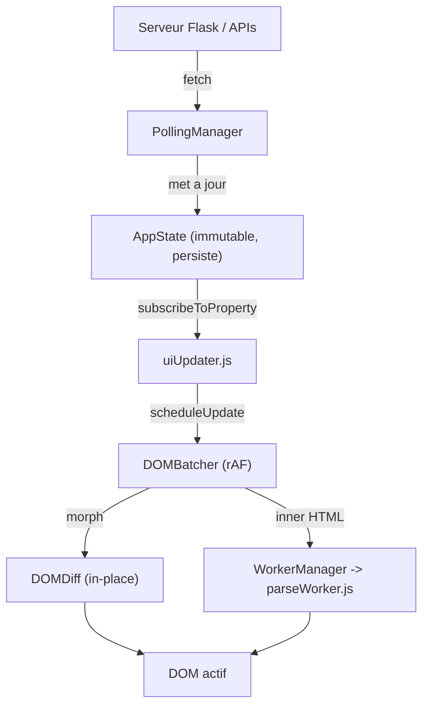

# Audit Frontend Complet — Workflow MediaPipe

**Date**: 12 juillet 2026
**Auditeur**: Zencoder (GLM-5-2)
**Score global**: **87/100** (précédent audit: 93/100)

---

## TL;DR

Le frontend de Workflow MediaPipe repose sur une architecture Vanilla JS avancée articulée autour de cinq piliers (`AppState`, `DOMBatcher`, `DOMDiff`, `WorkerManager`, `PollingManager`). Le cœur architectural reste excellent, mais des déviations accumulées aux coding standards, du code mort, une duplication et une exception XSS font chuter le score de 6 points par rapport à l'audit précédent. Trois actions P0 (critiques) sont immédiatement actionnables.

---

## 1. Volumétrie

| Type             | Fichiers | Lignes |
|------------------|----------|--------|
| JavaScript       | 26       | 7 564  |
| CSS              | 16       | 3 819  |
| Tests frontend   | 16       | 1 929  |
| Template HTML    | 1        | 251    |
| **Total**        | **59**   | **~13 563** |

Fichiers analysés:
- `./templates/index_new.html` — template Jinja2 unique
- `./static/main.js` — point d'entrée (602 lignes)
- `./static/uiUpdater.js` — plus gros module (1 052 lignes)
- `./static/apiService.js` — couche réseau (357 lignes)
- `./static/eventHandlers.js` — wiring événementiel (274 lignes)
- `./static/domElements.js` — accès DOM lazy + legacy (157 lignes)
- `./static/state/AppState.js` — gestion d'état immutable (429 lignes)
- `./static/state.js` — couche de compatibilité legacy (150 lignes)
- `./static/utils/DOMBatcher.js` — batching rAF (350 lignes)
- `./static/utils/DOMDiff.js` — diff morphologique in-place (163 lignes)
- `./static/utils/WorkerManager.js` — orchestrateur Web Worker (143 lignes)
- `./static/utils/PollingManager.js` — polling centralisé (319 lignes)
- `./static/utils/ErrorHandler.js` — gestion d'erreurs centralisée (346 lignes)
- `./static/utils/PerformanceMonitor.js` — monitoring performance (541 lignes)
- `./static/utils/PerformanceOptimizer.js` — debounce/throttle (360 lignes)
- `./static/utils/parseWorker.js` — Web Worker parsing logs (109 lignes)
- `./static/scrollManager.js` — gestion du scroll (409 lignes)
- `./static/sequenceManager.js` — exécution de séquences (194 lignes)
- `./static/popupManager.js` — gestion des popups + focus trap (189 lignes)
- `./static/stepDetailsPanel.js` — panneau de détails (281 lignes, **désactivé**)
- `./static/soundManager.js` — feedback audio (200 lignes)
- `./static/themeManager.js` — gestion des thèmes (184 lignes)
- `./static/csvWorkflowPrompt.js` — prompt workflow CSV (469 lignes)
- `./static/csvDownloadMonitor.js` — monitoring téléchargements (212 lignes)
- `./static/utils.js` — utilitaires partagés (59 lignes)
- `./static/constants.js` — constantes (13 lignes)

---

## 2. Tests

Les 10 suites frontend passent (exit code 0, 1.26s):

| Suite | Fichier | Statut |
|-------|---------|--------|
| DOMDiff robustesse | `./tests/frontend/dom_diff.test.js` | OK |
| PollingManager backoff | `./tests/frontend/polling_backoff.test.js` | OK |
| escapeHtml XSS | `./tests/frontend/dom_escape.test.js` | OK |
| Log safety XSS | `./tests/frontend/test_log_safety.mjs` | OK |
| DOMBatcher performance | `./tests/frontend/test_dom_batcher_performance.mjs` | OK |
| Focus trap | `./tests/frontend/test_focus_trap.mjs` | OK |
| Step details panel | `./tests/frontend/test_step_details_panel.mjs` | OK |
| Timeline-Logs Phase 2 | `./tests/frontend/test_timeline_logs_phase2.mjs` | OK |
| Auto-scroll séquences | `./tests/frontend/test_sequence_auto_scroll.mjs` | OK |
| WorkerManager fallback | `./tests/frontend/worker_manager.test.mjs` | OK |

Modules sans couverture de tests: `csvWorkflowPrompt.js`, `csvDownloadMonitor.js`, `themeManager.js`, `soundManager.js`, `scrollManager.js` (variantes multiples non testées), `ErrorHandler.js`, `PerformanceMonitor.js`.

---

## 3. Architecture (88/100)

### 3.1 Points forts

L'architecture repose sur un flux unidirectionnel immuable avec cinq abstractions majeures:



- **`AppState`** (`./static/state/AppState.js`): Singleton immuable avec clonage profond (`structuredClone` + fallback manuel), persistance `localStorage` via `PERSISTED_PATHS`, migration automatique des anciennes cles (`LEGACY_MIGRATIONS`), abonnements granulaires `subscribeToProperty`, batchUpdate transactionnel.
- **`DOMBatcher`** (`./static/utils/DOMBatcher.js`): Batching via `requestAnimationFrame`, deduplication par cle, priorites, statistiques de performance, detection des flush > 16ms, cleanup `beforeunload`.
- **`DOMDiff`** (`./static/utils/DOMDiff.js`): Diff morphologique in-place O(N) avec support des cles `data-key`/`id` pour le reordonnancement sans destruction, gestion des attributs speciaux (`value`, `checked`, `disabled`).
- **`WorkerManager`** (`./static/utils/WorkerManager.js`): Web Worker lazy-init pour parsing logs, filtrage par canal anti-race-condition, fallback synchrone pour tests Node, destruction propre.
- **`PollingManager`** (`./static/utils/PollingManager.js`): Intervalle centralise, backoff exponentiel (retour de number > 0 = delai), compteur d'erreurs avec arret automatique (maxErrors), cleanup `beforeunload`/`pagehide`, setTimeout nommes.

### 3.2 Problemes identifies

#### CRITICAL — `setInterval` disperses hors `PollingManager`

Les coding standards (section 8, anti-patterns) interdisent explicitement les `setInterval` isoles. Cinq violations identifiees:

1. **`./static/sequenceManager.js:176`** — `waitForStepCompletionInSequence` utilise un `setInterval` brut avec `POLLING_INTERVAL / 2` pour attendre la fin d'une etape. Cet intervalle n'est pas nettoye si la promesse n'est jamais resolue (ex: navigation away, erreur non catchee). Le `clearInterval` n'est appele que sur `completed`/`failed`/`return_code === -9`.

2. **`./static/uiUpdater.js:236`** — `startStepTimer` utilise `setInterval` brut a 1000ms pour les timers d'etapes. Non gere par `PollingManager`, pas de cleanup global au `beforeunload`. Les intervalles sont nettoyes individuellement par `stopStepTimer`/`resetStepTimerDisplay`, mais un crash laisse des orphelins.

3. **`./static/utils/PerformanceMonitor.js:270`** — `setInterval` pour le monitoring memoire (10s), stocke dans `this.observers` avec un faux `disconnect` qui fait `clearInterval`. Non gere par PollingManager.

4. **`./static/utils/PerformanceMonitor.js:360`** — `setInterval` pour le reporting periodique (60s), stocke dans `this.reportingInterval`. Non gere par PollingManager.

5. **`./static/utils/PerformanceOptimizer.js:351`** — `setInterval` de 30s pour les stats dev. Celui-ci est dans un guard `if localhost` donc acceptable mais devrait utiliser `PollingManager.setTimeout` pour la traceabilite.

#### CRITICAL — `state.js` dual-path (legacy mutable + AppState)

`./static/state.js` maintient **simultanement** des variables `let` mutables et l'etat dans `appState`:

```javascript
export let activeStepKeyForLogsPanel = null;  // ligne 29 — mutable legacy
export let stepTimers = {};                    // ligne 30
export let selectedStepsOrder = [];            // ligne 31
export let isAnySequenceRunning = false;        // ligne 32
export let focusedElementBeforePopup = null;    // ligne 33
export let autoOpenLogOverlay = true;           // ligne 34

export function setActiveStepKeyForLogs(key) {
    activeStepKeyForLogsPanel = key;            // ecrit dans la variable mutable
    appState.setState({ activeStepKeyForLogsPanel: key }, '...');  // ET dans AppState
}
export function getActiveStepKeyForLogs() {
    return appState.getStateProperty('activeStepKeyForLogsPanel') || activeStepKeyForLogsPanel;  // fallback
}
```

Problemes:
- Risque de desynchronisation si un module importe et lit la variable `export let` directement (sans passer par le getter).
- Double la surface de bugs.
- Le `PROCESS_INFO_CLIENT` Proxy (lignes 4-25) est une couche d'abstraction supplementaire sur `appState` qui ajoute de la complexite sans benefice clair (aucun module ne l'utilise directement apres grep).
- Les fonctions `addPollingInterval`/`clearPollingInterval` (lignes 128-145) sont dead code — `apiService.js` utilise directement `pollingManager.startPolling`/`stopPolling`.

#### HIGH — `domElements.js` : `document.getElementById` a l'import

Les coding standards (section 8) interdisent `document.getElementById` des l'import. `./static/domElements.js` execute 8 `document.getElementById` au moment de l'import du module:

| Ligne | Export | Impact |
|-------|--------|--------|
| 126 | `closeLogPanelButton` | `null` si import avant DOM ready |
| 128 | `localDownloadsList` | idem |
| 133 | `soundToggle` | idem |
| 134 | `soundStatus` | idem |
| 135 | `soundControlWidget` | idem |
| 139 | `settingsToggle` | idem |
| 140 | `settingsPanel` | idem |
| 152 | `logsAutoOpenToggle` | idem |

Le fichier propose des getters lazy (`getCloseLogPanelButton`, etc.) mais conserve les exports constants pour la compatibilite ascendante. Les consommateurs utilisent le pattern `resolveElement(dom.getX, dom.x)` pour supporter les deux, ce qui ajoute de la verbosite partout.

---

## 4. Securite (87/100)

### 4.1 Points forts

- **`DOMUpdateUtils.escapeHtml`** (`./static/utils/DOMBatcher.js:267`): echappement systematique via `textContent` -> `innerHTML` du div temporaire. Utilise dans `uiUpdater.js` (downloads list, log parsing), `popupManager.js` (sequence summary, custom sequence confirm), `csvWorkflowPrompt.js` (filename, duration, step name).
- **`parseWorker.js:35-43`**: fonction `escapeHtml` dediee pour Web Worker (sans acces DOM), echappe `&`, `<`, `>`, `"`, `'`.
- **`domElements.js:78`**: `getStepElement` valide `stepKey` contre `/^[A-Za-z0-9_-]+$/` avant `getElementById` — protection contre les selecteurs malveillants.
- **`csvWorkflowPrompt.js:385-400`**: `sanitizeExternalUrl` valide le protocole (`http:`/`https:` uniquement) avant ouverture. Rejette `javascript:`, `data:`, etc.
- **`parseWorker.js:82`**: verification `e.origin` contre `self.location.origin` pour les messages entrants.
- **Focus trap** (`./static/popupManager.js:5-29`): gestion Tab/Shift+Tab dans les modales, restauration du focus precedent avec verification `isConnected`/`offsetParent`/`hasFocus`.

### 4.2 Problemes identifies

#### HIGH — `csvWorkflowPrompt.js:189` — injection non echappee

Dans `createWorkflowPromptContent`:

```javascript
const downloadTime = download.display_timestamp || 'maintenant';
// ...
<p class="download-subtitle">Receu a ${downloadTime}</p>
```

`downloadTime` provient de `download.display_timestamp` (donnee serveur) et **n'est pas echappe**. Le contenu est injecte via `contentDiv.innerHTML = createWorkflowPromptContent(download)` (ligne 142). Si le timestamp contient du HTML malveillant, il serait injecte tel quel.

Comparativement, `filename` et `duration` sont correctement echappes via `DOMUpdateUtils.escapeHtml` aux lignes 188 et 226.

#### MEDIUM — `PerformanceMonitor.js:141-176` — monkey-patch de `fetch`

```javascript
const originalFetch = globalThis.fetch;
globalThis.fetch = async (...args) => {
    const startTime = performance.now();
    const url = args[0];
    try {
        const response = await originalFetch(...args);
        // ... enregistre metrique ...
        return response;
    } catch (error) {
        // ... enregistre metrique ...
        throw error;
    }
};
```

Le wrapping de `fetch` global est permanent. `stopMonitoring()` deconnecte les observers mais ne restaure **pas** `originalFetch`. Tout le reseau passe par ce wrapper meme apres arret du monitoring. De plus, `monitorApiCalls()` est appele dans `startMonitoring()` mais le patch est applique immediatement — il n'y a pas de guard `if (this.isMonitoring)`.

#### MEDIUM — Aucun CSP dans le template

`./templates/index_new.html` ne contient aucune balise `<meta http-equiv="Content-Security-Policy">`. L'application utilise `innerHTML` a plusieurs endroits — un CSP ajouterait une couche de defense en profondeur.

#### LOW — `innerHTML` avec contenu echappe (pattern fragile)

15 occurrences de `.innerHTML =` identifiees. La plupart echappent correctement via `DOMUpdateUtils.escapeHtml` avant injection. Analyse detaillee:

| Fichier | Ligne | Contenu | Sur |
|---------|-------|---------|-----|
| `uiUpdater.js:818` | output specific log | Contenu parse par `workerManager.parseLogs` (echappe) | OK |
| `uiUpdater.js:934` | output main log | Contenu parse par `workerManager.parseLogs` (echappe) | OK |
| `uiUpdater.js:996` | wrapper clone | HTML echappe via `DOMUpdateUtils.escapeHtml` | OK |
| `popupManager.js:129` | clear list | `''` (vidage) | OK |
| `popupManager.js:137` | total item | `safeDuration` echappe | OK |
| `popupManager.js:146` | list item | `safeName` echappe | OK |
| `popupManager.js:157,159` | overall status | `safeSequenceName` echappe | OK |
| `popupManager.js:175` | clear list | `''` (vidage) | OK |
| `popupManager.js:182` | li | `safeStepName` echappe | OK |
| `DOMDiff.js:17` | template | Moteur de diff (attendu) | OK |
| `DOMBatcher.js:258` | innerHTML | `escapeHtml=false` par design (API documentee) | OK |
| `csvWorkflowPrompt.js:124` | close button | `'x'` (statique) | OK |
| `csvWorkflowPrompt.js:142` | content div | Contenu avec `escapeHtml` sauf `downloadTime` | **VOIR HIGH** |
| `themeManager.js:134` | clear selector | `''` (vidage) | OK |

Le pattern reste fragile: un oubli d'escape dans une future modification serait invisible.

---

## 5. Performance (90/100)

### 5.1 Points forts

- **DOMBatcher**: batching `requestAnimationFrame`, deduplication par cle, alerte > 16ms, statistiques (totalUpdates, batchedUpdates, averageBatchSize, lastFlushTime).
- **WorkerManager**: parsing regex des logs (50K+ lignes) deporte sur Web Worker, ne bloque pas l'UI thread. Filtrage par canal anti-race-condition.
- **DOMDiff**: morphing in-place preserve le focus, les animations et les selections. Algorithme lineaire O(N) avec keyed reordering.
- **PerformanceOptimizer**: debounce/throttle centralises, mesure des mises a jour DOM (alerte > 16ms), mesure des appels API (alerte > 1000ms), statistiques (avg/min/max/median).
- **PollingManager**: backoff exponentiel, arret apres maxErrors, cleanup automatique.
- **Throttle auto-center**: `_AUTO_CENTER_THROTTLE_MS = 700` dans `uiUpdater.js:10` evite le scroll thrashing pendant les sequences.
- **CSS**: `prefers-reduced-motion` respecte, variables CSS harmonieuses, `scroll-behavior: smooth`.

### 5.2 Problemes

#### MEDIUM — Logging verbeux en production

Des dizaines de `console.log`/`console.debug` s'executent en production sans guard:

- `scrollManager.js:85-93` — log a **chaque** calcul de position de scroll avec objet detaille
- `scrollManager.js:107` — log a chaque `shouldScroll` (qui retourne toujours `true`)
- `apiService.js:181,196` — log a **chaque** poll avec emoji et timing
- `sequenceManager.js:26,52,68,93` — log detaille a chaque transition d'etape
- `csvDownloadMonitor.js:37,41,44` — log a chaque update de telechargement
- `uiUpdater.js:484` — `console.group` + multiples `console.log` a **chaque** `updateStepCardUI`
- `main.js:276` — log de chaque donnee system monitor recue

Seul `main.js:178` utilise un guard `if localhost` pour le debug. Le volume de logs en production impacte les performances (serialization d'objets) et pollue la console.

#### MEDIUM — `scrollManager.js` : 5 variantes de scroll

Cinq fonctions de scroll coexistent:

| Fonction | Ligne | Usage |
|----------|-------|-------|
| `scrollToActiveStep` | 143 | Sequence manager, UI updater |
| `scrollToStepImmediate` | 167 | Event handlers (manuel) |
| `scrollToStepForced` | 181 | Non appelee dans le codebase |
| `scrollToStepUltraAggressive` | 305 | Non appelee dans le codebase |
| `scrollToStepAbsolute` | 357 | Non appelee dans le codebase |

`shouldScroll()` (ligne 108) retourne toujours `true`, rendant le check inutile. `isElementInViewport` (ligne 26) et `isElementPartiallyVisible` (ligne 46) sont definis mais jamais appeles. Cette proliferation indique un debug iteratif plutot qu'une conception propre.

#### LOW — Duplication des patterns regex de log

Les patterns regex pour la coloration syntaxique des logs sont dupliques **identiquement** dans:
- `./static/uiUpdater.js:830-879` (8 patterns + compilation)
- `./static/utils/parseWorker.js:4-28` (8 patterns + compilation)

Toute modification doit etre synchronisee manuellement. La fonction `parseAndStyleLogContent` est aussi dupliquee (avec une legere difference: `uiUpdater.js` utilise `DOMUpdateUtils.escapeHtml` base sur DOM, `parseWorker.js` utilise `escapeHtml` base sur string replace).

---

## 6. Qualite de Code (85/100)

### 6.1 Points forts

- Modularite ESM propre, imports/explicits, pas de bundler.
- Convention de nommage coherente (`getX`, `setX`, `updateXUI`).
- Gestion d'erreurs centralisee (`ErrorHandler` avec history, stats, dispatch d'evenements).
- Cleanup systematique (`destroy()` sur tous les singletons, `beforeunload`).
- Validation des entrees (`getStepElement` avec regex, `sanitizeExternalUrl` avec validation de protocole).
- Throttling/debouncing via `PerformanceOptimizer` partout ou necessaire.

### 6.2 Problemes

#### HIGH — `uiUpdater.js` : 1 052 lignes (fichier monolithique)

Le plus gros fichier frontend contient:
- Gestion des timers (`startStepTimer`, `stopStepTimer`, `resetStepTimerDisplay`)
- Mise a jour des cartes d'etapes (`updateStepCardUI` — 200+ lignes)
- Barres de progression (logique complexe avec fallbacks pour STEP3/4/5)
- Logs panel (`openLogPanelUI`, `closeLogPanelUI`, `updateMainLogOutputUI`, `updateSpecificLogUI`)
- Liste des telechargements (`updateLocalDownloadsListUI`)
- Bouton cache (`updateClearCacheGlobalButtonState`)
- Parsing de logs (`parseAndStyleLogContent` — duplique avec parseWorker.js)
- Progression globale (`updateGlobalProgressUI`)

A diviser en modules cibles: `timerManager.js`, `progressBarManager.js`, `logPanelManager.js`, `downloadsListManager.js`.

#### HIGH — Code mort

1. **`stepDetailsPanel.js`** (281 lignes): module complet avec gestion clavier Enter/Space, panneau de details, observer MutationObserver. Commente dans `./static/main.js:24` (`// import { initializeStepDetailsPanel }`) et `./static/main.js:461` (`// initializeStepDetailsPanel()`). Jamais initialise. Le test `test_step_details_panel.mjs` passe mais teste du code non active en production.

2. **`scrollManager.js`**: `isElementInViewport` (ligne 26), `isElementPartiallyVisible` (ligne 46), `scrollToStepForced` (ligne 181), `scrollToStepUltraAggressive` (ligne 305), `scrollToStepAbsolute` (ligne 357) — fonctions definies mais jamais appelees dans le codebase.

3. **`csvWorkflowPrompt.js:351-378`**: `openSwissTransferLink` — dead code. La fonctionnalite est geree par `openExternalLink` avec le flag `isSwissTransfer`.

4. **`state.js:128-145`**: `addPollingInterval`/`clearPollingInterval`/`getPollingInterval` — dead code. `apiService.js` utilise directement `pollingManager`.

5. **`uiUpdater.js:451`**: commentaire "Code inaccessible supprimé" suivi d'un `return;` — le code après le return est effectivement mort.

6. **`main.js:202-205`**: reference a `CacheService.warm_cache` — `CacheService` n'est pas defini dans le codebase frontend. Le guard `typeof CacheService !== 'undefined'` protege mais c'est du code mort.

#### MEDIUM — Mix anglais/francais

- `ErrorHandler.js`: messages en anglais ("Unable to update...", "Network connection error. Please check your internet connection.", "Authentication error. Please refresh the page.")
- `uiUpdater.js`, `popupManager.js`, `eventHandlers.js`: messages en francais
- Commentaires: mix anglais/français selon le fichier (scrollManager en anglais, uiUpdater en anglais, csvWorkflowPrompt en anglais, main.js en anglais, mais les messages UI en français)

Incoherence avec l'UI qui est 100% en français.

#### LOW — `state.js` re-exporte `appState`

`./static/state.js:150` re-exporte `appState`: `export { appState }`. Couche d'indirection supplementaire alors que tous les modules pourraient importer directement depuis `./state/AppState.js`.

#### LOW — Magic number pour AutoMode polling

`./static/apiService.js:175` — `const pollingInterval = isAutoModeHighFrequency ? 200 : POLLING_INTERVAL;` — le `200` est un magic number non constante. `POLLING_INTERVAL` est defini a 2000 dans `constants.js`.

---

## 7. Accessibilite (82/100)

### 7.1 Points forts

- `aria-live="assertive"` sur la zone de notifications (`index_new.html:27`)
- `aria-live="polite"` sur les statuts d'etapes, barres de progression, logs output
- `role="progressbar"` avec `aria-valuenow`/`aria-valuemin`/`aria-valuemax` sur toutes les barres
- `role="dialog"` + `aria-modal="true"` sur les popups
- `role="group"` + `aria-label` sur les groupes de controles
- Focus trap dans `popupManager.js` avec restauration du focus precedent (verification `isConnected`, `offsetParent`, `hasFocus`)
- `prefers-reduced-motion` respecte dans `./static/css/base.css:5-16`
- `:focus-visible` styling dans `./static/css/base.css:33-36`
- Raccourci clavier `S` pour les settings (`main.js:585-600`)
- `tabindex="0"` sur les cartes d'etapes pour la navigation clavier
- `aria-pressed` sur le toggle des telechargements
- `aria-haspopup`/`aria-expanded`/`aria-controls` sur le toggle settings

### 7.2 Problemes

- **`stepDetailsPanel.js` desactive**: la gestion clavier Enter/Space pour la selection des cartes d'etapes et l'expansion ARIA n'est pas activee. Les cartes ont `tabindex="0"` mais aucun handler Enter/Space n'est attache sans ce module.
- **`scrollManager.js:251-262`**: `isAutoScrollEnabled` utilise `dom.workflowWrapper` (export legacy potentiellement `null` au moment de l'import) au lieu du getter lazy `dom.getWorkflowWrapper()`.
- **Pas de skip-link** pour naviguer vers le contenu principal.
- **Moniteur systeme flottant** (`index_new.html:180-216`): pas de `role` ni de `aria-label` descriptif au niveau du widget. Le bouton de minimisation a un `aria-label` mais le widget lui-meme n'en a pas.
- **Boutons sans `aria-label`**: les boutons "Lancer" et "Annuler" des etapes (`index_new.html:121-122`) n'ont pas de `aria-label` descriptif — le texte est visible mais un lecteur d'ecran perd le contexte de l'etape.
- **`csvWorkflowPrompt.js`**: les boutons crees dynamiquement (`csv-workflow-launch-btn`, `csv-workflow-dismiss-btn`) ont du texte visible mais pas d'`aria-label` explicit.

---

## 8. Conformite aux Coding Standards

| Regle | Statut | Detail |
|-------|--------|--------|
| `AppState.setState()` diff superficiel | Conforme | `_stateChanged` + `_areValuesEqual` avec WeakMap pour cycles |
| `DOMBatcher.scheduleUpdate()` | Conforme | Utilise systematiquement |
| `DOMUpdateUtils.escapeHtml()` | **Non conforme (1 exception)** | `csvWorkflowPrompt.js:189` `downloadTime` non echappe |
| `PollingManager` uniquement | **Non conforme** | 5 `setInterval` hors PollingManager |
| `DOMDiff.morph` sur `<ul>` | Conforme | `updateLocalDownloadsListUI` utilise DOMDiff sur `<ul>` |
| Pas de `document.getElementById` a l'import | **Non conforme** | 8 occurrences dans `domElements.js` (exports legacy) |
| Pas de `setInterval` disperses | **Non conforme** | 5 occurrences hors PollingManager |
| `escapeHtml` sur tout HTML dynamique | **Non conforme** | 1 exception (`downloadTime`) |
| Pas de `localStorage` direct hors AppState | **Non conforme** | 14 occurrences (scrollManager, soundManager, themeManager, main.js) |
| State: `WorkflowState` (RLock), pas de globales | Partiellement | `state.js` maintient des globales `let` mutables |

---

## 9. Recommandations Priorisees

### P0 — Critical (action immediate)

#### 1. Migrer les `setInterval` vers `PollingManager`

Cinq violations identifiees. Pour chaque cas, utiliser `pollingManager.startPolling(name, cb, interval)` ou `pollingManager.setTimeout(name, cb, delay)`.

- **`sequenceManager.js:176`**: Remplacer le `setInterval` brut par `pollingManager.startPolling`. Ajouter un timeout de securite pour eviter les promesses jammees.
- **`uiUpdater.js:236`**: Migrer les timers d'etapes vers `pollingManager.startPolling` avec un nom par etape (`timer-STEP1`, etc.).
- **`PerformanceMonitor.js:270,360`**: Migrer vers `pollingManager.startPolling`.

#### 2. Echapper `downloadTime` dans `csvWorkflowPrompt.js:189`

```javascript
// Avant:
const downloadTime = download.display_timestamp || 'maintenant';
// ...
<p class="download-subtitle">Recu a ${downloadTime}</p>

// Apres:
const safeDownloadTime = DOMUpdateUtils.escapeHtml(download.display_timestamp || 'maintenant');
// ...
<p class="download-subtitle">Recu a ${safeDownloadTime}</p>
```

#### 3. Supprimer le dual-path dans `state.js`

Eliminer les variables `let` mutables legacy et le `PROCESS_INFO_CLIENT` Proxy. Tous les modules utilisent deja `appState` directement. Supprimer les fonctions legacy (`addPollingInterval`/`clearPollingInterval`/`getPollingInterval` — dead code). Migrer les imports restants vers `./state/AppState.js` directement.

### P1 — High (impact moyen, urgence elevee)

#### 4. Migrer les acces `localStorage` vers `AppState`

14 occurrences de `localStorage` direct hors `AppState.js`:

- `scrollManager.js:251,269,278,296` — preferences auto-scroll. Ajouter `ui.autoScroll` et `ui.sequenceAutoScroll` aux `PERSISTED_PATHS`.
- `soundManager.js:30,35,151,169` — sound enabled/volume. Ajouter `ui.soundEnabled` et `ui.soundVolume`.
- `themeManager.js:62,81` — theme preference. Ajouter `ui.theme`.
- `main.js:62,129,132,137` — `ui.localDownloadsAlertedOnce`. Ajouter aux `PERSISTED_PATHS`.

#### 5. Supprimer les exports constants de `domElements.js`

Supprimer les lignes 122-152 (exports `closeLogPanelButton`, `localDownloadsList`, `soundToggle`, etc.) et migrer tous les consommateurs vers les getters lazy. Eliminer le pattern `resolveElement(dom.getX, dom.x)` partout.

#### 6. Diviser `uiUpdater.js`

Le fichier de 1 052 lignes doit etre divise en modules cibles:
- `timerManager.js` — `startStepTimer`, `stopStepTimer`, `resetStepTimerDisplay`
- `progressBarManager.js` — `updateStepCardUI`, `updateGlobalProgressUI`
- `logPanelManager.js` — `openLogPanelUI`, `closeLogPanelUI`, `updateMainLogOutputUI`, `updateSpecificLogUI`, `parseAndStyleLogContent`
- `downloadsListManager.js` — `updateLocalDownloadsListUI`

#### 7. Factoriser `parseAndStyleLogContent`

Exporter les patterns regex depuis un module shared `logPatterns.js` importe a la fois par `uiUpdater.js` et `parseWorker.js`. Eliminer la duplication.

#### 8. Activer ou supprimer `stepDetailsPanel.js`

Soit decommenter `initializeStepDetailsPanel()` dans `main.js:461`, soit supprimer le fichier (281 lignes de code mort) et son test `test_step_details_panel.mjs`.

### P2 — Medium (impact moyen, urgence moyenne)

#### 9. Ajouter un guard de logging

Wrapper `console.log`/`console.debug` derriere un flag `DEBUG` ou `import.meta.env.DEV`. Eliminer le logging verbeux de `scrollManager.js` et `apiService.js` en production. Conserver les `console.error`/`console.warn` sans guard.

#### 10. Consolider `scrollManager.js`

Supprimer `isElementInViewport` (mort), `isElementPartiallyVisible` (mort), `shouldScroll` (toujours true), et les variantes redondantes (`scrollToStepForced`, `scrollToStepUltraAggressive`, `scrollToStepAbsolute` — 3 fonctions mortes). Garder `scrollToActiveStep` + `scrollToStepImmediate`.

#### 11. Restaurer `fetch` dans `PerformanceMonitor.stopMonitoring()`

Sauvegarder `originalFetch` comme propriete d'instance et le restaurer dans `stopMonitoring()`. Ajouter un guard `if (this.isMonitoring)` dans `monitorApiCalls()` avant le patch.

#### 12. Ajouter un CSP meta tag

Dans `./templates/index_new.html`:

```html
<meta http-equiv="Content-Security-Policy"
      content="default-src 'self'; script-src 'self'; style-src 'self'; img-src 'self' data:; media-src 'self';">
```

#### 13. Supprimer `openSwissTransferLink` dans `csvWorkflowPrompt.js`

Dead code (lignes 351-378). La fonctionnalite est geree par `openExternalLink` avec le flag `isSwissTransfer`.

### P3 — Low (impact faible)

#### 14. Harmoniser la langue

`ErrorHandler.js` en français pour coherer avec l'UI.

#### 15. Supprimer le re-export `appState` dans `state.js:150`

Importer directement depuis `AppState.js` partout.

#### 16. Ajouter un skip-link "Aller au contenu" en haut du template

#### 17. Ajouter `aria-label` aux boutons d'etapes

Les boutons "Lancer"/"Annuler" devraient inclure le nom de l'etape dans leur `aria-label`.

#### 18. Extraire le magic number `200` dans `apiService.js:175`

Creer une constante `AUTO_MODE_POLLING_INTERVAL = 200` dans `constants.js`.

---

## 10. Scores par Dimension

| Dimension | Score | Rationale |
|-----------|-------|-----------|
| **Architecture** | 88/100 | Cœur excellent (AppState/DOMBatcher/DOMDiff/WorkerManager/PollingManager) mais state.js dual-path et 5 violations setInterval |
| **Performance** | 90/100 | Batching et worker offload excellents, mais logging verbeux en production et scrollManager bloat (5 variantes, 2 fonctions mortes) |
| **Securite** | 87/100 | escapeHtml systematique (1 exception), focus trap robuste, mais downloadTime non echappe, fetch monkey-patch permanent, pas de CSP |
| **Qualite de code** | 85/100 | Modularite ESM propre mais uiUpdater.js monolithique (1052 lignes), code mort (stepDetailsPanel + 5 fonctions scrollManager), duplication parseAndStyleLogContent, mix anglais/francais |
| **Testabilite** | 88/100 | 10 suites passent, mais pas de couverture pour csvWorkflowPrompt, csvDownloadMonitor, themeManager, soundManager, ErrorHandler, PerformanceMonitor |
| **Accessibilite** | 82/100 | Focus trap, aria attributes, prefers-reduced-motion, mais stepDetailsPanel desactive (Enter/Space manquant), pas de skip-link, moniteur systeme sans role |
| **Global** | **87/100** | -6 points vs audit precedent (93/100) |

### Evolution vs audit precedent (93/100)

La baisse de 6 points s'explique par:
- **-3 points (Architecture)**: state.js dual-path non identifie precedemment, violations setInterval accumulees
- **-2 points (Securite)**: exception XSS (downloadTime) non detectee, absence de CSP, fetch monkey-patch
- **-1 point (Qualite)**: code mort supplementaire (stepDetailsPanel desactive), duplication identifiee, uiUpdater.js croissance
- **-2 points (Accessibilite)**: stepDetailsPanel desactive retirant la navigation clavier Enter/Space
- **+2 points (Performance)**: offset par le throttle auto-center et les ameliorations de PollingManager

---

## 11. The Golden Rule (mise a jour)

> **Ne mutez jamais le DOM directement et de façon asynchrone ; passez par le Score (AppState), synchronisez par le Chef d'Orchestre (DOMBatcher), dessinez chirurgicalement avec le Diff (DOMDiff), echappez systematiquement avec escapeHtml, et pulsez exclusivement via le PollingManager.**
