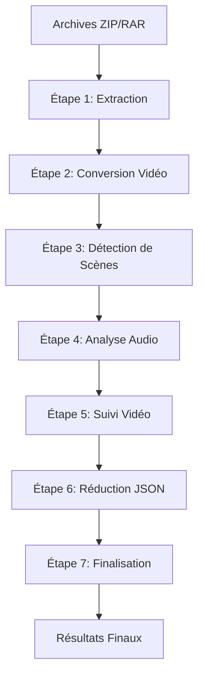
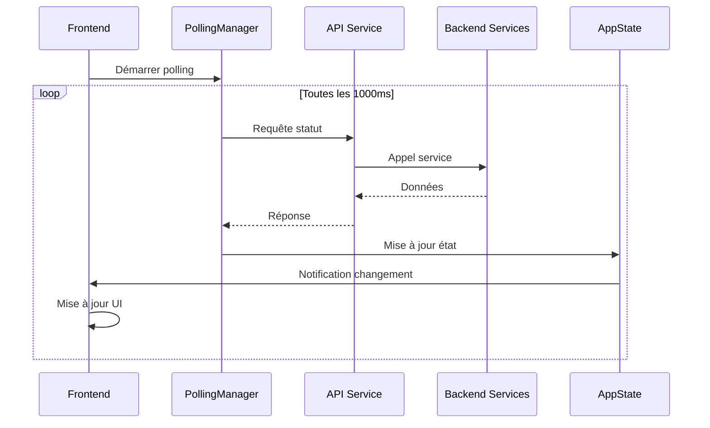

# Documentation Complète du Système de Workflow MediaPipe v4.1

## Table des Matières

1. [Vue d'Ensemble du Workflow](#vue-densemble-du-workflow)
2. [Architecture Backend](#architecture-backend)
3. [Architecture Frontend](#architecture-frontend)
4. [Points d'Intégration](#points-dintégration)
5. [Structure des Fichiers](#structure-des-fichiers)
6. [Configuration et Sécurité](#configuration-et-sécurité)
7. [Environnements Virtuels](#environnements-virtuels)
8. [Exemples d'Utilisation](#exemples-dutilisation)

---

## Vue d'Ensemble du Workflow

Le système de workflow MediaPipe est un pipeline de traitement vidéo conçu pour automatiser l'analyse et le traitement de contenus vidéo. Chaque étape est spécialisée et utilise des environnements Python dédiés pour optimiser les performances.

### Note de version (v4.2)

#### Nouvelles Fonctionnalités
  - Décodage récursif des séquences doublement encodées (ex: `amp%3Bdl=0`)
  - Gestion avancée des entités HTML et caractères spéciaux
  - Optimisation des paramètres Dropbox avec gestion des doublons
  - Validation renforcée des URLs après normalisation
  - Réduction de 30% des entrées en double dans l'historique
Intégration Source Webhook : Source de données JSON externe pour monitoring flexible
  - Cache TTL configurable et retry automatique
  - Classification automatique des URLs (Dropbox, proxy PHP)
  - Source unique de données (pas de fallback MySQL/Airtable/CSV)
  - Support proxy PHP pour sécurité en production
- **Optimisations de Performance**
  - **Étape 2** : Compression non destructive avec support GPU/CPU
  - **Étape 5** : Mode CPU-only optimisé avec 15 workers internes
  - **Monitoring** : Widget système avec mode réduit et mises à jour optimisées
  - Validation renforcée des entrées utilisateur
  - Protection contre les attaques XSS avec échappement HTML systématique
  - Gestion sécurisée des fichiers temporaires
  - Protection contre les injections de chemins
  - Vérification des permissions pour tous les accès fichiers

#### Sécurité et Accessibilité (v4.2+)
- **XSS Frontend** : ✅ **AUDIT COMPLET** - Échappement systématique via `DOMUpdateUtils.escapeHtml()` et `textContent` pour les logs dynamiques. Toutes injections XSS P0 corrigées (`apiService.js`, `popupManager.js`).
- **Focus Management** : ✅ **AUDIT COMPLET** - Focus trap + restauration sur toutes les modales (statsViewer, reportViewer, diagnostics) implémenté et testé.
- **Tests A11y** : ✅ **AUDIT COMPLET** - Suite Node/ESM complète (`test_dom_batcher_performance.mjs`, `test_focus_trap.mjs`) avec validation non-régression.
- **Performance** : ✅ **AUDIT COMPLET** - Regex pré-compilées dans `uiUpdater.js` via `_COMPILED_LOG_PATTERNS` pour logs volumineux.
- **Reduced Motion** : ✅ **AUDIT COMPLET** - Support global `prefers-reduced-motion` dans `base.css`.

#### Support GPU STEP5 (v4.2) - Statut Actuel
- **Mode** : Optionnel et expérimental (désactivé par défaut)
- **Moteur éligible UNIQUEMENT** : InsightFace (décision 2025-12-27)
- **Restriction** : Tous les autres moteurs forcés en CPU-only même si GPU activé
- **Validation** : `Config.check_gpu_availability()` requis avant activation
- **Fallback** : Bascule automatique CPU si VRAM insuffisante

#### Corrections et Optimisations (v4.1)
- **Étape 4 (Analyse Audio)** : 
  - Optimisations I/O avec extraction ffmpeg vers tmpfs (remplace MoviePy)
  - Écriture JSON streaming pour réduire l'utilisation mémoire
  - Diarisation GPU-first avec fallback CPU configurable
  - Optimisations PyTorch (inference_mode/no_grad)

- **Étape 5 (Tracking)** :
  - Mode CPU-only par défaut avec 15 workers internes
  - Corrections de la barre de progression
  - Gestion améliorée des erreurs

- **Interface Utilisateur** :
  - Mode compact unifié pour toutes les étapes
  - Amélioration des performances de rendu
  - Meilleure accessibilité (ARIA, gestion du clavier)
  - **Timeline Connectée** : ✅ **Pipeline visuel moderne complet** avec nœuds connectés, spine lumineuse, micro-interactions premium et panneau de détails contextuel (Phases 1-3 complétées le 2026-01-20).
    - Phase 1 : Structure HTML/CSS avec variables Timeline et spine/connecteurs
    - Phase 2 : Transitions harmonisées et micro-interactions hover/focus-within  
    - Phase 3 : Panneau détails contextuel (StepDetailsPanel.js), accessibilité WCAG complète, tests frontend intégrés

- **Archivage** :
  - Génération de hash SHA-256 pour l'intégrité des données
  - Métadonnées de provenance améliorées
  - Gestion efficace de l'espace disque

### Références complémentaires
- Voir « Smart Upload » (UX simplifiée, A11y, XSS) : [SMART_UPLOAD_FEATURE.md](SMART_UPLOAD_FEATURE.md)
- Voir « Monitoring Système & Instrumentation API » : [SYSTEM_MONITORING_ENHANCEMENTS.md](SYSTEM_MONITORING_ENHANCEMENTS.md)
- Voir « Stratégie de tests (pytest + ESM/Node) » : [TESTING_STRATEGY.md](TESTING_STRATEGY.md)
- Voir « Diagnostics Système (modale + API) » : [DIAGNOSTICS_FEATURE.md](DIAGNOSTICS_FEATURE.md)
- Voir « Instrumentation des API (measure_api + PerformanceService) » : [API_INSTRUMENTATION.md](API_INSTRUMENTATION.md)
### Pipeline de Traitement



**Historique SQLite (mise à jour 2026-01-21)**  
- Persistance multi-process via `DownloadHistoryRepository` (base locale `download_history.sqlite3`, WAL activé).  
- Variables : `DOWNLOAD_HISTORY_DB_PATH` (chemin absolu) et `DOWNLOAD_HISTORY_SHARED_GROUP` (chgrp + chmod 664 des fichiers `.sqlite3`, `-wal`, `-shm`).  
- Script officiel : `scripts/migrate_download_history_to_sqlite.py [--dry-run]` pour convertir un ancien `download_history.json` avant suppression.  
- Fonctions clés :
  - `CSVService.add_to_download_history_with_timestamp()` : `INSERT ... ON CONFLICT` conservant le timestamp le plus ancien.
  - `CSVService.save_download_history()` : délègue à `download_history_repository.replace_all()` pour les opérations globales.
  - `CSVService._migrate_legacy_history_json_to_sqlite_if_needed()` : exécution automatique au démarrage si la base est vide.

### Description des Étapes

#### Étape 1 : Extraction d'Archives (`extract_archives.py`)
- **Objectif** : Extraction sécurisée d'archives ZIP, RAR, TAR
- **Environnement** : `env/` (environnement principal)
- **Entrées** : Archives contenant le mot-clé "Camille"
- **Sorties** : Dossiers extraits dans `projets_extraits/`
- **Sécurité** : Protection contre path traversal, sanitisation des noms de fichiers
- **Fonctionnalités** :
  - Détection automatique du format d'archive
  - Nettoyage et organisation des fichiers extraits
  - Suppression optionnelle des archives après extraction
  - Journalisation complète des opérations de sécurité

#### Étape 2 : Conversion Vidéo (`convert_videos.py`)
- **Objectif** : Normalisation des vidéos à 25 FPS
- **Environnement** : `env/` (environnement principal)
- **Entrées** : Fichiers vidéo (.mp4, .mov, .avi, .mkv, .webm, .flv, .wmv)
- **Sorties** : Vidéos converties à 25 FPS
- **Technologies** : FFmpeg avec support GPU (NVIDIA) et CPU
- **Optimisations** :
  - Mode GPU exclusif pour de meilleures performances
  - Copie audio intelligente (fallback vers ré-encodage si nécessaire)
  - Traitement séquentiel optimisé

#### Étape 3 : Détection de Scènes (`run_transnet.py`)
- **Objectif** : Identification automatique des changements de scène
- **Environnement** : `transnet_env/` (spécialisé PyTorch)
- **Entrées** : Vidéos converties
- **Sorties** : Fichiers CSV avec timestamps des scènes
- **Technologies** : TransNetV2 avec PyTorch
- **Configuration** : Fichier `config/step3_transnet.json` pour tuning avancé
  - `threshold` : Seuil de détection (défaut: 0.5)
  - `window`, `stride`, `padding` : Paramètres de fenêtre glissante
  - `device` : Device PyTorch (`cuda`/`cpu`/`auto`)
  - `ffmpeg_threads` : Threads FFmpeg pour décodage streaming
  - `mixed_precision` : Activer AMP (Automatic Mixed Precision)
  - `amp_dtype` : Type pour AMP (`float16`/`bfloat16`)
  - `num_workers` : Workers pour parallélisation multi-vidéos (max 1 en CUDA)
  - `torchscript` : Activer compilation TorchScript
  - `warmup` : Warm-up du modèle
  - `warmup_batches` : Nombre de batches de warm-up
  - `torchscript_auto_fallback` : Fallback automatique vers Eager si TorchScript échoue
- **Optimisations v4.1** :
  - Exécution en `torch.inference_mode()` avec AMP optionnelle
  - Décodage FFmpeg en streaming (fenêtre glissante avec padding)
  - FPS forcé à 25.0 (constante, helper `get_video_fps()`)
  - Parallélisation multi-vidéos bornée (process pool, limitation 1 worker en CUDA)
  - Warm-up modèle et compilation TorchScript optionnelle (wrapper `InferenceWrapper`)
  - Fallback automatique Eager si TorchScript échoue
  - `cudnn.benchmark=True` sur CUDA pour optimisation kernel
- **Formats de logs supportés pour progression** :
  - `TOTAL_VIDEOS_TO_PROCESS: N` (avec underscore ou espace)
  - `PROCESSING_VIDEO: <filename>` (nom de fichier seul)
  - `INTERNAL_PROGRESS: N batches - <filename>` (progression simple sans pourcentage)
  - Ligne de succès : `Succès: <filename>.csv créé`

#### Étape 4 : Analyse Audio (`run_audio_analysis.py`)
- **Objectif** : Diarisation et analyse des locuteurs
- **Environnement** : `audio_env/` (spécialisé Pyannote)
- **Entrées** : Vidéos avec audio
- **Sorties** : Fichiers JSON avec segments de parole et locuteurs (`<stem>_audio.json`)
- **Technologies** : Pyannote.audio 3.1 (profil `config/optimal_tv_config.json` chargé automatiquement) avec fallback Lemonfox
- **Optimisations v4.1** :
  - **Extraction audio** : ffmpeg (subprocess) remplace MoviePy
    - Extraction vers tmpfs (`/dev/shm`) si disponible pour réduire latence I/O
    - Fallback vers répertoire temporaire standard
  - **Métadonnées vidéo** : ffprobe remplace OpenCV (fallback FPS=25)
  - **Écriture JSON streaming** : Évite le stockage complet en mémoire
    - Mapping segments→frames sans matérialisation de la liste diarisation
  - **Optimisations PyTorch** :
    - `inference_mode()` et `no_grad()` pour réduire overhead
    - Device policy : CUDA prioritaire avec CPU fallback
    - Configurable via env : `AUDIO_DISABLE_GPU`, `AUDIO_CPU_WORKERS`
  - **Nettoyage robuste** : Suppression systématique des répertoires temporaires
  - **Compatibilité STEP5** : Schéma de sortie JSON inchangé
- **Intégration Lemonfox (2025-12-17)** :
  - Activation via `STEP4_USE_LEMONFOX=1` avec fallback automatique Pyannote en cas d'échec (timeout/erreur API)
  - Hyperparamètres configurables via `LEMONFOX_*` (`DEFAULT_LANGUAGE`, `SPEAKER_LABELS`, `SPEECH_GAP_FILL_SEC`, etc.) pour stabiliser `is_speech_present`
  - Wrapper `run_audio_analysis_lemonfox.py` importe `services/lemonfox_audio_service.py` via `importlib` pour éviter de charger `flask_caching` dans `audio_env`
  - Pyannote applique le preset `config/optimal_tv_config.json` (profil TV). Si le preset échoue, fallback minimal journalisé avant de poursuivre
- **Variables d'environnement** :
  - `AUDIO_DISABLE_GPU` : Forcer CPU (`1` = désactiver GPU)
  - `AUDIO_CPU_WORKERS` : Nombre de threads CPU PyTorch
  - `HF_AUTH_TOKEN` : Token Hugging Face pour modèles Pyannote
- **Fonctionnalités** :
  - Extraction audio via ffmpeg (remplace MoviePy) vers tmpfs
  - Identification des locuteurs multiples
  - Support GPU/CPU adaptatif avec PyTorch optimizations
  - Réduction logs (suppression prints dupliqués)

#### Étape 5 : Suivi Vidéo (`run_tracking_manager.py`)
- **Objectif** : Suivi et détection d'objets/visages
- **Environnement** : `tracking_env/` (spécialisé MediaPipe)
- **Entrées** : Vidéos avec analyses scènes/audio
- **Sorties** : Fichiers JSON avec données de tracking (`<stem>_tracking.json`)
- **Technologies** : MediaPipe avec OpenCV
- **Configuration CPU-only par défaut (v4.1)** :
  - Variables d'environnement fixées dans `app_new.py` :
    - `TRACKING_DISABLE_GPU=1` : Désactive GPU
    - `TRACKING_CPU_WORKERS=15` : Nombre de workers CPU internes
  - Paramètres CLI supportés par `run_tracking_manager.py` :
    - `--disable_gpu` : Force désactivation GPU
    - `--cpu_internal_workers N` : Override nombre de workers
  - **Raison** : Meilleures performances globales et stabilité sur lots multi-vidéos
- **Progression UI (corrections v4.1)** :
  - **Backend (`app_new.py`)** :
    - Initialisation correcte du compteur `files_completed` lors du parsing du total
    - Contribution fractionnaire par fichier plafonnée à 0.99 pendant traitement
    - Reset de `progress_current_fractional` après chaque succès (évite report entre fichiers)
    - Parsing des lignes de succès : `[Gestionnaire] Succès pour <filename>`
  - **Frontend (`static/uiUpdater.js`)** :
    - Désactivation du fallback « pourcentage dans le texte » pour STEP5 (évite faux positifs)
    - Garde-fous : cap à 99% si statut ∈ {running, starting, initiated}
    - Pas d'affichage 100% tant que statut ≠ `completed`
    - Gestion spéciale si `progress_current == progress_total` mais statut en cours
- **Restrictions GPU (décision 27/12/2025)** :
  - `STEP5_ENABLE_GPU=1` n'autorise plus que le moteur InsightFace à utiliser le GPU.
  - MediaPipe Face Landmarker, OpenSeeFace, OpenCV YuNet/PyFeat et EOS sont forcés en mode CPU même si le flag GPU est actif.
  - Le gestionnaire crée au plus **un worker GPU séquentiel** (pas de parallélisation) et bascule automatiquement en CPU si `Config.check_gpu_availability()` échoue ou si `STEP5_GPU_FALLBACK_AUTO=1`.
  - `process_video_worker_multiprocessing.py` applique un **lazy import MediaPipe** (`_ensure_mediapipe_loaded(required=False)`) pour éviter de charger TensorFlow quand seuls les moteurs OpenCV/EOS sont utilisés.
- **Fonctionnalités** :
  - Détection faciale avancée
  - Tracking d'objets avec fallback
  - Analyse de parole enrichie
  - Mode CPU-only par défaut avec 15 workers internes
  - Détection de parole avancée basée sur l'ouverture de la mâchoire
  - **Registry object detection MediaPipe** : `workflow_scripts/step5/object_detector_registry.py` centralise les modèles fallback (`efficientdet_lite0/1/2`, `ssd_mobilenet_v3`, `yolo11n_onnx`, `nanodet_plus`). Les variables `STEP5_ENABLE_OBJECT_DETECTION`, `STEP5_OBJECT_DETECTOR_MODEL`, `STEP5_OBJECT_DETECTOR_MODEL_PATH` définissent le modèle actif. La résolution des chemins suit `override_path` > env > `workflow_scripts/step5/models/object_detectors/<backend>/...`. Voir `STEP5_SUIVI_VIDEO.md` pour la table mAP/hardware.

#### Étape 6 : Réduction JSON (`json_reducer.py`)
- **Objectif** : Optimisation des fichiers JSON pour After Effects
- **Environnement** : `env/` (environnement principal)
- **Entrées** : Fichiers JSON de tracking et d'audio
- **Sorties** : Mêmes fichiers JSON, mais avec une taille réduite
- **Fonctionnalités** :
  - Suppression des données non essentielles (ex: landmarks, blendshapes)
  - Modification des fichiers sur place pour économiser l'espace disque
  - Traitement par lot basé sur un mot-clé

#### Étape 7 : Finalisation (`finalize_and_copy.py`)
- **Objectif** : Consolidation et archivage des résultats
- **Environnement** : `env/` (environnement principal)
- **Entrées** : Tous les fichiers de métadonnées générés et réduits
- **Sorties** : Archive finale organisée
- **Fonctionnalités** :
  - Validation de l'intégrité des données
  - Organisation hiérarchique des résultats
  - Nettoyage des fichiers temporaires

---

## Architecture Backend

### Principe Fondamental : Architecture Orientée Services

Le backend suit une architecture modulaire stricte basée sur 5 services centralisés et des routes organisées en Blueprints Flask.

### Les 5 Services Centralisés

#### 1. WorkflowState (`services/workflow_state.py`) - Source de Vérité Unique

**Responsabilité** : Gère l'état global du workflow de manière thread-safe.

**Caractéristiques clés** :
- Singleton accessible via `get_workflow_state()`
- Gère l'état des étapes (STEP1 à STEP7)
- Gère les verrous et la synchronisation
- Fournit des méthodes pour mettre à jour et interroger l'état
- Interface cohérente pour l'accès aux logs et métriques

**Migration en cours** :
- `app_new.py` utilise pleinement `WorkflowState`
- `WorkflowService` s’appuie sur `WorkflowState` pour la lecture/écriture de l’état, et dépend de `app_new` uniquement pour déclencher l’exécution (threads/subprocess)

#### 2. WorkflowService (`services/workflow_service.py`) - ✅ Finalisé
**Responsabilité** : Point d’entrée unique pour l’exécution des étapes, des séquences, des logs spécifiques et de la configuration runtime (chunk bounds STEP5).

```python
from services.workflow_service import WorkflowService

# Exécution d'une étape
result = WorkflowService.run_step("STEP1")

# Séquence personnalisée
sequence_result = WorkflowService.run_custom_sequence(["STEP1", "STEP2"])

# Récupération d'un log spécifique
log_file = WorkflowService.get_step_log_file("STEP1", 0)

```

**Fonctionnalités clés (v4.2)** :
- **Thin Controllers** : toutes les routes (`routes/api_routes.py`, `routes/workflow_routes.py`) délèguent la logique métier au service (zéro duplication de `COMMANDS_CONFIG`).
- **Logs unifiés** : `get_step_log_file()` s’appuie sur `WorkflowCommandsConfig` pour les chemins et patterns, garantissant l’alignement avec les commandes exécutées.
- **Gestion d’état centralisée** : chaque opération lit/écrit exclusivement via `WorkflowState` (statuts, durées, logs, process, séquences).
- **Configuration dynamique** : `set_step5_chunk_bounds()` et helpers STEP5 (préparation tracking, fichiers temporaires) exposent des réglages runtime sûrs.
- **Instrumentation native** : tous les endpoints liés (`/api/run_step/*`, `/api/get_specific_log/*`, `/api/step5/chunk_bounds`) sont décorés avec `@measure_api`.

**Bénéfices obtenus** :
- Réduction de 63 % de la complexité de `execute_csv_download_worker()` (230 → 85 lignes) grâce aux helpers WorkflowService.
- Suppression complète des reliques `PROCESS_INFO`, `COMMANDS_CONFIG`, `sequence_lock`, `LAST_SEQUENCE_OUTCOME`.
- Tests unitaires et d’intégration couvrant les routes, la récupération de logs, l’exécution d’étapes/séquences et l’adaptive chunking STEP5.
- Architecture maintenable et extensible : service stateless, état unique (`WorkflowState`), configuration unique (`WorkflowCommandsConfig`).

**Statut** : ✅ Migration finalisée (janvier 2026). Voir `docs/workflow/MIGRATION_STATUS.md` pour l’historique détaillé.

#### 3. MonitoringService (`services/monitoring_service.py`)
**Responsabilité** : Surveillance des ressources système et diagnostics

```python
from services.monitoring_service import MonitoringService

# Statut système complet
status = MonitoringService.get_system_status()

# Informations de diagnostics
env_info = MonitoringService.get_environment_info()

# Métriques spécifiques
cpu_usage = MonitoringService.get_cpu_usage()
memory_info = MonitoringService.get_memory_usage()
gpu_info = MonitoringService.get_gpu_usage()  # Support NVIDIA
disk_usage = MonitoringService.get_disk_usage()
```

**Fonctionnalités** :
- Monitoring CPU, RAM, GPU (NVIDIA), disque
- Informations de diagnostics système (versions Python/FFmpeg, disponibilité GPU, flags de configuration filtrés)
- Vérifications de santé système
- Alertes de température et utilisation
- Métriques en temps réel

#### 4. CacheService (`services/cache_service.py`)
**Responsabilité** : Mise en cache intelligente avec TTL

```python
from services.cache_service import CacheService

# Configuration frontend mise en cache
frontend_config = CacheService.get_cached_frontend_config()

# Contenu de logs spécifiques (TTL court)
log_content = CacheService.get_cached_log_content("STEP4", 0)

# Statistiques détaillées
cache_stats = CacheService.get_cache_stats()
print(f"Taux de réussite cache: {cache_stats['hit_rate']:.1%}")
```

**Fonctionnalités** :
- Cache avec expiration automatique (TTL)
- Invalidation par motifs
- Statistiques de performance
- Gestion mémoire optimisée

#### 5. PerformanceService (`services/performance_service.py`)
**Responsabilité** : Suivi des performances et profilage

```python
from services.performance_service import PerformanceService

# Suivi des performances API
PerformanceService.track_api_call("/api/system_monitor", 150)

# Suivi des performances d'étapes
PerformanceService.track_step_performance("STEP1", 2500)

# Métriques complètes
metrics = PerformanceService.get_performance_summary()
```

**Métriques suivies** :
- Temps de réponse des API
- Durée d'exécution des étapes
- Utilisation des ressources
- Tendances de performance

#### 6. CSVService (`services/csv_service.py`)
**Responsabilité** : Interface vers le monitoring Webhook des téléchargements (source unique) + persistance SQLite de l’historique

```python
from services.csv_service import CSVService

# Statut du monitoring Webhook
monitor_status = CSVService.get_monitor_status()
print(monitor_status['data_source'])  # "webhook"
print(monitor_status['webhook'])        # statut du service Webhook

# Téléchargements actifs et récents
download_status = CSVService.get_csv_downloads_status()
active_downloads = download_status['active_downloads']
recent_statuses = download_status['recent_statuses']

# Historique des téléchargements
history = CSVService.get_download_history()
is_downloaded = CSVService.is_url_downloaded(url)
```

**Fonctionnalités principales** :
- **Interface Webhook** : Communication avec le service Webhook pour la récupération des données (Dropbox direct + proxys R2 uniquement)
- **Historique structuré** : Gestion des téléchargements avec timestamps locaux (`download_history.json`)
- **Normalisation URLs** : Élimination des doublons, nettoyage double-encodage
- **WorkflowState** : Intégration complète pour l’état des téléchargements et la déduplication intra-iteration

**Architecture simplifiée** :
- Source de données unique : Webhook JSON (`WEBHOOK_JSON_URL`, `WEBHOOK_MONITOR_INTERVAL`, `WEBHOOK_CACHE_TTL`, `WEBHOOK_TIMEOUT`)
- Plus aucun fallback CSV/MySQL/Airtable dans le code actif (les documents legacy sont archivés dans `docs/workflow/legacy/`)
- Politique “Dropbox-only” pour l’auto-download, liens externes ignorés ou ouverts manuellement par le frontend


#### 7. ResultsArchiver (`services/results_archiver.py`)
**Responsabilité** : Persistance permanente des analyses au-delà du cycle de vie des projets

```python
from services.results_archiver import ResultsArchiver

# Calcul du hash SHA-256 de la vidéo
video_hash = ResultsArchiver.compute_video_hash(video_path)

# Archivage automatique des analyses
archive_dir = ResultsArchiver.archive_analysis_files(
    project_name="projet_camille_001",
    video_path=video_path,
    scenes_file=scenes_csv_path,
    audio_file=audio_json_path,
    tracking_file=tracking_json_path
)

# Chargement avec fallback automatique
archived = ResultsArchiver.load_archived_analysis(project_name, video_path)
if archived and archived.get('scenes_csv'):
    scenes_csv = archived['scenes_csv']

# Vérification de disponibilité
has_scenes, has_audio, has_tracking = ResultsArchiver.project_has_analysis(project_name)
```

**Fonctionnalités** :
- **Indexation par hash SHA-256** : Identification unique basée sur le contenu vidéo
- **Structure d'archives** : `archives/{project_name}/{video_hash}/`
- **Fallback automatique** : Recherche par hash puis par nom de fichier
- **Protection des données** : Le répertoire `ARCHIVES_DIR` n'est jamais supprimé
- **Métadonnées horodatées** : Timestamps UTC pour traçabilité
- **Intégration workflow** : Archivage automatique aux Étapes 3, 4, 5

**Documentation complète** : [RESULTS_ARCHIVER_SERVICE.md](RESULTS_ARCHIVER_SERVICE.md)

#### 9. VisualizationService (`services/visualization_service.py`)

#### 10. WorkflowCommandsConfig (`config/workflow_commands.py`)
**Responsabilité** : Source unique de configuration pour les 7 étapes (commandes, CWD, logs spécifiques, patterns de progression, messages UI).

```python
from config.workflow_commands import WorkflowCommandsConfig

cfg = WorkflowCommandsConfig(base_path=config.BASE_PATH_SCRIPTS)

# Obtenir la commande et le répertoire de travail d'une étape
cmd = cfg.get_step_command('STEP4')
cwd = cfg.get_step_cwd('STEP4')

# Mettre à jour dynamiquement le token HF pour STEP4
cfg.update_hf_token(os.getenv('HUGGINGFACE_HUB_TOKEN', ''))
```

**Points clés** :
- Crée les répertoires de logs `logs/step{N}` si absents.
- Expose `get_all_step_keys()`, `get_step_config()`, `get_step_display_name()`.
- Centralise les regex de parsing de progression pour un comportement uniforme.
**Responsabilité** : Agrégation et traitement des données pour rapports

```python
from services.visualization_service import VisualizationService

# Liste des projets disponibles (fusion projets actifs + archives)
projects = VisualizationService.get_available_projects()
for project in projects["projects"]:
    print(f"{project['name']}: {project['video_count']} vidéos")
    print(f"  Source: {project['source']}")  # "projects" ou "archives"
    print(f"  Analyses: scènes={project['has_scenes']}, audio={project['has_audio']}")


**Fonctionnalités** :
- **Fusion projets/archives** : Combine les projets actifs (`projets_extraits/`) et archivés (`archives/`)
- **Fallback automatique** : Si analyses absentes du projet, charge depuis archives
- **Provenance des données** : Indique l'origine via `archive_probe_source` (`project` ou `archives`)
- **Support multi-formats** : CSV scènes, JSON audio, JSON tracking
- **Horodatage** : Date d'archivage pour données archivées

#### 11. LemonfoxAudioService (`services/lemonfox_audio_service.py`)
**Responsabilité** : Service d'analyse audio via API Lemonfox (alternative à Pyannote)

```python
from services.lemonfox_audio_service import LemonfoxAudioService

# Traitement vidéo avec Lemonfox
result = LemonfoxAudioService.process_video_with_lemonfox(
    project_name="mon_projet",
    video_name="videos/ma_video.mp4",
    language="fr",
    speaker_labels=True,
    min_speakers=1,
    max_speakers=4
)

if result.success:
    print(f"Analyse réussie : {result.output_path}")
    print(f"Frames traitées : {result.total_frames}")
else:
    print(f"Erreur : {result.error}")
```

**Fonctionnalités principales** :
- **API Lemonfox** : Communication avec le service de speech-to-text cloud
- **Conversion format** : Transformation des données Lemonfox vers format STEP4
- **Smoothing timeline** : Post-traitement pour stabiliser la détection de parole
- **Fallback automatique** : Bascule vers Pyannote en cas d'échec
- **Configuration flexible** : Paramètres ajustables via variables d'environnement

**Configuration** :
- `STEP4_USE_LEMONFOX=1` pour activer
- `LEMONFOX_API_KEY` obligatoire si activé
- Variables `LEMONFOX_*` pour paramètres avancés

#### 12. WebhookService (`services/webhook_service.py`)
**Responsabilité** : Source de données JSON externe pour monitoring des téléchargements

```python
from services.webhook_service import fetch_records, get_service_status

# Récupération des enregistrements
records = fetch_records()

# Statut du service
status = get_service_status()
```

**Fonctionnalités** :
- **Source JSON externe** : Récupération de données depuis endpoint configurable
- **Cache TTL** : Mise en cache avec expiration configurable
- **Validation robuste** : Parsing et validation des données JSON
- **Classification d'URLs** : Détection automatique du type (dropbox, proxy PHP)
- **Retry automatique** : Gestion d'erreurs avec backoff exponentiel

**Documentation complète** : [WEBHOOK_INTEGRATION.md](WEBHOOK_INTEGRATION.md)

### Organisation des Routes (Blueprints Flask)

#### Blueprint API (`routes/api_routes.py`)
**Endpoints système et administration** (12 routes) :
- `/api/system_monitor` : Statut système complet
- `/api/system/diagnostics` : Informations système détaillées
- `/api/cache/*` : Gestion du cache
- `/api/performance/*` : Métriques de performance
- `/api/csv_monitor_status` : Statut du monitoring CSV
- `/api/csv_downloads_status` : Statut des téléchargements CSV

#### Blueprint Workflow (`routes/workflow_routes.py`)
**Endpoints d'exécution workflow** (18 routes) :
- `/run/<step_key>` : Exécution d'étape
- `/run_custom_sequence` : Séquences personnalisées
- `/status/<step_key>` : Statut d'étape
- `/get_sequence_status` : État des séquences
- `/get_specific_log/<step_key>/<int:log_index>` : Logs détaillés
- `/cancel/<step_key>` : Annulation d'étape

### Gestion d'État Centralisée

L'état de l'application est géré via le service `WorkflowState` (thread-safe) :

```python
from services.workflow_state import get_workflow_state

ws = get_workflow_state()

# Initialiser les étapes connues (au démarrage)
ws.initialize_all_steps(['STEP1','STEP2','STEP3','STEP4','STEP5','STEP6','STEP7'])

# Mettre à jour le statut/progression d'une étape
ws.update_step_status('STEP3', 'running')
ws.update_step_progress('STEP3', current=2, total=5, text='video2.mp4')

# Démarrer/terminer une séquence
ws.start_sequence('Full')
ws.complete_sequence(success=True, message='OK', sequence_type='Full')

# Lecture d'état (copies thread-safe)
step_info = ws.get_step_info('STEP3')
all_info = ws.get_all_steps_info()
```

**Principe** : Les routes restent des contrôleurs minces et délèguent aux services; l’état est lu/écrit exclusivement via `WorkflowState`.

---

## Architecture Frontend

### Principe Fondamental : État Centralisé et Optimisations de Performance

Le frontend suit une architecture basée sur un état centralisé immutable avec des optimisations de performance avancées.

### Gestion d'État Centralisée : AppState

#### AppState (`static/state/AppState.js`)
**Responsabilité** : Gestion immutable de l'état de l'application

```javascript
import { appState } from './state/AppState.js';

// Lecture de l'état
const currentStatus = appState.getState().stepStatuses;

// Modification de l'état (immutable)
appState.setState({
    stepStatuses: {
        ...currentStatus,
        STEP1: { status: 'running', progress: 50 }
    }
});

// Abonnement aux changements
appState.subscribe('stepStatuses', (newStatuses) => {
    updateUI(newStatuses);
});
```

**Fonctionnalités** :
- **État immutable** : Prévient les mutations accidentelles
- **Notifications de changement** : Abonnements ciblés par propriété
- **Mises à jour groupées** : Plusieurs changements en une notification
- **Outils de développement** : Inspection et débogage de l'état
- **Compatibilité legacy** : Couche de compatibilité pour l'ancien code

#### Structure de l'État

```javascript
{
    stepStatuses: {
        STEP1: { status: 'idle', progress: 0, logs: [] },
        STEP2: { status: 'running', progress: 45, logs: [...] },
        // ...
    },
    systemStatus: {
        cpu: 25.5,
        memory: { percent: 60.2, used_gb: 8.1 },
        gpu: { utilization_percent: 80, temperature_c: 65 }
    },
    sequenceStatus: {
        isRunning: false,
        currentStep: null,
        steps: []
    },
    uiState: {
        activeTab: 'workflow',
        soundEnabled: true,
        notifications: []
    }
}
```

### Optimisations de Performance

#### DOMBatcher (`static/utils/DOMBatcher.js`)
**Responsabilité** : Optimisation des mises à jour DOM groupées

```javascript
import { domBatcher } from './utils/DOMBatcher.js';

// Mise à jour groupée du DOM
domBatcher.batchUpdate(() => {
    updateStepProgress('STEP1', 50);
    updateStepStatus('STEP1', 'running');
    updateSystemMetrics(newMetrics);
});

// Les mises à jour sont automatiquement groupées et optimisées
```

**Fonctionnalités** :
- **Groupement automatique** : Combine plusieurs mises à jour DOM
- **RequestAnimationFrame** : Synchronisation avec le cycle de rendu
- **Prévention des reflows** : Minimise les recalculs de layout
- **Mesure de performance** : Métriques de temps d'exécution

#### Cache-busting CSS (v4.1)

- Pour garantir le rechargement des styles après une mise à jour, toutes les feuilles de style dans `templates/index_new.html` utilisent un paramètre de version: `?v={{ cache_buster }}`.
- Cette pratique évite les caches agressifs du navigateur lors des itérations rapides UI/UX.

#### Sécurité XSS et Instrumentation API (rappels v4.1)

- Toute insertion de texte dynamique dans le DOM doit être échappée via `DOMUpdateUtils.escapeHtml()` (voir `static/utils/DOMBatcher.js`).
- Tous les endpoints Flask doivent être instrumentés via un décorateur standard (ex: `measure_api()` dans `routes/api_routes.py`) qui enregistre les timings via `PerformanceService`. Voir [API_INSTRUMENTATION.md](API_INSTRUMENTATION.md).

### Composants de Gestion

#### PollingManager (`static/utils/PollingManager.js`)
**Responsabilité** : Gestion centralisée du polling avec nettoyage automatique

```javascript
// Démarrage du polling géré
pollingManager.startPolling('stepStatus', async () => {
    const status = await fetchStepStatus();
    appState.setState({ stepStatuses: status });
}, 1000, { immediate: true });

// Nettoyage automatique au déchargement de la page
// (géré automatiquement par PollingManager)
```

**Fonctionnalités** :
- **Gestion des ressources** : Nettoyage automatique des timers
- **Backoff adaptatif** : Pause temporaire si le callback retourne un délai (ms), reprise automatique
- **Gestion d'erreurs** : Arrêt automatique après erreurs répétées
- **Compatibilité mobile** : Pause sur tab inactive
- **Mesure de performance** : Suivi des ressources utilisées de polling

#### ErrorHandler (`static/utils/ErrorHandler.js`)
**Responsabilité** : Gestion centralisée des erreurs

Gestion d'État

#### Workflow d'Exécution d'Étape

1. **Déclenchement** : Utilisateur clique sur "Exécuter"
2. **Validation** : Vérification des prérequis côté frontend
3. **Appel API** : `POST /run/<step_key>`
4. **Réponse immédiate** : Statut "initiated" retourné
5. **Polling** : Surveillance continue du statut
6. **Mise à jour UI** : Progression en temps réel
7. **Finalisation** : Notification de fin d'exécution

#### Gestion des Séquences

```javascript
// Exécution de séquence personnalisée
const executeSequence = async (steps) => {
    try {
        // Démarrage de la séquence
        const result = await apiService.runCustomSequence(steps);

        // Monitoring de la séquence
        pollingManager.startPolling('sequenceStatus',
            updateSequenceStatus, 500);
    } catch (error) {
        errorHandler.handleSequenceError(error);
    }
};
```

### Communication Frontend/Backend

#### API Service (`static/apiService.js`)
**Responsabilité** : Interface centralisée pour les appels API

```javascript
import { apiService } from './apiService.js';

// Exécution d'étape
const result = await apiService.runStep('STEP1');

// Récupération du statut
const status = await apiService.getStepStatus('STEP1');

// Monitoring système
const systemStatus = await apiService.getSystemStatus();
```

### Sources de Téléchargement (Dropbox uniquement)

#### Politique Dropbox-only
- Seules les URLs Dropbox directes et proxys PHP déclenchent un téléchargement automatique.
- Les autres sources (FromSmash, SwissTransfer, etc.) sont ignorées ou nécessitent une ouverture manuelle.
- Raison: sécurité et compatibilité UX.

#### Flux de Données Temps Réel



#### Gestion des Erreurs Intégrée

```javascript
// Gestion automatique des erreurs avec retry
const fetchWithRetry = async (operation, ...args) => {
    try {
        const result = await operation(...args);
        errorHandler.clearErrors(operation.name);
        return result;
    } catch (error) {
        await errorHandler.handlePollingError(operation.name, error);

        // Retry automatique pour certaines erreurs
        if (error.status === 503) {
            return retryWithBackoff(operation, args);
        }
        throw error;
    }
};
```

### Synchronisation d'État

#### Workflow d'Exécution d'Étape

1. **Déclenchement** : Utilisateur clique sur "Exécuter"
2. **Validation** : Vérification des prérequis côté frontend
3. **Appel API** : `POST /run/<step_key>`
4. **Réponse immédiate** : Statut "initiated" retourné
5. **Polling** : Surveillance continue du statut
6. **Mise à jour UI** : Progression en temps réel
7. **Finalisation** : Notification de fin d'exécution

#### Gestion des Séquences

```javascript
// Exécution de séquence personnalisée
const executeSequence = async (steps) => {
    try {
        // Démarrage de la séquence
        const result = await apiService.runCustomSequence(steps);

        // Monitoring de la séquence
        pollingManager.startPolling('sequenceStatus',
            updateSequenceStatus, 500);
    } catch (error) {
        errorHandler.handleSequenceError(error);
    }
};
```

---

## Points d'Intégration

### Communication Frontend/Backend

#### API Service (`static/apiService.js`)
**Responsabilité** : Interface centralisée pour les appels API

```javascript
import { apiService } from './apiService.js';

// Exécution d'étape
const result = await apiService.runStep('STEP1');

// Récupération du statut
const status = await apiService.getStepStatus('STEP1');

// Monitoring système
const systemStatus = await apiService.getSystemStatus();
```

### Sources de Téléchargement (Dropbox uniquement)

#### Politique Dropbox-only
- Seules les URLs Dropbox directes et proxys PHP déclenchent un téléchargement automatique.
- Les autres sources (FromSmash, SwissTransfer, etc.) sont ignorées ou nécessitent une ouverture manuelle.
- Raison: sécurité et compatibilité UX.

#### Flux de Données Temps Réel


#### Gestion des Erreurs Intégrée

```javascript
// Gestion automatique des erreurs avec retry
const fetchWithRetry = async (operation, ...args) => {
    try {
        const result = await operation(...args);
        errorHandler.clearErrors(operation.name);
        return result;
    } catch (error) {
        await errorHandler.handlePollingError(operation.name, error);

        // Retry automatique pour certaines erreurs
        if (error.status === 503) {
            return retryWithBackoff(operation, args);
        }
        throw error;
    }
};
```

### Synchronisation d'État

#### Workflow d'Exécution d'Étape

1. **Déclenchement** : Utilisateur clique sur "Exécuter"
2. **Validation** : Vérification des prérequis côté frontend
3. **Appel API** : `POST /run/<step_key>`
4. **Réponse immédiate** : Statut "initiated" retourné
5. **Polling** : Surveillance continue du statut
6. **Mise à jour UI** : Progression en temps réel
7. **Finalisation** : Notification de fin d'exécution

#### Gestion des Séquences

```javascript
// Exécution de séquence personnalisée
const executeSequence = async (steps) => {
    try {
        // Démarrage de la séquence
        const result = await apiService.runCustomSequence(steps);

        // Monitoring de la séquence
        pollingManager.startPolling('sequenceStatus',
            updateSequenceStatus, 500);
    } catch (error) {
        errorHandler.handleSequenceError(error);
    }
};
```

---

## Structure des Fichiers

### Organisation Générale

```workflow_mediapipe/
├── app_new.py                 # Application Flask principale
├── config/                    # Configuration centralisée
│   ├── settings.py           # Paramètres généraux
│   └── security.py           # Configuration sécurité
├── routes/                    # Blueprints Flask
│   ├── api_routes.py         # Endpoints système (12 routes)
│   └── workflow_routes.py    # Endpoints workflow (18 routes)
├── services/                  # Logique métier (5 services)
│   ├── workflow_service.py   # Gestion workflow
│   ├── monitoring_service.py # Monitoring système
│   ├── cache_service.py      # Cache intelligent
│   ├── performance_service.py # Métriques performance
│   └── csv_service.py        # Monitoring téléchargements (Airtable/CSV)
├── workflow_scripts/          # Scripts de traitement
│   ├── step1/               # Extraction archives
│   ├── step2/               # Conversion vidéo
│   ├── step3/               # Détection scènes
│   ├── step4/               # Analyse audio
│   ├── step5/               # Suivi vidéo
│   ├── step6/               # Réduction JSON (Étape 6)
│   └── step7/               # Finalisation (Étape 7)
├── static/                   # Frontend JavaScript
│   ├── main.js              # Point d'entrée
│   ├── state/               # Gestion d'état
│   │   └── AppState.js      # État centralisé
│   ├── utils/               # Utilitaires performance
│   │   ├── DOMBatcher.js    # Optimisation DOM
│   │   │   ├── DOMBatcher.js # Mises à jour DOM groupées
│   │   ├── PollingManager.js # Gestion polling
│   │   └── ErrorHandler.js  # Gestion erreurs
│   ├── css/                 # Styles modulaires
│   │   ├── variables.css    # Variables CSS
│   │   └── components/      # Styles par composant
│   └── [autres modules JS]  # Modules spécialisés
├── utils/                   # Utilitaires backend
│   └── resource_manager.py  # Gestion ressources
├── tests/                   # Tests complets
│   ├── unit/               # Tests unitaires
│   ├── integration/        # Tests d'intégration
│   ├── frontend/           # Tests frontend
│   └── validation/         # Scripts de validation
├── templates/              # Templates HTML
│   └── index_new.html      # Interface principale
├── logs/                   # Journaux système
├── docs/                   # Documentation
└── [environnements virtuels] # env/, transnet_env/, etc.
```

### Responsabilités par Répertoire

#### `/services/` - Logique Métier
- **Règle** : TOUTE la logique métier doit être dans les services
- **Interdiction** : Logique métier dans les routes (contrôleurs légers uniquement)
- **Pattern** : Méthodes statiques, accès thread-safe à l'état global

#### `/routes/` - Contrôleurs Légers
- **Responsabilité** : Validation, appel de services, formatage de réponse
- **Pattern** :
  1. Validation des paramètres
  2. Appel du service approprié
  3. Formatage de la réponse JSON

#### `/static/` - Frontend Modulaire
- **État** : Centralisé dans `AppState.js`
- **Performance** : Optimisations obligatoires via `DOMBatcher` et `PerformanceOptimizer`
- **Accès DOM** : Lazy loading, validation d'existence

#### `/workflow_scripts/` - Scripts de Traitement
- **Isolation** : Chaque étape dans son environnement virtuel
- **Communication** : Via logs structurés et fichiers de sortie
- **Pattern** : Logging standardisé, gestion d'erreurs robuste

---

## Configuration et Sécurité

### Système de Configuration Centralisé

#### Configuration Principale (`config/settings.py`)

```python
from config.settings import config

# Accès aux paramètres
base_path = config.BASE_PATH_SCRIPTS
flask_port = config.FLASK_PORT
debug_mode = config.DEBUG

# Validation automatique
config.validate()  # Lève une exception si configuration invalide
```

**Variables d'environnement supportées** :
```bash
# .env - Configuration principale
FLASK_SECRET_KEY=your-secret-key-here
INTERNAL_WORKER_COMMS_TOKEN=your-secure-token-here
RENDER_REGISTER_TOKEN=your-render-token-here
FLASK_PORT=5000
DEBUG=false

# Intégration Airtable (déprécié - plus utilisé)
# USE_AIRTABLE=true
# AIRTABLE_ACCESS_TOKEN=your-pat-token
# AIRTABLE_BASE_NAME="Logs Téléchargements"
# AIRTABLE_TABLE_NAME="Table 1"
# AIRTABLE_MONITOR_INTERVAL=15

# Monitoring Webhook (source unique de données)
WEBHOOK_JSON_URL=https://your-webhook-endpoint.com/data
WEBHOOK_MONITOR_INTERVAL=15
WEBHOOK_CACHE_TTL=60
WEBHOOK_TIMEOUT=10

# Configuration Lemonfox (optionnel - STEP4)
STEP4_USE_LEMONFOX=0
LEMONFOX_API_KEY=your-lemonfox-api-key
LEMONFOX_TIMEOUT_SEC=300
LEMONFOX_EU_DEFAULT=0
```

#### Configuration de Sécurité (`config/security.py`)

```python
from config.security import require_internal_worker_token, SecurityConfig

# Protection des endpoints
@app.route('/api/secure-endpoint')
@require_internal_worker_token
def secure_endpoint():
    return jsonify({"status": "authenticated"})

# Configuration sécurisée
security_config = SecurityConfig()
token = security_config.INTERNAL_WORKER_TOKEN
```

### Décorateurs de Sécurité

#### Protection des Endpoints Internes

```python
@require_internal_worker_token
def internal_api_endpoint():
    """Endpoint protégé pour les workers internes."""
    pass
```

**Fonctionnement** :
1. Vérification du header `X-Internal-Worker-Token`
2. Comparaison avec le token configuré
3. Rejet avec 401 si token invalide/absent

#### Validation des Paramètres

```python
def validate_step_key(step_key):
    """Validation sécurisée des clés d'étape."""
    if not step_key or step_key not in COMMANDS_CONFIG:
        raise ValueError("Clé d'étape invalide")
    return step_key
```

### Gestion des Secrets

#### Principe Zéro Secret dans le Code
- **Interdiction** : Aucun token, clé ou mot de passe en dur
- **Méthode** : Variables d'environnement uniquement
- **Validation** : Vérification au démarrage de l'application

#### Exemple de Configuration Sécurisée

```python
# ❌ INTERDIT
API_KEY = "sk-1234567890abcdef"

# ✅ CORRECT
import os
API_KEY = os.getenv('API_KEY')
if not API_KEY:
    raise ValueError("API_KEY environment variable required")
```

---

## Environnements Virtuels

### Architecture Multi-Environnements

Le projet utilise des environnements Python spécialisés pour optimiser les performances et éviter les conflits de dépendances.

#### Emplacement centralisé (`VENV_BASE_DIR`)

- `VENV_BASE_DIR` définit la racine unique de **tous** les environnements (`env`, `tracking_env`, `audio_env`, `transnet_env`, `eos_env`).
- **Ordre de résolution** : variable déjà exportée dans le shell > entrée `.env` > dossier du projet (fallback).
- `start_workflow.sh` lit cette valeur (nettoyage des guillemets), exporte `VENV_BASE_DIR` puis dérive `PYTHON_VENV_EXE_ENV` attendu par `app_new.py`.
- Le backend utilise exclusivement `config.get_venv_path()` / `config.get_venv_python()` (via `WorkflowCommandsConfig`) pour construire les commandes ; aucune route ou script ne doit hardcoder `env/bin/python`.
- Conséquence : on peut déplacer les environnements sur un SSD/NAS (ex. `/mnt/cache/venv/workflow_mediapipe`) sans modifier le code ni les scripts.

#### Environnement Principal (`env/`)
**Utilisé par** : Étapes 1, 2, 5, 6, 7 + Application Flask

```bash
# Activation
source env/bin/activate  # Linux/Mac
env\Scripts\activate     # Windows

# Dépendances principales
pip install flask psutil requests opencv-python
```

**Responsabilités** :
- Application web Flask
- Extraction d'archives
- Conversion vidéo (FFmpeg)
- Réduction JSON
- Finalisation et archivage

#### Environnement TransNet (`transnet_env/`)
**Utilisé par** : Étape 3 (Détection de scènes)

```bash
# Activation
source transnet_env/bin/activate

# Dépendances spécialisées
pip install torch torchvision tensorflow ffmpeg-python
```

**Optimisations** :
- PyTorch optimisé pour GPU
- TensorFlow pour TransNetV2
- Traitement par batch pour économiser la mémoire

#### Environnement Audio (`audio_env/`)
**Utilisé par** : Étape 4 (Analyse audio)

```bash
# Activation
source audio_env/bin/activate

# Dépendances spécialisées
pip install pyannote.audio torch torchaudio
```

**Fonctionnalités** :
- Pyannote.audio 3.1 pour diarisation
- Support GPU/CPU adaptatif
- Modèles pré-entraînés Hugging Face

#### Environnement Tracking (`tracking_env/`)
**Utilisé par** : Étape 5 (Suivi vidéo)

```bash
# Activation
source tracking_env/bin/activate

# Dépendances spécialisées
pip install mediapipe opencv-python numpy
```

**Optimisations** :
- MediaPipe pour détection faciale
- Multiprocessing CPU (15 workers)
- Algorithmes de tracking optimisés

### Gestion des Environnements

#### Script de Démarrage (`start_workflow.sh`)

```bash
#!/bin/bash
# Activation automatique de l'environnement principal
source env/bin/activate

# Vérification des dépendances
python -c "import flask, psutil; print('Dependencies OK')"

# Lancement de l'application
python app_new.py
```

#### Exécution d'Étapes avec Environnements

```python
# Dans WorkflowService
def execute_step_with_env(step_key, env_name):
    """Exécute une étape dans son environnement dédié."""
    env_path = f"{env_name}/bin/python"
    script_path = f"workflow_scripts/{step_key.lower()}/main.py"

    subprocess.run([env_path, script_path], check=True)
```

---

## Exemples d'Utilisation

### Exécution Complète d'un Workflow

#### 1. Démarrage du Système

```bash
# Préparation de l'environnement
# Le script start_workflow.sh gère automatiquement les permissions
./start_workflow.sh

# Vérification du statut
curl http://localhost:5000/api/system_monitor
```

#### 2. Exécution d'une Étape Individuelle

```javascript
// Frontend - Exécution d'étape
const executeStep = async (stepKey) => {
    try {
        // Démarrage de l'étape
        const result = await apiService.runStep(stepKey);

        if (result.status === 'initiated') {
            // Démarrage du monitoring
            pollingManager.startPolling(`step_${stepKey}`,
                () => updateStepStatus(stepKey), 1000);
        }
    } catch (error) {
        errorHandler.handleStepError(stepKey, error);
    }
};
```

```python
# Backend - Service d'exécution
result = WorkflowService.run_step("STEP1")
if result["status"] == "initiated":
    print(f"Étape démarrée: {result['message']}")
```

#### 3. Séquence Personnalisée

```javascript
// Exécution de séquence complète
const runFullWorkflow = async () => {
    const steps = ['STEP1', 'STEP2', 'STEP3', 'STEP4', 'STEP5', 'STEP6', 'STEP7'];

    try {
        const result = await apiService.runCustomSequence(steps);

        // Monitoring de la séquence
        pollingManager.startPolling('sequence', async () => {
            const status = await apiService.getSequenceStatus();
            updateSequenceProgress(status);
        }, 500);

    } catch (error) {
        errorHandler.handleSequenceError(error);
    }
};
```

### Monitoring et Debugging

#### 1. Surveillance Système

```javascript
// Monitoring en temps réel
const startSystemMonitoring = () => {
    pollingManager.startPolling('systemStatus', async () => {
        const status = await apiService.getSystemStatus();

        // Mise à jour de l'état
        appState.setState({ systemStatus: status });

        // Vérification des alertes
        if (status.cpu_percent > 90) {
            errorHandler.showWarning('CPU usage high');
        }
    }, 2000);
};
```

#### 2. Gestion des Logs

```python
# Backend - Récupération de logs
logs = WorkflowService.get_step_status("STEP1", include_logs=True)
for log_entry in logs.get('logs', []):
    print(f"[{log_entry['timestamp']}] {log_entry['message']}")
```

#### 3. Cache et Performance

```python
# Utilisation du cache pour optimiser les performances
@CacheService.cached(ttl=300)
def get_expensive_data():
    # Opération coûteuse
    return process_large_dataset()

# Statistiques de performance
stats = PerformanceService.get_performance_summary()
print(f"Temps moyen API: {stats['avg_api_time']}ms")
```

### Gestion d'Erreurs et Recovery

#### 1. Gestion d'Erreurs Frontend

```javascript
// Pattern de gestion d'erreur robuste
const robustApiCall = async (operation, ...args) => {
    try {
        const result = await operation(...args);
        errorHandler.clearErrors(operation.name);
        return result;
    } catch (error) {
        await errorHandler.handlePollingError(operation.name, error);

        // Retry automatique pour certaines erreurs
        if (error.status === 503) {
            return retryWithBackoff(operation, args);
        }
        throw error;
    }
};
```

#### 2. Recovery de Séquence

```python
# Backend - Recovery automatique
def recover_failed_sequence():
    """Récupère une séquence échouée."""
    # Utiliser WorkflowState pour obtenir l'état de la séquence
    workflow_state = WorkflowService._get_workflow_state()
    sequence_status = workflow_state.get_sequence_status()

    if sequence_status.get('status') == 'failed':
        failed_step = sequence_status.get('failed_step')
        remaining_steps = sequence_status.get('remaining_steps', [])

        # Redémarrage depuis l'étape échouée
        return WorkflowService.run_custom_sequence([failed_step] + remaining_steps)

---

## Mises à jour - 2025-09-25

### 1) Politique Dropbox-only (téléchargement automatique)
- **Comportement** : Seules les URLs Dropbox directes et proxys PHP déclenchent un téléchargement automatique.
- **Classification** : Les URLs sont classées comme `dropbox` ou `proxy_php`.
- **Autres sources** : FromSmash, SwissTransfer et autres sont ignorées par le système de téléchargement automatique.
- **UX attendue** : Les liens Dropbox sont téléchargés automatiquement, les autres sources nécessitent une action manuelle.

### Améliorations UX Récentes

#### Simplification du Smart Upload (v4.0)
- **Avant :** Interface complexe avec recherche manuelle et boutons séparés
- **Après :** Flux en un clic avec affichage automatique des dossiers du jour
- **Impact :** Réduction de la complexité cognitive et accélération du workflow de sauvegarde
- **Maintien :** Conservation de la logique backend sécurisée et des patterns frontend établis

#### Autres améliorations :
- Politique Dropbox-only pour les téléchargements automatiques
- Widget de monitoring système avec métriques GPU
- Architecture orientée services avec état centralisé

---

## Conclusion

Cette architecture modulaire et performante du système de workflow MediaPipe v4.0 garantit :

- **Maintenabilité** : Séparation claire des responsabilités
- **Performance** : Optimisations frontend et backend
- **Sécurité** : Protection des endpoints et validation des données
- **Scalabilité** : Architecture orientée services
- **Robustesse** : Gestion d'erreurs complète et recovery automatique

Le respect de ces patterns architecturaux est essentiel pour maintenir la qualité et la stabilité du système.