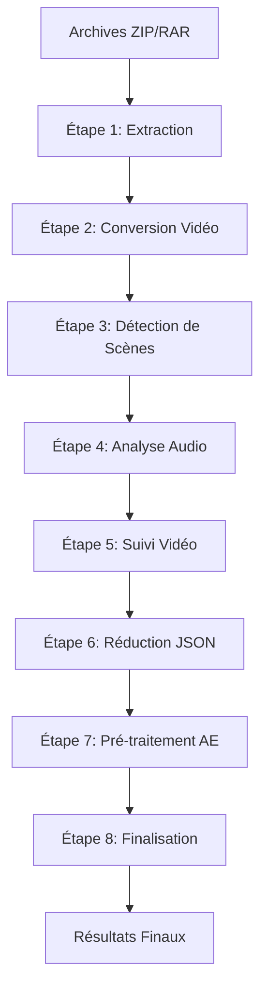

# Architecture du Workflow MediaPipe

**TL;DR** : Un pipeline vidéo en 8 étapes avec Flask + JavaScript natif, où chaque étape tourne dans son environnement Python isolé. L'état est centralisé via `WorkflowState`, la configuration via `WorkflowCommandsConfig`, et les données arrivent par un webhook JSON unique.

## Le Problème que Nous Résolvons

Tu dois analyser des vidéos pour la post-production After Effects, mais chaque outil (détection de scènes, analyse audio, tracking facial) demande des bibliothèques Python différentes et souvent incompatibles. Lancer manuellement chaque étape est chronophage, et les résultats sont difficiles à synchroniser.

## Notre Solution : Le Pipeline à 8 Étapes

Nous avons construit un pipeline où chaque étape est un script Python indépendant, orchestré par une interface web. Tu lances une étape, tu regardes la progression en temps réel, et les résultats sont automatiquement disponibles pour After Effects.



## Architecture Backend : Services Centralisés

### Le Principe : Architecture Orientée Services

Toute la logique métier vit dans `/services`. Les routes Flask sont des contrôleurs minces qui ne font que valider les entrées et appeler les services.

### ❌ Controller gras (anti-pattern)
```python
@api_bp.route('/api/step/<step_key>/run')
def run_step(step_key):
    # Logique métier directement dans la route
    config = COMMANDS_CONFIG[step_key.upper()]
    command = config['command']
    subprocess.run(command, shell=True)  # Dangereux !
    return jsonify({"status": "started"})
```

### ✅ Blueprint mince (pattern recommandé)
```python
@api_bp.route('/api/step/<step_key>/run')
@measure_api('/api/step/<step_key>/run')
def run_step(step_key):
    payload = request.get_json()
    validate_step(step_key)  # Validation uniquement
    return WorkflowService.run_step(step_key, payload)  # Délégation
```

### Les Services Essentiels

**WorkflowState** (`services/workflow_state.py`) - La source de vérité unique
- Gère l'état des 8 étapes de manière thread-safe
- Singleton accessible via `get_workflow_state()`
- Méthodes atomiques : `update_step_status()`, `update_step_progress()`, `append_step_log()`

**WorkflowService** (`services/workflow_service.py`) - Le point d'entrée unique
- Exécute les étapes et séquences
- Récupère les logs spécifiques
- Prépare les fichiers temporaires pour STEP5
- Instrumenté avec `@measure_api` pour les métriques

**WorkflowCommandsConfig** (`config/workflow_commands.py`) - La configuration centralisée
- Commandes, répertoires de travail, patterns de logs pour chaque étape
- Gestion du token Hugging Face pour STEP4
- Crée automatiquement les répertoires de logs

**CSVService** (`services/csv_service.py`) - Le monitoring des téléchargements
- Interface avec le webhook JSON (source unique de données)
- Historique persistant en SQLite via `download_history.sqlite3`
- Normalisation des URLs et déduplication automatique

### Les Routes Organisées

Deux blueprints Flask :
- `routes/api_routes.py` : 12 endpoints système (monitoring, cache, performance)
- `routes/workflow_routes.py` : 18 endpoints workflow (exécution, statuts, logs)

## Architecture Frontend : État Centralisé et Performance

### AppState - L'État Immutable

```javascript
import { appState } from './state/AppState.js';

// Lecture immutable
const { stepTimers, isAnySequenceRunning } = appState.getState();

// Mise à jour (immutabilité garantie)
appState.setState({
    stepTimers: {
        ...stepTimers,
        STEP3: { startTime: Date.now(), elapsedMs: 0 }
    }
}, 'step_timer_start');
```

**Structure de l'état** :
- `stepTimers` : Temps d'exécution par étape
- `isAnySequenceRunning` : État des séquences
- `activeStepKeyForLogsPanel` : Panneau de logs connecté
- `performanceMetrics` : Métriques API
- `ui` : Préférences utilisateur (compact mode, etc.)

### Optimisations de Performance

**DOMBatcher** - Mises à jour DOM groupées
```javascript
domBatcher.scheduleUpdate(() => {
    updateStepProgress('STEP1', 50);
    updateStepStatus('STEP1', 'running');
});
```

**PollingManager** - Gestion centralisée du polling
- Nettoyage automatique des timers
- Backoff adaptatif en cas d'erreur
- Pause automatique on tab inactive

### Timeline Connectée - L'Interface Moderne

Une timeline visuelle avec :
- Spine lumineuse connectant les 8 étapes
- Nœuds d'état dynamiques (idle, running, completed, error)
- Auto-scroll déterministe pendant les séquences
- Panneau de logs en overlay synchronisé

## Les 8 Étapes du Pipeline

### Étape 1 : Extraction (`env/`)
Extrait les archives ZIP/RAR/TAR avec sécurité :
- Protection contre path traversal
- Nettoyage des noms de fichiers
- Sortie dans `projets_extraits/`

### Étape 2 : Conversion Vidéo (`env/`)
Normalise les vidéos à 25 FPS avec FFmpeg :
- Support GPU/CPU automatique
- Copie audio intelligente
- Sortie prête pour les étapes suivantes

### Étape 3 : Détection de Scènes (`transnet_env/`)
Identifie les changements de scène avec TransNetV2 :
- PyTorch optimisé avec AMP optionnel
- Décodage FFmpeg en streaming
- Configuration via `config/step3_transnet.json`

### Étape 4 : Analyse Audio (`audio_env/`)
Diarisation et analyse des locuteurs :
- **Pyannote.audio 3.1** par défaut (profil TV optimisé)
- **Lemonfox** en fallback si `STEP4_USE_LEMONFOX=1`
- Extraction audio via ffmpeg (remplace MoviePy)
- Support embeddings locuteurs avec `AUDIO_INCLUDE_SPEAKER_EMBEDDINGS=1`

**Variables clés** :
```bash
AUDIO_DISABLE_GPU=0          # Forcer CPU si nécessaire
HF_AUTH_TOKEN=your_token     # Token Hugging Face
STEP4_USE_LEMONFOX=0         # Activer Lemonfox
```

### Étape 5 : Suivi Vidéo (`tracking_env_slim/` ou `insightface_env/`)
Détection faciale et tracking d'objets :

**Architecture simplifiée (v4.3)** :
- **MediaPipe** (défaut, CPU) : 478 landmarks + 52 blendshapes ARKit
- **InsightFace** (GPU optionnel) : Activé avec `STEP5_ENABLE_GPU=1` et `STEP5_TRACKING_ENGINE=insightface`

**Variables clés** :
```bash
STEP5_TRACKING_ENGINE=          # vide = MediaPipe, "insightface" = GPU
STEP5_ENABLE_GPU=0              # Activer GPU (InsightFace uniquement)
TRACKING_CPU_WORKERS=15         # Workers CPU pour MediaPipe
STEP5_ENABLE_PROFILING=0        # Logs détaillés toutes les 20 frames
```

**Restrictions importantes** :
- InsightFace est GPU-only (nécessite validation GPU)
- MediaPipe reste forcé en CPU même si GPU activé
- Fallback automatique CPU si GPU indisponible

### Étape 6 : Réduction JSON (`env/`)
Optimise les données pour After Effects :
- Sortie primaire : `*_tracking.json` (consommé par les scripts AE)
- Enrichissement : `tracking_analytics`, `expression_summary`, `temporal_alignment`
- Réduction de taille (suppression données non essentielles)

**Variables optionnelles** :
```bash
STEP6_INCLUDE_TRACKING_ANALYTICS=1
STEP6_INCLUDE_EXPRESSION_SUMMARY=1
STEP6_EXPRESSION_KEYS=key1,key2,key3
```

### Étape 7 : Pré-traitement AE (`env/`)
Prépare les données optimisées pour After Effects :
- Génération de `*_ae.json` (structures compactes)
- Filtrage par frames pour les compositions AE
- Pont Python pour les scripts ExtendScript via `system.callSystem()`

### Étape 8 : Finalisation (`env/`)
Archive et consolide les résultats :
- Validation d'intégrité SHA-256
- Organisation hiérarchique dans `archives/`
- Métadonnées de provenance complètes

## Configuration et Sécurité

### Variables d'Environnement Essentielles

```bash
# Base
FLASK_SECRET_KEY=your-secret-key
INTERNAL_WORKER_COMMS_TOKEN=secure-token
FLASK_PORT=5000
DEBUG=false

# Monitoring (source unique)
WEBHOOK_JSON_URL=https://your-webhook.com/data
WEBHOOK_MONITOR_INTERVAL=15
WEBHOOK_CACHE_TTL=60

# Cache configurable
CACHE_ROOT_DIR=/mnt/cache          # Remplace /mnt/cache hardcodé
DISABLE_EXPLORER_OPEN=1           # Sécurité prod/headless

# STEP4 Audio
HF_AUTH_TOKEN=your-hf-token
AUDIO_DISABLE_GPU=0
STEP4_USE_LEMONFOX=0

# STEP5 Tracking
STEP5_TRACKING_ENGINE=           # vide ou "insightface"
STEP5_ENABLE_GPU=0
TRACKING_CPU_WORKERS=15

# STEP6 Réduction
STEP6_INCLUDE_TRACKING_ANALYTICS=1
STEP6_INCLUDE_EXPRESSION_SUMMARY=1
```

### Principes de Sécurité

- **Zéro secret dans le code** : Tout via variables d'environnement
- **Protection des endpoints** : `@require_internal_worker_token` pour les workers
- **Validation des entrées** : Toutes les clés d'étape validées
- **Échappement XSS systématique** : `DOMUpdateUtils.escapeHtml()` pour le contenu dynamique

## Environnements Virtuels Isolés

Chaque étape utilise son environnement Python dédié :

- `env/` : Flask + étapes 1, 2, 6, 7, 8
- `transnet_env/` : PyTorch + TransNetV2 (étape 3)
- `audio_env/` : Pyannote + Lemonfox (étape 4)
- `tracking_env_slim/` : MediaPipe CPU (étape 5 par défaut)
- `insightface_env/` : InsightFace GPU (étape 5 optionnel)

**VENV_BASE_DIR** permet de déplacer tous les environnements sans modifier le code.

## Workflow d'Exécution Complet

### 1. Démarrage
```bash
./start_workflow.sh  # Gère l'activation et les permissions
```

### 2. Exécution d'une étape (Frontend)
```javascript
const result = await apiService.runStep('STEP1');
if (result.status === 'initiated') {
    // Monitoring automatique via PollingManager
    pollingManager.startPolling('step_STEP1', updateStepStatus, 1000);
}
```

### 3. Séquence complète
```javascript
const steps = ['STEP1','STEP2','STEP3','STEP4','STEP5','STEP6','STEP7','STEP8'];
await apiService.runCustomSequence(steps);
```

### 4. Monitoring système
```javascript
const status = await apiService.getSystemStatus();
// CPU, RAM, GPU, disque en temps réel
```

## Trade-offs Architecturaux

| Choix | Avantages | Limites | Quand l'utiliser |
|-------|-----------|---------|-----------------|
| **Services isolés** | Testabilité unitaire, dépendances claires | Plus de fichiers, complexité initiale | Projet qui évolue, équipe > 1 |
| **État centralisé** | Cohérence garantie, thread-safe | Point de défaillance unique | Pipeline avec étapes séquentielles |
| **Environnements spécialisés** | Pas de conflits de deps, optimisation | Installation plus longue | Multi-technologies (PyTorch, TF, MediaPipe) |
| **Webhook-only** | Sécurité maximale, traçabilité | Source unique de données | Production avec monitoring |
| **Frontend vanilla** | Performance, pas de bundle complexe | Plus de code manuel | Interface d'administration technique |

## Analogie : Chef d'Orchestre

Pense à l'architecture comme un **chef d'orchestre**. Les **services** sont les musiciens experts (violon, piano, batterie). Le **WorkflowState** est la partition partagée. Les **routes** sont les signaux du chef qui indiquent quand jouer, sans jamais jouer eux-mêmes. Chaque musicien (service) reste dans sa zone (environnement virtuel) pour éviter les conflits sonores (dépendances).

## Conclusion

Cette architecture transforme un problème complexe (pipeline vidéo multi-technologies) en une solution maintenable où chaque composant a une responsabilité claire. Les 8 étapes s'exécutent de manière prévisible, l'état est centralisé et cohérent, et l'interface offre une visibilité complète en temps réel.

---

## Golden Rule

**Garde les services lourds, les routes légères, et l'état unique ; sinon tu crées des dépendances croisées.**
