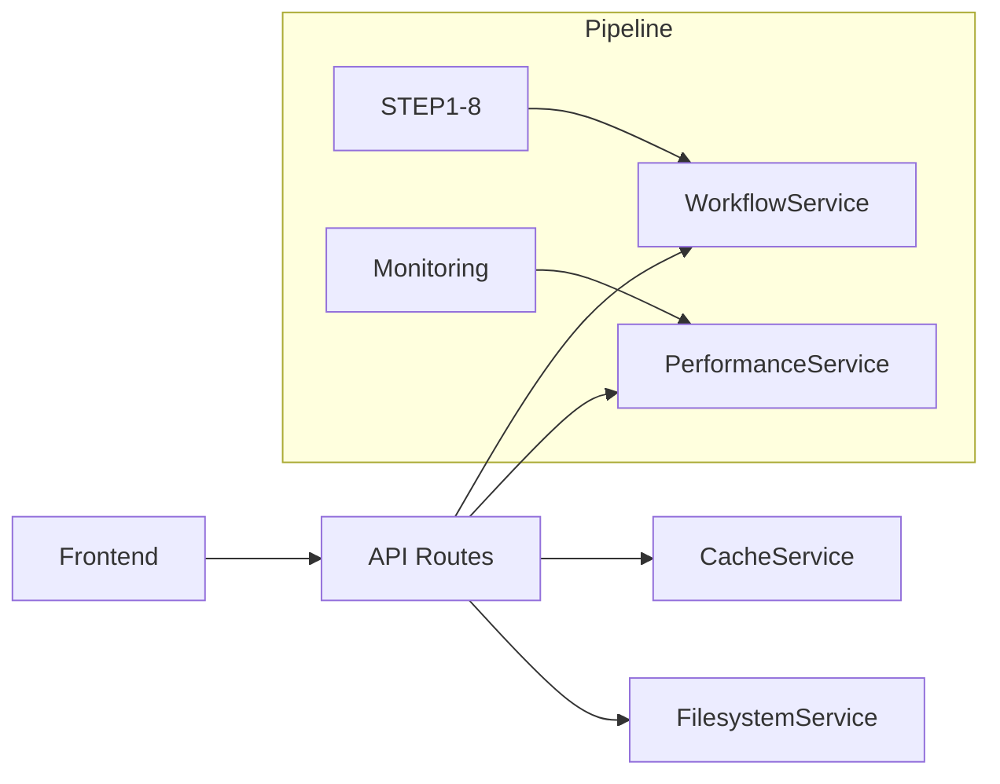

# API Routes - Contrats et Sécurité

**TL;DR** : Endpoints REST Flask avec validation, instrumentation, délégation services et tokens internes pour la sécurité.

## Le Problème : API Non Structurée et Non Sécurisée

Tu as besoin d'interfaces API claires pour contrôler le pipeline, mais les routes sont dispersées, non documentées et sans sécurité. Tu as besoin de contrats clairs, d'instrumentation et de protection contre les accès non autorisés.

## Notre Solution : Routes Centralisées avec Contrats et Sécurité

Nous utilisons un blueprint Flask centralisé avec des routes minces qui suivent le pattern : validation → instrumentation → délégation → réponse JSON. Chaque endpoint est sécurisé et documenté avec des contrats clairs.

### ❌ Routes monolithiques (anti-pattern)
```python
# Approche dangereuse - logique métier dans les routes
@app.route('/api/step/<step_key>/run')
def run_step(step_key):
    # Validation manuelle
    if step_key not in ['step1', 'step2']:
        return jsonify({'error': 'Invalid step'}), 400
    # Logique métier ici (interdit !)
    subprocess.run(['python', f'scripts/{step_key}.py'])
    return jsonify({'status': 'success'})
# Résultat : pas de validation, pas d'instrumentation, pas de sécurité
```

### ✅ Contrôleur mince (pattern recommandé)
```python
# Approche propre - délégation complète
@api_bp.route('/api/step/<step_key>/run', methods=['POST'])
@measure_api('/api/step/<step_key>/run')
def run_step(step_key: str):
    payload = request.get_json()
    validate_step(step_key)  # Validation entrée
    workflow_service.run_step(step_key, payload)  # Délégation service
    return jsonify({"status": "queued"})  # Réponse standardisée
# Résultat : validation, instrumentation, sécurité, traçabilité
```

### Flux de Traitement des Requêtes

1. **Validation entrée** : Vérification des paramètres et schémas
2. **Instrumentation** : Mesure automatique des performances avec `@measure_api`
3. **Délégation** : Appel aux services spécialisés (pas de logique métier dans les routes)
4. **Réponse** : Format JSON standardisé avec métriques

## Architecture des Routes

### Pattern Contrôleur Mince

```python
@api_bp.route('/api/step/<step_key>/run', methods=['POST'])
@measure_api('/api/step/<step_key>/run')
def run_step(step_key: str):
    """Déclenche l'exécution d'une étape du pipeline."""
    payload = request.get_json()
    validate_step(step_key)  # Validation entrée
    workflow_service.run_step(step_key, payload)  # Délégation service
    return jsonify({"status": "queued"})
```

### Sécurité par Tokens

```python
from config.security import require_internal_worker_token

@api_bp.route('/api/cache/open', methods=['POST'])
@require_internal_worker_token
@measure_api('/api/cache/open')
def open_cache_folder():
    """Ouverture explorateur (sécurisé)."""
    return filesystem_service.open_path_in_explorer(...)
```

## Contrats API

### POST `/api/step/<step_key>/run`

**Objectif** : Déclencher l'exécution d'une étape du pipeline.

**Entrée** :
```json
{
  "project_name": "projet_camille_001",
  "video_name": "video1.mp4",
  "sequence_id": "custom_seq_123"
}
```

**Sortie** :
```json
{
  "status": "queued",
  "step_key": "step5",
  "sequence_id": "custom_seq_123",
  "timestamp": "2026-02-04T13:45:00Z"
}
```

**Erreurs** :
- `400 Bad Request` : step_key invalide ou payload malformé
- `409 Conflict` : étape déjà en cours
- `500 Internal Server Error` : échec service

### GET `/api/step_status/<step_key>`

**Objectif** : Obtenir le statut d'une étape en temps réel.

**Sortie** :
```json
{
  "status": "running",
  "progress": 45,
  "current_file": "video1.mp4",
  "estimated_completion": "2026-02-04T13:50:00Z"
}
```

### GET `/api/get_specific_log/<step_key>/<log_index>`

**Objectif** : Streamer un fichier log avec pagination.

**Paramètres** :
- `step_key` : clé d'étape (ex: `step5`)
- `log_index` : index du fichier log (0 = plus récent)
- `offset` (query) : offset lignes pour pagination

**Sortie** :
```text
[2026-02-04 13:45:12] [INFO] Starting video processing...
[2026-02-04 13:45:13] [PROFILING] Frame 1000, FPS: 28.5
...
```

### POST `/api/cache/open`

**Objectif** : Ouvrir un dossier cache dans l'explorateur.

**Entrée** :
```json
{
  "folder_number": 5
}
```

**Sortie** :
```json
{
  "status": "opened",
  "path": "/mnt/cache/projets_extraits_20260204_05"
}
```

**Sécurité** : Nécessite `INTERNAL_WORKER_TOKEN` dans header `X-Worker-Token`

## Trade-offs par Type d'Endpoint

| Type | Complexité | Sécurité | Performance | Quand l'utiliser |
|------|-----------|----------|-------------|-----------------|
| **Workflow** | Moyenne | Token requis | Instrumenté | Production, contrôle pipeline |
| **Monitoring** | Simple | Ouvert | Optimisé | Développement, debug |
| **Cache** | Simple | Token requis | Rapide | Opérations système |
| **Performance** | Simple | Ouvert | Métriques | Monitoring interne |

## Trade-offs par Stratégie de Sécurité

| Stratégie | Couverture | Complexité | Risques | Quand l'utiliser |
|-----------|-----------|------------|---------|-----------------|
| **Token unique** | Endpoints critiques | Simple | Point unique | Production standard |
| **Multi-token** | Granulaire | Complexe | Gestion tokens | Systèmes multi-utilisateurs |
| **OAuth2** | Maximale | Très complexe | Dépendances | Entreprise, SaaS |
| **Aucune** | Aucune | Minimale | Maximale | Développement local |

## Analogie : Contrôle Aérien vs Porte Automatique

Pense aux routes API comme un **contrôle aérien** vs une **porte automatique**. Les **tokens internes** sont les badges d'accès du contrôle aérien : seuls les personnels autorisés (workers internes) peuvent accéder aux zones critiques (cache, système). La **validation des entrées** est le scanner de sécurité : chaque bagage (payload) est inspecté avant d'entrer. L'**instrumentation** est le système de surveillance : chaque mouvement est enregistré et analysé pour détecter les anomalies.

## Sécurité

### Tokens Internes

```python
# Configuration
INTERNAL_WORKER_TOKEN = os.getenv('INTERNAL_WORKER_TOKEN', 'default-dev-token')

# Décorateur de sécurité
def require_internal_worker_token(f):
    @wraps(f)
    def decorated(*args, **kwargs):
        token = request.headers.get('X-Worker-Token')
        if token != current_app.config['INTERNAL_WORKER_TOKEN']:
            abort(401, description="Invalid worker token")
        return f(*args, **kwargs)
    return decorated
```

### Validation Step Keys

```python
def validate_step(step_key: str) -> None:
    """Valide que la clé d'étape existe."""
    config = WorkflowCommandsConfig()
    if step_key not in config.get_step_configs():
        abort(400, description=f"Invalid step key: {step_key}")
```

### CORS et Headers

```python
@app.after_request
def add_security_headers(response):
    response.headers['X-Content-Type-Options'] = 'nosniff'
    response.headers['X-Frame-Options'] = 'DENY'
    return response
```

## Instrumentation

### Décorateur `@measure_api`

```python
@measure_api(endpoint_name, sample_rate=1.0)
def endpoint_handler():
    """Automatiquement instrumenté."""
```

**Comportement** :
- Mesure durée exécution via `time.perf_counter_ns()`
- Capture statut HTTP et erreurs
- Enregistre métriques dans `PerformanceService`
- Génère logs structurés avec request_id

### Exemple de Log

```json
{
  "timestamp": "2026-02-04T13:45:12.123Z",
  "level": "INFO",
  "component": "api",
  "request_id": "req_abc123",
  "endpoint": "/api/step5/run",
  "status_code": 200,
  "duration_ms": 1245.67,
  "tags": ["step5", "workflow", "v4.2"]
}
```

### Métriques Personnalisées

```python
@api_bp.route('/api/step4/lemonfox_audio', methods=['POST'])
@measure_api('/api/step4/lemonfox_audio', sample_rate=0.1)  # 10% sampling
async def analyze_audio():
    result = await LemonfoxAudioService.analyze(...)
    
    # Métriques enrichies
    PerformanceService.record_metric(
        component="audio",
        metric="processing_time_ms",
        value=result['processing_time'],
        tags={"model": result['model'], "duration_sec": result['duration']}
    )
    
    return jsonify({
        "status": "success",
        "data": result,
        "_metrics": {
            "processing_time_ms": result['processing_time'],
            "speech_segments": len(result['segments'])
        }
    })
```

## Performance et Monitoring

### Métriques Collectées

- **Temps de réponse** : par endpoint, percentiles
- **Taux d'erreur** : par type d'erreur
- **Débit** : requêtes/seconde par endpoint
- **Métriques métier** : temps traitement étapes, taille cache

### Monitoring Dashboard

- Endpoint `/api/performance/metrics` expose les métriques en JSON
- Widget System Monitor dans frontend consomme ces métriques
- Logs structurés permettent agrégation via ELK/Prometheus

### Optimisations

```python
# Sampling pour endpoints lourds
@measure_api('/api/step4/lemonfox_audio', sample_rate=0.1)

# Cache pour réponses statiques
@cache.memoize(timeout=300)
def get_diagnostics():
    return MonitoringService.get_diagnostics()

# Async pour I/O-bound
async def analyze_audio():
    result = await LemonfoxAudioService.analyze(...)
```

## Patterns d'Utilisation

### Validation Entrée

```python
def validate_run_step_payload(payload: dict) -> None:
    """Validation schéma payload."""
    required = ['project_name', 'video_name']
    missing = [k for k in required if k not in payload]
    if missing:
        abort(400, description=f"Missing required fields: {missing}")
```

### Gestion Erreurs

```python
@api_bp.errorhandler(404)
def handle_not_found(e):
    return jsonify({"error": "Resource not found"}), 404

@api_bp.errorhandler(500)
def handle_internal_error(e):
    logger.error(f"Internal error: {e}")
    return jsonify({"error": "Internal server error"}), 500
```

### Réponses Structurées

```python
def api_response(data: Any, status: str = "success", code: int = 200):
    """Format de réponse standardisé."""
    return jsonify({
        "status": status,
        "data": data,
        "timestamp": datetime.utcnow().isoformat() + "Z"
    }), code
```

## Tests et Validation

### Tests d'Intégration

```python
def test_run_step_endpoint():
    """Test POST /api/step/<step_key>/run."""
    payload = {"project_name": "test_project", "video_name": "test.mp4"}
    response = client.post('/api/step5/run', json=payload)
    assert response.status_code == 200
    assert response.json['status'] == 'queued'

def test_invalid_step_key():
    """Test validation step_key."""
    response = client.post('/api/invalid_step/run', json={})
    assert response.status_code == 400
    assert 'Invalid step key' in response.json['error']
```

### Tests de Sécurité

```python
def test_internal_endpoint_without_token():
    """Test protection par token."""
    response = client.post('/api/cache/open', json={"folder_number": 1})
    assert response.status_code == 401

def test_internal_endpoint_with_token():
    """Test accès autorisé."""
    headers = {'X-Worker-Token': app.config['INTERNAL_WORKER_TOKEN']}
    response = client.post('/api/cache/open', json={"folder_number": 1}, headers=headers)
    assert response.status_code == 200
```

## Configuration Essentielle

### Variables d'Environnement

```bash
# Sécurité
INTERNAL_WORKER_TOKEN=your-secure-token-here
FLASK_SECRET_KEY=your-flask-secret-key

# Performance
API_SAMPLE_RATE=1.0
API_CACHE_TIMEOUT=300
API_REQUEST_TIMEOUT=30

# Monitoring
ENABLE_API_MONITORING=true
LOG_LEVEL=INFO
```

### Configuration Flask

```python
# app.py
from routes.api_routes import api_bp
from config.settings import config

app.register_blueprint(api_bp, url_prefix='/api')
app.config['INTERNAL_WORKER_TOKEN'] = config.INTERNAL_WORKER_TOKEN
```

## Résolution de Problèmes

### Token Invalide

```bash
# Diagnostic
curl -H "X-Worker-Token: invalid-token" http://localhost:5000/api/cache/open

# Solution
# Vérifier la configuration INTERNAL_WORKER_TOKEN
echo $INTERNAL_WORKER_TOKEN
# Utiliser le token correct dans les headers
```

### Step Key Invalide

```bash
# Diagnostic
curl -X POST http://localhost:5000/api/invalid_step/run -H "Content-Type: application/json" -d '{"project_name": "test"}'

# Solution
# Vérifier les étapes disponibles
curl http://localhost:5000/api/step_status/step5
# Utiliser une clé d'étape valide (step1-8)
```

### Timeout Endpoint

```bash
# Diagnostic
curl -X POST http://localhost:5000/api/step4/lemonfox_audio -H "Content-Type: application/json" -d '{"project_name": "test"}' --max-time 5

# Solution
# Augmenter timeout dans configuration
# Optimiser le traitement dans le service
# Utiliser sampling pour endpoints lourds
```

### Performance Insuffisante

```bash
# Diagnostic
curl http://localhost:5000/api/performance/metrics

# Solution
# Activer sampling pour les endpoints lourds
# Mettre en cache les réponses statiques
# Utiliser async pour les opérations I/O
```

## Dépendances et Prérequis

### Bibliothèques Principales

```python
# Flask et extensions
from flask import Flask, request, jsonify, Blueprint
from flask_cors import CORS

# Services injectés
from services.workflow_service import WorkflowService
from services.cache_service import CacheService
from services.performance_service import PerformanceService
from services.filesystem_service import FilesystemService

# Configuration
from config.settings import config
from config.security import require_internal_worker_token

# Utilitaires
import datetime
import functools
import logging
```

### Dépendances Externes

- **Flask** : Framework web
- **Flask-CORS** : Gestion CORS
- **Python 3.8+** : Support des décorateurs et async/await

### Environnement Virtuel

```bash
# Activation environnement principal
source env/bin/activate

# Installation dépendances
pip install flask flask-cors
pip install python-dotenv
```

## Intégration Pipeline

### Position dans l'Architecture



### Flux de Données

```python
# Frontend → API Routes → Services → Pipeline
request → validate_step() → workflow_service.run_step() → step_execution
```

## Pièges Courants et Solutions

### Piège #1 : Token Manquant
**Solution** : Configurer `INTERNAL_WORKLER_TOKEN` et l'envoyer dans le header `X-Worker-Token`.

### Piège #2 : Step Key Invalide
**Solution** : Utiliser les clés valides (step1-8) et valider via `WorkflowCommandsConfig`.

### Piège #3 : Timeout sur Endpoints Lourds
**Solution** : Activer sampling, mettre en cache les réponses statiques, utiliser async.

### Piège #4 : Pas de Logs Structurés
**Solution** : Activer `ENABLE_API_MONITORING=true` et configurer le niveau de log approprié.

### Piège #5 : CORS Bloqué
**Solution** : Configurer Flask-CORS avec les origines autorisées dans les headers.

L'API transforme l'interface du pipeline en un système structuré, sécurisé et performant. Chaque endpoint est documenté avec des contrats clairs, instrumenté pour le monitoring, et protégé par des tokens internes. Le frontend dispose maintenant d'une interface fiable et documentée pour contrôler toutes les opérations du pipeline.

---

## Golden Rule

**Valide avant de déléguer ; sinon tu exposes ton système à des entrées malveillantes et tu perds la traçabilité des opérations.**
