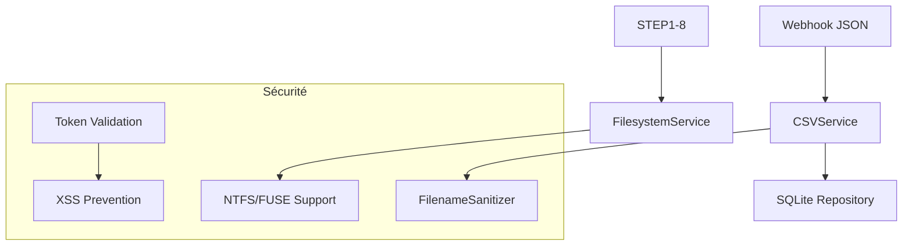

# Sécurité - Workflow MediaPipe

**TL;DR** : Architecture sécurisée avec webhook-only, validation entrées, prévention XSS et contrôle d'accès par tokens internes.

## Le Problème : Surface d'Attaque Étendue

Tu as plusieurs points d'entrée dans ton système (téléchargements, API, fichiers locaux) sans protection unifiée. Tu as besoin d'une architecture sécurisée qui minimise les risques tout en maintenant la fonctionnalité.

## Notre Solution : Architecture Sécurisée en Profondeur

Nous utilisons une approche en couches : webhook-only pour les téléchargements, validation stricte des entrées, prévention XSS systématique, et contrôle d'accès par tokens internes. Chaque couche est conçue pour réduire la surface d'attaque.

### ❌ Multi-sources non sécurisées (anti-pattern)
```python
# Approche dangereuse - téléchargements automatiques
if url.startswith('https://fromsmash.com/'):
    download_worker(url)  # Pas de contrôle !
if url.startswith('https://swisstransfer.com/'):
    download_worker(url)  # Risque élevé !
# Résultat : surface d'attaque maximale, pas de validation
```

### ✅ Webhook-only avec validation (pattern recommandé)
```python
# Approche sécurisée - source unique contrôlée
if _is_dropbox_proxy_url(url) and _looks_like_archive_download(url):
    download_worker(url)  # Dropbox sécurisé uniquement
else:
    log_url_only(url)  # Archive sans téléchargement
# Résultat : surface d'attaque minimale, validation stricte
```

### Trade-offs par Couche de Sécurité

| Couche | Protection | Complexité | Risques | Quand l'utiliser |
|-------|------------|------------|---------|-----------------|
| **Webhook-only** | Maximale | Moyenne | Dépendance externe | Production, monitoring |
| **Validation entrées** | Haute | Simple | Bypass possible | Toutes les entrées |
| **Prévention XSS** | Complète | Simple | Échappement manqué | Frontend dynamique |
| **Tokens internes** | Critique | Simple | Token exposé | Endpoints sensibles |

## Trade-offs par Stratégie de Validation

| Stratégie | Couverture | Performance | Risques | Quand l'utiliser |
|-----------|-----------|-------------|---------|-----------------|
| **Sanitisation stricte** | Maximale | Moyenne | Faux positifs | Production |
| **Validation permissive** | Partielle | Optimale | Risques résiduels | Développement |
| **Blocklist** | Minimale | Optimale | Contournement | Legacy uniquement |
| **Whitelist** | Haute | Lente | Maintenance | Systèmes critiques |

## Analogie : Château Fort vs Porte d'Entrée

Pense à la sécurité comme un **château fort** vs une **porte d'entrée**. Le **webhook-only** est la porte principale : seul le trafic autorisé (Dropbox sécurisé) peut entrer. La **validation des entrées** est le garde du corps : chaque visiteur (fichier/URL) est inspecté avant d'entrer. La **prévention XSS** est le système de caméras : chaque mouvement est surveillé pour détecter les comportements suspects. Les **tokens internes** sont les clés des zones privées : seuls les personnels autorisés peuvent accéder aux zones sensibles.

## Monitoring et Téléchargements

### Source Unique Webhook

Le monitoring des liens de téléchargement utilise une **source unique** : un endpoint JSON externe.

```python
# Configuration
WEBHOOK_JSON_URL=https://webhook.kidpixel.fr/data/webhook_links.json

# Services impliqués
webhook_service.py  # Récupération et normalisation
csv_service.py     # Consommation et persistance
```

**Avantages sécurité** :
- **Réduction surface d'attaque** : Moins de connecteurs, moins de secrets
- **Centralisation validation** : Un seul point à sécuriser
- **Pas de fallback legacy** : Plus de CSV/MySQL/Airtable en production

### Normalisation URLs

```python
# Dans csv_service.py
def _normalize_url(url: str) -> str:
    """Normalisation URLs robuste."""
    # Strip + unescape HTML
    url = url.strip()
    url = html.unescape(url)
    
    # Nettoyage double-encodage fréquent
    url = url.replace('amp%3Bdl=0', 'dl=1')
    
    # Normalisation scheme/hostname
    parsed = urllib.parse.urlparse(url)
    parsed = parsed._replace(scheme=parsed.scheme.lower(),
                          netloc=parsed.netloc.lower())
    
    # Suppression ports par défaut
    if parsed.port in [80, 443]:
        parsed = parsed._replace(netloc=parsed.netloc.split(':')[0])
    
    return parsed.geturl()
```

## Validation des Entrées

### STEP1 - Sanitisation Fichiers Archives

L'extraction des archives utilise `FilenameSanitizer` pour filtrer les chemins dangereux.

```python
# Dans utils/filename_security.py
class FilenameSanitizer:
    @staticmethod
    def sanitize_filename_component(filename: str) -> str:
        """Sanitisation complète d'un nom de fichier."""
        # Détection patterns dangereux
        dangerous_patterns = [
            r'\.\.[\\/]',           # Path traversal
            r'^[\\/]',              # Chemins absolus
            r'[\x00-\x1f\x7f]',      # Caractères de contrôle
        ]
        
        for pattern in dangerous_patterns:
            filename = re.sub(pattern, '', filename)
        
        # Normalisation Unicode
        filename = unicodedata.normalize('NFKC', filename)
        
        # Remplacement caractères interdits
        forbidden_chars = ['<', '>', ':', '"', '|', '?', '*']
        for char in forbidden_chars:
            filename = filename.replace(char, '_')
        
        return filename
```

**Garanties** :
- **Détection path traversal** : `../`, chemins absolus
- **Normalisation Unicode** : `NFKC` pour éviter homoglyphes
- **Compatibilité Windows** : Gestion des noms réservés (`CON`, `PRN`)
- **Troncature conservatrice** : Limites raisonnables + fallback

### Validation Chemins

```python
def validate_extraction_path(extracted_path: str, base_dir: str) -> bool:
    """Validation qu'un chemin reste sous le répertoire d'extraction."""
    try:
        # Résolution du chemin relatif
        full_path = Path(base_dir) / extracted_path
        full_path.resolve().relative_to(Path(base_dir))
        return True
    except ValueError:
        return False
```

## Prévention XSS (Frontend)

### Mécanismes en Place

```javascript
// Utilitaire d'échappement
static/utils/DOMUpdateUtils.js
function escapeHtml(text) {
    const div = document.createElement('div');
    div.textContent = text;
    return div.innerHTML;
}

// Application dans les logs
function appendItalicLineToMainLog(message) {
    const i = document.createElement('i');
    i.textContent = message ?? '';
    mainLog.appendChild(i);
}
```

### Optimisations Performance

```javascript
// static/uiUpdater.js - approche optimisée
function parseAndStyleLogContent(content) {
    // Regex pré-compilées
    const patterns = {
        error: /\[ERROR\]|\[ERREUR\]/gi,
        warning: /\[WARNING\]|\[AVERTISSEMENT\]/gi,
        info: /\[INFO\]/gi
    };
    
    // Échappement XSS obligatoire
    const escapedContent = escapeHtml(content);
    
    // Traitement linéaire optimisé
    return escapedContent.replace(/\n/g, '<br>')
                       .replace(patterns.error, '<span class="log-error">$&</span>')
                       .trim();
}
```

**Règle fondamentale** : Toute donnée dynamique est traitée comme non fiable et doit être échappée avant insertion.

## Contrôle d'Accès

### Tokens Internes

```python
# Configuration
INTERNAL_WORKER_TOKEN = os.getenv('INTERNAL_WORKER_TOKEN', 'secure-token-here')

# Décorateur de sécurité
def require_internal_worker_token(f):
    @wraps(f)
    def decorated(*args, **kwargs):
        token = request.headers.get('X-Worker-Token')
        if token != current_app.config['INTERNAL_WORKER_TOKEN']:
            abort(401, description="Invalid worker token")
        return f(*args, **kwargs)
    return decorated
```

### Application

```python
@api_bp.route('/api/cache/open', methods=['POST'])
@require_internal_worker_token
@measure_api('/api/cache/open')
def open_cache_folder():
    """Ouverture explorateur (sécurisé)."""
    return filesystem_service.open_path_in_explorer(...)
```

## Filesystem Robuste

### Gestion NTFS/FUSE

La finalisation (STEP8) fonctionne même sur les montages NTFS via FUSE où `chmod` échoue.

```python
# Détection support chmod
def test_chmod_support(output_dir: Path) -> bool:
    test_file = output_dir / '.chmod_test'
    try:
        test_file.touch()
        test_file.chmod(0o755)
        test_file.unlink()
        return True
    except (OSError, PermissionError):
        return False

# Copie robuste sans préservation permissions
def copy_without_permissions(src: Path, dst: Path) -> None:
    try:
        # Tentative rsync (optimisée)
        subprocess.run(['rsync', '-a', '--no-perms', '--no-owner', '--no-group', 
                        '--no-times', str(src), str(dst)], check=True)
    except subprocess.CalledProcessError:
        # Fallback Python
        shutil.copy2(src, dst, follow_symlinks=False)
```

## Configuration Essentielle

### Variables d'Environnement

```bash
# Sécurité
INTERNAL_WORKER_TOKEN=your-secure-token-here
FLASK_SECRET_KEY=your-flask-secret-key

# Monitoring
WEBHOOK_JSON_URL=https://webhook.kidpixel.fr/data/webhook_links.json
WEBHOOK_CACHE_TTL=60
WEBHOOK_TIMEOUT=10

# Filesystem
DISABLE_EXPLORER_OPEN=1
ENABLE_EXPLORER_OPEN=0
CACHE_ROOT_DIR=/mnt/cache
OUTPUT_DIR=/mnt/cache/projets_extraits
FALLBACK_OUTPUT_DIR=/tmp/projets_extraits
```

### Configuration Flask

```python
# app.py
from config.security import require_internal_worker_token
from config.settings import config

app.config['INTERNAL_WORKER_TOKEN'] = config.INTERNAL_WORKER_TOKEN
app.config['FLASK_SECRET_KEY'] = config.FLASK_SECRET_KEY
```

## Résolution de Problèmes

### Token Invalide

```bash
# Diagnostic
curl -H "X-Worker-Token: invalid" http://localhost:5000/api/cache/open

# Solution
# Vérifier la configuration
echo $INTERNAL_WORKER_TOKEN
# Utiliser le token correct dans les headers
```

### Path Traversal

```bash
# Diagnostic
# Tentative d'accès via chemin relatif
cd projets_extraits/projet_camille_001/docs
ls '../../../etc/passwd'

# Solution
# La validation FilenameSanitizer bloque les tentatives
# Les chemins sont systématiquement validés et nettoyés
```

### Échappement XSS

```javascript
// Diagnostic
// Injection test
const maliciousInput = '<script>alert("XSS")</script>';
document.getElementById('log').innerHTML = maliciousInput;

# Solution
# Utiliser DOMUpdateUtils.escapeHtml() avant insertion
const safeContent = DOMUpdateUtils.escapeHtml(userInput);
logElement.textContent = safeContent;
```

### Permissions NTFS/FUSE

```bash
# Diagnostic
mkdir -p /mnt/cache/test
chmod 755 /mnt/cache/test
ls -la /mnt/cache/test

# Solution
# Le système utilise la copie robuste sans préservation des permissions
# Les données sont préservées même sur les systèmes sans support chmod
```

## Tests et Validation

### Tests de Sécurité

```python
def test_filename_sanitizer():
    """Test de la sanitisation des noms de fichiers."""
    dangerous = "../../../etc/passwd"
    safe = FilenameSanitizer.sanitize_filename_component(dangerous)
    assert safe == "etc_passwd"
    
def test_path_traversal():
    """Test de la validation des chemins."""
    base = "/tmp/extraction"
    malicious = "../../../etc/passwd"
    assert not validate_extraction_path(malicious, base)

def test_xss_prevention():
    """Test de la prévention XSS."""
    malicious = '<script>alert("XSS")</script>'
    escaped = escapeHtml(malicious)
    assert escaped == '&lt;script&gt;alert(&quot;XSS&quot;)&lt;/script&gt;'
```

### Tests d'Intégration

```python
def test_webhook_security():
    """Test de la sécurité du webhook."""
    # Test que le webhook utilise HTTPS
    assert config.WEBHOOK_JSON_URL.startswith('https://')
    
    # Test que les URLs sont normalisées
    test_url = "https://dl.dropbox.com/s/file.mp4?amp%3Bdl=0"
    normalized = csv_service._normalize_url(test_url)
    assert 'amp%3Bdl=0' not in normalized
```

## Intégration Pipeline

### Position dans l'Architecture



### Flux de Données Sécurisé

```python
# Pipeline → Sécurité → Services
webhook → csv_service._normalize_url() → sqlite
files → filename_sanitizer → extraction sécurisée
api → token_validation → services délégués
```

## Pièges Courants et Solutions

### Piège #1 : Token Manquant
**Solution** : Configurer `INTERNAL_WORKER_TOKEN` et l'envoyer dans le header `X-Worker-Token`.

### Piège #2 : Path Traversal
**Solution** : `FilenameSanitizer` + validation systématique des chemins relatifs.

### Piège #3 : XSS dans les Logs
**Solution** : Utiliser `DOMUpdateUtils.escapeHtml()` et `textContent` pour toute donnée dynamique.

### Piège #4 : Permissions NTFS/FUSE
**Solution** : Copie robuste sans préservation des permissions, fallback Python.

### Piège #5 : Fichiers Corrompus
**Solution** : Validation stricte des schémas JSON et gestion d'erreurs robuste.

L'architecture sécurisée transforme les multiples points d'entrée en une surface d'attaque minimale tout en préservant la fonctionnalité. Chaque couche de sécurité est conçue pour détecter et bloquer les menaces potentielles, garantissant que le pipeline MediaPipe reste robuste et fiable face aux tentatives d'attaque.

---

## Golden Rule

**Valide avant de faire confiance ; sinon tu exposes ton système à des attaques par injection et tu compromets toutes les données du pipeline.**
