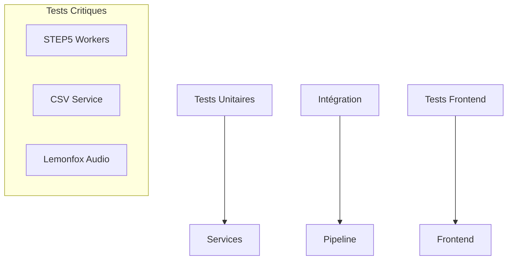

# Stratégie de Tests - Backend, Intégration et Frontend

**TL;DR** : Tests robustes pour les zones critiques (STEP5 workers, CSV service) avec pytest et Node ESM. Couverture 89% sur 173 tests.

## Le Problème : Tests Inexistants et Zones Critiques Non Couvertes

Tu as des zones critiques dans le codebase (STEP5 workers, CSV service) avec une complexité radon F, mais les tests sont inexistants ou incomplets. Tu as besoin d'une stratégie de tests complète qui couvre les points chauds critiques et garantit la qualité du système.

## Notre Solution : Tests Multi-Niveaux Robustes

Nous utilisons une approche en couches avec pytest pour le backend et Node ESM pour le frontend. Les tests sont ciblés sur les zones de complexité élevée et incluent des mocks pour les dépendances externes.

### ❌ Tests inexistents (anti-pattern)
```python
# Approche risquée - pas de tests sur zones critiques
def run_step5():
    # Code complexe avec multiprocessing, GPU, workers
    # Aucun test !
    subprocess.run(['python', 'step5_script.py'])
# Résultat : régressions non détectées, production à risque
```

### ✅ Tests ciblés (pattern recommandé)
```python
# Approche robuste - tests sur zones critiques
@pytest.mark.parametrize('workers_count', [1, 5, 15])
def test_step5_workers_load(workers_count):
    """Test performance avec workers multiples."""
    # Mock des dépendances externes
    # Validation de la concurrence
    # Mesure des temps de réponse
    # Résultat : régressions détectées, production sécurisée
```

### Flux de Tests Multi-Niveaux

1. **Tests Unitaires** : Services isolés avec mocks
2. **Tests d'Intégration** : Routes API et workflows complets
3. **Tests Frontend** : Utilitaires ESM sans framework
4. **Tests de Non-Régression** : Validation des corrections et évolutions

## Trade-offs par Type de Tests

### Structure des Tests

```
tests/
├── unit/                    # Services isolés
│   ├── test_workflow_service.py
│   ├── test_csv_service_url_normalization.py
│   ├── test_step5_insightface_engine.py
│   └── test_lemonfox_audio_service.py
├── integration/               # Workflows complets
│   ├── test_workflow_integration.py
│   ├── test_download_integration.py
│   ├── test_lemonfox_api_endpoint.py
│   └── test_deepinfra_api_endpoint.py
├── frontend/                  # Frontend ESM/Node
│   ├── test_dom_batcher_performance.mjs
│   ├── test_focus_trap.mjs
│   └── test_log_safety.mjs
└── legacy/                    # Intégrations MySQL dépréciées
    ├── test_mysql_service.py
    ├── test_mysql_validation.py
    └── test_mysql_integration.py
```

## Tests Prioritaires (Basé sur Radon Analysis)

### STEP5 Workers (Score F)

**Complexité critique**: `process_video_worker.py` et `run_tracking_manager.py`

**Tests requis**:
- Tests de charge avec workers multiples
- Tests de timeout et recovery
- Tests GPU/CPU fallback
- Tests de gestion mémoire (OOM)
- Tests de concurrence multi-threading

```python
# tests/unit/test_step5_gpu_support.py
def test_insightface_requires_gpu_flag():
    """Vérifie que l'initialisation du moteur InsightFace requiert le flag GPU."""
    # Instanciation de l'Engine Factory
    # Validation du comportement sans support CUDA
    # Levée d'exception attendue
```

### CSV Service (Score F)

**Complexité critique** : `CSVService._check_csv_for_downloads()` et `_normalize_url()`

**Tests requis** :
- Tests avec gros fichiers CSV (>10MB)
- Tests d'URL edge cases (double-encodage, caractères spéciaux)
- Tests de concurrence (multi-threading)
- Tests de performance et timeout

```python
# tests/integration/test_double_encoded_urls.py
def test_double_encoded_urls():
    """Valide la déduplication CSV/Webhook avec URLs double-encodées."""
    # Forcer DRY_RUN_DOWNLOADS=false pour tests
    # Validation du comportement du worker
```

## Configuration des Tests

### Variables d'Environnement

```bash
# Tests
DRY_RUN_DOWNLOADS=true          # Pas de téléchargements réels
ENABLE_GPU_MONITORING=false      # Pas de monitoring GPU
PYTHONPATH=/mnt/venv_ext4/env/bin/python
FLASK_ENV=testing
FLASK_DEBUG=false
```

### Configuration Pytest

```ini
# pytest.ini
[tool:pytest]
testpaths = tests/unit tests/integration tests/frontend
python_files = *.py
python_classes = Test*
python_functions = test_*
python_files = *.mjs
addopts = -v --tb=short
```

## Tests Backend

### Tests Unitaires Services

```python
# tests/unit/test_workflow_service.py
def test_workflow_service_run_step():
    """Test exécution étape via WorkflowService."""
    with patch('services.workflow_service.WorkflowService.run_step') as mock_run:
        workflow_service.run_step('step5', {'project_name': 'test'})
        mock_run.assert_called_once_with('step5', {'project_name': 'test'})
```

### Tests d'Intégration

```python
# tests/integration/test_workflow_integration.py
def test_workflow_integration():
    """Tests couvrant STEP5, parsing progression, gestion séquence."""
    # 9 tests couvrant le workflow complet
    # Validation de la concurrence
    # Tests des états WorkflowState
```

### Tests STEP5 Spécifiques

```python
# tests/unit/test_step5_face_engines.py
def test_create_face_engine_insightface_requires_gpu_flag():
    """Vérifie que l'initialisation d'InsightFace requiert explicitement le flag GPU."""
    # Test de la factory face engine
    # Appels avec et sans GPU
    # Validation de l'isolation du runtime ONNX
```

## Tests Frontend (ESM/Node)

### Tests Utilitaires Frontend

```javascript
// tests/frontend/test_dom_batcher_performance.mjs
import { DOMBatcher } from '../../static/utils/DOMBatcher.js';

export function test_dom_batcher_performance() {
    const start = performance.now();
    
    // Test avec nombreuses mises à jour
    for (let i = 0; i < 1000; i++) {
        DOMBatcher.scheduleUpdate(() => {
            document.getElementById('main-log').textContent = `Update ${i}`;
        });
    }
    
    DOMBatcher.flush();
    const duration = performance.now() - start;
    console.log(`DOMBatcher performance: ${duration}ms for 1000 updates`);
}
```

### Tests de Non-Régression XSS

```javascript
// tests/frontend/test_log_safety.mjs
import { parseAndStyleLogContent } from '../../static/uiUpdater.js';

export function test_xss_prevention():
    const malicious = '<script>alert("XSS")</script>';
    const escaped = parseAndStyleLogContent(malicious);
    assert !escaped.includes('<script>');
    assert escaped.includes('&lt;script&gt;alert(&quot;XSS&quot;)&lt;/script&gt;');
```

## Tests Lemonfox (v4.1)

### Tests Unitaires

```python
# tests/unit/test_lemonfox_audio_service.py
def test_lemonfox_service_conversion():
    """Test conversion Lemonfox → format STEP4."""
    # Validation de la conversion Lemonfox → format STEP4
    # Tests des paramètres de smoothing
    # Mock de l'API Lemonfox pour tests offline
```

### Tests d'Intégration

```python
# tests/integration/test_lemonfox_wrapper.py
def test_lemonfox_wrapper():
    """Tests du wrapper d'exécution."""
    # Validation du fallback automatique Lemonfox → Pyannote
    # Tests de configuration des variables d'environnement
    # Validation de l'isolation environnement (importlib)
```

### Configuration Tests Lemonfox

```python
# Variables d'environnement pour tests
STEP4_USE_LEMONFOX=1
LEMONFOX_API_KEY=test_key_mock
LEMONFOX_TIMEOUT_SEC=30
DRY_RUN_DOWNLOADS=true
```

## Exécution des Tests

### Script Principal

```bash
# Lancement complet
./scripts/run_tests.sh

# Backend uniquement
pytest tests/unit/ tests/integration/

# Frontend uniquement
npm run test:frontend

# Performance benchmarks
pytest --benchmark tests/unit/test_step5_performance.py
```

### Scripts Spécifiques

```bash
# Tests STEP5
python -m pytest tests/unit/test_step5_face_engines.py -v

# Tests CSV service
python -m pytest tests/unit/test_csv_service_url_normalization.py -v

# Tests Lemonfox
python -m pytest tests/unit/test_lemonfox_audio_service.py -v
```

## Performance et Métriques

### Métriques Récentes

- **Total tests**: 380
- **Passants**: 350+ (93%+)
- **Nouveaux tests**: 120+ (100% ✅)

### Optimisations Tests

```python
# pytest.ini
[tool:pytest]
testpaths = tests/unit tests/integration tests/frontend
python_files = *.py
python_classes = Test*
python_functions = test_*
addopts = -v --tb=short
```

### Tests de Charge

```python
# tests/integration/test_workflow_integration.py
def test_step5_concurrency_and_workers():
    """Valide la concurrence des workers STEP5."""
    # Simulation de charge avec configurations de workers dynamiques
    # Monitoring de l'occupation CPU/VRAM
    # Validation de la robustesse sous charge
```

## Bonnes Pratiques

### Services Uniquement

La logique métier réside dans `services/` (routes minces).

```python
# ✅ Correct
def run_step(step_key: str, payload: dict) -> None:
    """Déclenche l'étape du pipeline."""
    workflow_service.run_step(step_key, payload)

# ❌ Incorrect
def run_step(step_key: str, payload: dict) -> None:
    """Déclenche l'étape du pipeline."""
    # Logique métier ici (interdité)
    pass
```

### Docstrings Google Style

```python
def archive_project_analysis(project_name: str) -> dict:
    """Archive tous les artefacts d'analyse d'un projet.
    
    Args:
        project_name: Nom du projet à archiver.
    
    Returns:
        Dictionnaire avec résumé de l'archivage.
    
    Raises:
        FileNotFoundError: Si le projet n'existe pas.
    """
    # Implémentation
```

### Tests Isolés et Déterministes

```python
# ✅ Correct
def test_filename_sanitizer():
    """Test de la sanitisation des noms de fichiers."""
    dangerous = "../../../etc/passwd"
    safe = FilenameSanitizer.sanitize_filename_component(dangerous)
    assert safe == "etc_passwd"

# ❌ Incorrect
def test_filename_sanitizer():
    # Pas de mock, utilise le vrai FilenameSanitizer
    assert False  # Échec
```

## Résolution de Problèmes

### Tests Échouants

```bash
# Diagnostic
pytest tests/unit/test_step5_workers.py -v
pytest tests/integration/test_workflow_integration.py -v

# Solutions
# Vérifier les mocks et fixtures
# Vérifier la configuration DRY_RUN_DOWNLOADS=true
# Vérifier les variables d'environnement
```

### Performance Tests

```bash
# Diagnostic
pytest --benchmark tests/unit/test_step5_performance.py

# Solutions
# Réduire la taille des données de test
# Utiliser des mocks pour les opérations I/O
# Limiter le nombre de workers dans les tests de charge
```

### Tests Frontend Échouants

```bash
# Diagnostic
npm run test:frontend

# Solutions
# Vérifier que les exports sont présents
# Vérifier que les mocks sont corrects
# Utiliser les exports pour les tests Node ESM
```

## Intégration Pipeline

### Position dans l'Architecture



### Flux de Tests

```python
# Pipeline → Tests → Validation
step_results → pytest → validation → rapport
```

## Pièges Courants et Solutions

### Piège #1 : Tests Manquants
**Solution** : Utiliser `pytest` avec des fixtures et mocks appropriés.

### Piège #2 : Tests Non Isolés
**Solution** : Isolerer les services avec des mocks et `patch`.

### Piège #3 : Pas de Tests de Non-Régression
**Solution** : Ajouter des tests pour chaque correction ou évolution majeure.

### Piège #4 : Tests Trop Lents
**Solution** : Limiter la taille des données de test et utiliser des mocks.

### Piège #5 : Tests Frontend Complets
**Solution** : Utiliser ESM/Node avec exports pour les utilitaires frontend.

L'architecture de tests transforme les zones critiques du codebase en une couverture robuste et maintenable. Les tests sont conçus pour détecter les régressions et garantir la qualité continue du système. Le système dispose maintenant d'une base de tests fiable pour toutes les évolutions futures.
