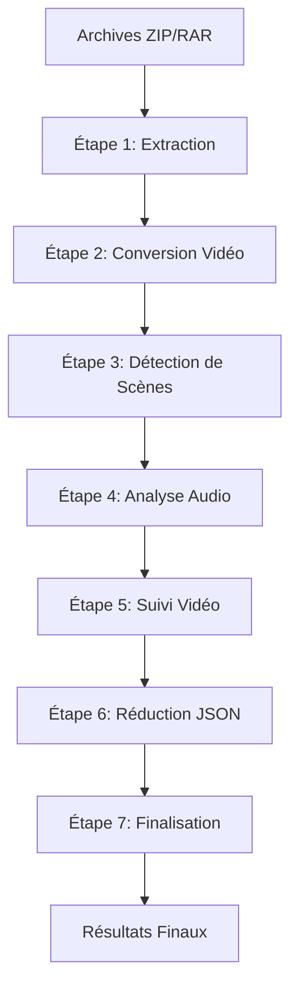

# Vue d'Ensemble - Workflow MediaPipe v4.2

> **Workflow MediaPipe** est un système complet d'analyse vidéo automatisée qui traite les fichiers vidéo à travers un pipeline modulaire en 7 étapes. Le système combine des technologies de vision par ordinateur, d'analyse audio et de traitement des données pour générer des métadonnées riches utilisables dans After Effects.

## Architecture du Système

### Backend (Flask + Services)
- **Framework** : Flask avec architecture orientée services
- **Logique métier** : Découplée dans `services/` (WorkflowState, DownloadService, etc.)
- **Configuration** : Centralisée via `WorkflowCommandsConfig` et `WorkflowState`
- **Sécurité** : Validation des entrées, échappement XSS, gestion sécurisée des fichiers

### Frontend (JavaScript Natif)
- **État centralisé** : `AppState` avec gestion immutable
- **Performance** : `DOMBatcher` pour les mises à jour groupées
- **Accessibilité** : Focus trap, navigation clavier, ARIA
- **Sécurité** : `DOMUpdateUtils.escapeHtml()` pour tout contenu dynamique

### Pipeline de Traitement



## Les 7 Étapes du Workflow

### Étape 1 - Extraction d'Archives
Extrait de manière sécurisée les archives (ZIP, RAR, TAR) dans des environnements isolés avec validation des fichiers et détection de menaces.

### Étape 2 - Conversion Vidéo  
Standardise toutes les vidéos à 25 FPS en utilisant FFmpeg avec accélération GPU/CPU, compression optimisée et validation des formats.

### Étape 3 - Détection de Scènes
Utilise TransNetV2 (PyTorch) pour identifier les changements de scène et générer des fichiers CSV avec les timestamps des transitions.

### Étape 4 - Analyse Audio
Effectue la diarisation des locuteurs via Pyannote.audio ou Lemonfox API, avec extraction des timestamps et identification des voix.

### Étape 5 - Analyse du Tracking
Détecte et suit les objets et personnes dans chaque image, en utilisant des algorithmes de vision par ordinateur avancés (MediaPipe, OpenSeeFace, YuNet, etc.).

### Étape 6 - Réduction JSON
Optimise les fichiers JSON générés pendant les étapes d'analyse vidéo et audio pour n'inclure que les données essentielles requises par After Effects.

### Étape 7 - Finalisation
Rassemble tous les résultats des analyses précédentes et prépare le matériel pour l'importation dans After Effects.

## Fonctionnalités Clés

### Monitoring Système
- **Surveillance en temps réel** : CPU, RAM, GPU via `/api/system_monitor`
- **Diagnostics intégrés** : Modale avec versions logicielles et configuration
- **Logs structurés** : Fichiers de logs par étape avec formatage standardisé

### Gestion des Téléchargements
- **Source Webhook** : Monitoring automatique via JSON externe
- **Support multi-sources** : Dropbox, FromSmash, SwissTransfer
- **Historique structuré** : `{url, timestamp}` avec déduplication

### Archivage des Résultats
- **Stockage persistant** : Hash SHA-256 pour l'intégrité
- **Métadonnées complètes** : Provenance, timestamps, configuration
- **Accès rapide** : Interface de recherche et de récupération

### Sécurité et Performance
- **Mode CPU-only par défaut** : Stabilité v4.1 avec 15 workers STEP5
- **Support GPU optionnel** : InsightFace avec validation VRAM (v4.2)
- **Protection XSS** : Échappement systématique des contenus dynamiques
- **Tests automatisés** : Suite pytest + Node/ESM complète

## Environnements Virtuels Spécialisés

| Environnement | Usage | Dépendances principales |
|---------------|-------|------------------------|
| `env/` | Flask + Steps 1,2,6,7 | Flask, FFmpeg, utils |
| `transnet_env/` | Step 3 (Scènes) | PyTorch, TensorFlow |
| `audio_env/` | Step 4 (Audio) | Pyannote, Torch Audio |
| `tracking_env/` | Step 5 (Tracking) | MediaPipe, OpenCV |
| `eos_env/` | Step 5 (EOS 3DMM) | eos-py, scipy |

## Configuration Principale

### Variables Essentielles (.env)
```bash
# Base
FLASK_SECRET_KEY=your-secret-key
FLASK_HOST=0.0.0.0
FLASK_PORT=5000

# Monitoring
WEBHOOK_JSON_URL=https://webhook.kidpixel.fr/data/webhook_links.json

# STEP5 (Tracking)
TRACKING_DISABLE_GPU=1          # CPU-only par défaut
TRACKING_CPU_WORKERS=15         # Workers internes
STEP5_TRACKING_ENGINE=mediapipe_landmarker

# STEP4 (Audio)
STEP4_USE_LEMONFOX=0           # Pyannote par défaut
```

## Points d'Intégration

### API Endpoints
- `/api/system_monitor` : État système en temps réel
- `/api/step_status/{step}` : Statut d'une étape
- `/api/run/{step}` : Exécution d'une étape
- `/api/system/diagnostics` : Informations système complètes

### Services Backend
- `WorkflowState` : Gestion centralisée de l'état
- `DownloadService` : Gestion des téléchargements
- `PerformanceService` : Instrumentation des API
- `ResultsArchiver` : Archivage des résultats

### Frontend Utils
- `AppState` : Gestion d'état centralisée
- `DOMBatcher` : Mises à jour DOM performantes
- `PollingManager` : Polling adaptatif avec backoff
- `ErrorHandler` : Gestion unifiée des erreurs

## Documentation Complémentaire

- **Guide de démarrage rapide** : `core/GUIDE_DEMARRAGE_RAPIDE.md`
- **Architecture complète** : `core/ARCHITECTURE_COMPLETE_FR.md`
- **Référence développeurs** : `core/REFERENCE_RAPIDE_DEVELOPPEURS.md`
- **Détails des étapes** : `pipeline/STEP*_*.md`
- **Fonctionnalités** : `features/*.md`

## Standards de Qualité

- **Tests** : Couverture complète avec pytest (backend) et Node/ESM (frontend)
- **Sécurité** : Audit XSS complet, validation des entrées, gestion sécurisée des fichiers
- **Performance** : Mode CPU optimisé, support GPU optionnel, DOM batching
- **Accessibilité** : ARIA complète, navigation clavier, focus management
- **Maintenabilité** : Code modulaire, documentation exhaustive, logs structurés