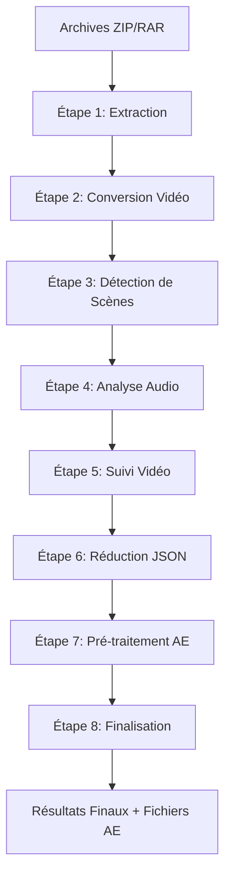

# Vue d'Ensemble - Workflow MediaPipe v4.2

> **Code-Doc Metrics** – 113 files, 27 573 LOC (Python 14 967, JavaScript 5 643, CSS 3 594); complexity moyenne **D (23.5)**, points chauds dans CSV/STEP5 workers. See `cloc_stats.json` and `complexity_report.txt` for detailed analysis.

> **Workflow MediaPipe** est un système complet d'analyse vidéo automatisée qui traite les fichiers vidéo à travers un pipeline modulaire en **8 étapes**. Le système combine des technologies de vision par ordinateur, d'analyse audio et de traitement des données pour générer des métadonnées riches optimisées pour After Effects.

## Architecture Snapshot (Code-Doc Analysis)

### Documentation Structure
```
docs/workflow/
├── admin/                     # Administration & audits (5 files)
├── config/                    # Configuration & deployment (3 files)
├── core/                      # Core documentation (4 files)
├── features/                  # Feature documentation (2 files)
├── lemonfox-ai/               # Lemonfox AI integration (1 file)
├── pipeline/                  # 7-step pipeline docs (11 files)
├── technical/                 # Technical deep-dives (9 files)
├── README.md                  # This file
└── overview.md                # System overview
```

### Code Metrics Summary
- **Total Files**: 113 fichiers actifs (Python 54, JavaScript 24, CSS 17, etc.)
- **Primary Languages**: Python (14 967 LOC), JavaScript (5 643 LOC), CSS (3 594 LOC)
- **Complexity Distribution**:
  - **Critical (F)**: CSV monitoring, STEP5 workers, STEP6 JSON reducer
  - **High (E/D)**: STEP3 TransNet, STEP5 InsightFace engine, Lemonfox audio
  - **Moderate (C)**: STEP2 conversion, STEP4 audio analysis, STEP7/8 finalization
  - **Low (A/B)**: STEP1 extraction, services core

---

### Backend (Flask + Services)
- **Framework** : Flask avec architecture orientée services
- **Logique métier** : Découplée dans `services/` (WorkflowState, DownloadService, etc.)
- **Configuration** : Centralisée via `WorkflowCommandsConfig` et `WorkflowState`
- **Sécurité** : Validation des entrées, échappement XSS, gestion sécurisée des fichiers

### Frontend (JavaScript Natif)
- **État centralisé** : `AppState` avec gestion immutable
- **Performance** : `DOMBatcher` pour les mises à jour groupées
- **Accessibilité** : Focus trap, navigation clavier, ARIA
- **Sécurité** : `DOMUpdateUtils.escapeHtml()` pour tout contenu dynamique

### Pipeline de Traitement


```mermaid
graph TD
    A[Archives ZIP/RAR] --> B[Étape 1: Extraction]
    B --> C[Étape 2: Conversion Vidéo]
    C --> D[Étape 3: Détection de Scènes]
    D --> E[Étape 4: Analyse Audio]
    E --> F[Étape 5: Suivi Vidéo]
    F --> G[Étape 6: Réduction JSON]
    G --> H[Étape 7: Pré-traitement AE]
    H --> I[Étape 8: Finalisation]
    I --> J[Résultats Finaux + Fichiers AE]
```

## Les 8 Étapes du Workflow

### Étape 1 - Extraction d'Archives
Extrait de manière sécurisée les archives (ZIP, RAR, TAR) dans des environnements isolés avec validation des fichiers et détection de menaces.

### Étape 2 - Conversion Vidéo  
Standardise toutes les vidéos à 25 FPS en utilisant FFmpeg avec accélération GPU/CPU, compression optimisée et validation des formats.

### Étape 3 - Détection de Scènes
Utilise TransNetV2 (PyTorch) pour identifier les changements de scène et générer des fichiers CSV avec les timestamps des transitions.

### Étape 4 - Analyse Audio
Effectue la diarisation des locuteurs via Pyannote.audio ou Lemonfox API, avec extraction des timestamps et identification des voix.

### Étape 5 - Analyse du Tracking
Détecte et suit les visages dans chaque image avec deux moteurs optimisés :
- **MediaPipe (CPU)** : Moteur par défaut via `tracking_env_slim`, 478 landmarks + blendshapes ARKit
- **InsightFace (GPU)** : Mode optionnel via `insightface_env` quand `STEP5_ENABLE_GPU=1`, 5 landmarks + expressions faciales

### Étape 6 - Réduction JSON
Optimise les fichiers JSON générés pendant les étapes d'analyse vidéo et audio pour n'inclure que les données essentielles requises par After Effects. Produit `*_tracking.json` (source primaire pour AE) avec enrichissement analytics et alignement temporel.

### Étape 7 - Pré-traitement After Effects
Prépare et optimise les données JSON spécifiquement pour After Effects en générant des fichiers `*_ae.json` pré-indexés et structurés pour une lecture efficace dans les scripts AE.

### Étape 8 - Finalisation
Rassemble tous les résultats des analyses précédentes, archive les projets avec métadonnées complètes et prépare le matériel final pour la livraison.

## Fonctionnalités Clés

### Monitoring Système
- **Surveillance en temps réel** : CPU, RAM, GPU via `/api/system_monitor`
- **Diagnostics intégrés** : Modale avec versions logicielles et configuration
- **Logs structurés** : Fichiers de logs par étape avec formatage standardisé

### Gestion des Téléchargements
- **Source Webhook** : Monitoring automatique via JSON externe
- **Support multi-sources** : Dropbox, FromSmash, SwissTransfer
- **Historique structuré** : `{url, timestamp}` avec déduplication

### Archivage des Résultats
- **Stockage persistant** : Hash SHA-256 pour l'intégrité
- **Métadonnées complètes** : Provenance, timestamps, configuration
- **Accès rapide** : Interface de recherche et de récupération

### Sécurité et Performance
- **Mode CPU-only par défaut** : MediaPipe CPU via `tracking_env_slim` avec 15 workers
- **Support GPU optionnel** : InsightFace via `insightface_env` avec validation VRAM
- **Architecture simplifiée STEP5** : Seulement MediaPipe CPU + InsightFace GPU (moteurs legacy supprimés)
- **Protection XSS** : Échappement systématique des contenus dynamiques
- **Tests automatisés** : Suite pytest + Node/ESM complète

## Environnements Virtuels Spécialisés

| Environnement | Usage | Dépendances principales |
|---------------|-------|------------------------|
| `env/` | Flask + Steps 1,2,6,7,8 | Flask, FFmpeg, utils |
| `transnet_env/` | Step 3 (Scènes) | PyTorch, TensorFlow |
| `audio_env/` | Step 4 (Audio) | Pyannote, Torch Audio, Lemonfox |
| `tracking_env_slim/` | Step 5 (MediaPipe CPU) | MediaPipe, OpenCV (allégé) |
| `insightface_env/` | Step 5 (InsightFace GPU) | ONNX Runtime GPU, InsightFace |

## Configuration Principale

### Variables Essentielles (.env)
```bash
# Base
FLASK_SECRET_KEY=your-secret-key
FLASK_HOST=0.0.0.0
FLASK_PORT=5000

# Monitoring
WEBHOOK_JSON_URL=https://webhook.kidpixel.fr/data/webhook_links.json

# STEP5 (Tracking)
TRACKING_DISABLE_GPU=1          # CPU-only par défaut (MediaPipe)
TRACKING_CPU_WORKERS=15         # Workers internes
STEP5_TRACKING_ENGINE=          # Vide=MediaPipe, 'insightface'=GPU
STEP5_ENABLE_GPU=0              # Activer GPU pour InsightFace

# STEP4 (Audio)
STEP4_USE_LEMONFOX=0           # Pyannote par défaut
AUDIO_INCLUDE_SPEAKER_EMBEDDINGS=1  # Embeddings locuteurs pour AE
```

## Points d'Intégration

### API Endpoints
- `/api/system_monitor` : État système en temps réel
- `/api/step_status/{step}` : Statut d'une étape
- `/api/run/{step}` : Exécution d'une étape
- `/api/system/diagnostics` : Informations système complètes

### Services Backend
- `WorkflowState` : Gestion centralisée de l'état (thread-safe)
- `WorkflowService` : Orchestrateur du pipeline (8 étapes)
- `DownloadService` : Gestion des téléchargements (SQLite)
- `PerformanceService` : Instrumentation des API
- `ResultsArchiver` : Archivage des résultats (SHA-256)
- `VisualizationService` : Métriques et rapports HTML
- `CSVService` : Monitoring webhook (download_history.sqlite3)

### Frontend Utils
- `AppState` : Gestion d'état centralisée
- `DOMBatcher` : Mises à jour DOM performantes
- `PollingManager` : Polling adaptatif avec backoff
- `ErrorHandler` : Gestion unifiée des erreurs

## Documentation Complémentaire

- **Guide de démarrage rapide** : `core/GUIDE_DEMARRAGE_RAPIDE.md`
- **Architecture complète** : `core/ARCHITECTURE_COMPLETE_FR.md`
- **Référence développeurs** : `core/REFERENCE_RAPIDE_DEVELOPPEURS.md`
- **Détails des étapes** : `pipeline/STEP*_*.md` (1-8)
- **Fonctionnalités** : `features/*.md`
- **Scripts After Effects** : `scripts/after_effects/*.jsx`

## Standards de Qualité

- **Tests** : Couverture complète avec pytest (backend) et Node/ESM (frontend)
- **Sécurité** : Audit XSS complet, validation des entrées, gestion sécurisée des fichiers
- **Performance** : Mode CPU optimisé, support GPU optionnel, DOM batching
- **Accessibilité** : ARIA complète, navigation clavier, focus management
- **Maintenabilité** : Code modulaire, documentation exhaustive, logs structurés