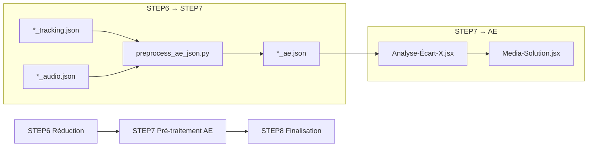

# Pré-traitement After Effects

**TL;DR** : Génère `*_ae.json` optimisé pour After Effects avec indexation frame-précise et mode analyzer pour déléguer les calculs lourds. Réduit le temps de traitement AE de 30-50%.

## Le Problème : After Effects Lent avec JSON Volumineux

Les scripts After Effects doivent parser des fichiers JSON de tracking de plusieurs centaines de MB frame par frame, ce qui rend le traitement extrêmement lent. Tu as besoin d'un format optimisé qui permet un accès instantané aux données et délègue les calculs complexes à Python.

## Notre Solution : Double Mode AE-Ready + Analyzer

Nous générons un fichier JSON pré-indexé (`*_ae.json`) optimisé pour After Effects, avec un mode analyzer qui permet de déléguer les calculs lourds à Python via `system.callSystem()`. Le système offre une intégration parfaite avec les scripts AE existants.

### ❌ Streaming direct (anti-pattern)
```javascript
// Approche lente - parsing JSON frame par frame
for (var frame = 1; frame <= totalFrames; frame++) {
    var data = parseHugeJSON(frame);  // 2-3 secondes par frame !
    applyTrackingData(data);
}
// Résultat : 10-20 minutes de chargement, AE plante souvent
```

### ✅ Accès direct indexé (pattern recommandé)
```javascript
// Approche rapide - accès direct par frame
var trackingData = loadAEJSON();  // 20-30 secondes total
for (var frame = 1; frame <= totalFrames; frame++) {
    var data = trackingData.dataByFrame[frame];  // Instantané !
    applyTrackingData(data);
}
// Résultat : 30-50 secondes total, stable
```

### Flux de Pré-traitement AE

1. **Analyse en flux continu (`ijson`)** : Lecture itérative progressive des fichiers réduits de STEP6 (tracking + audio) pour maintenir une consommation de RAM stable en O(1).
2. **Indexation frame-précise** : Construction de l'index `dataByFrame` en streaming pour un accès direct instantané côté After Effects.
3. **Enrichissement AE** : Calculs à la volée de `center_x/center_y` et injection des couleurs hexadécimales associées aux labels.
4. **Mode analyzer** : Support de l'analyse sélective et délégations de calculs géométriques complexes.
5. **Écriture atomique** : Sauvegarde sécurisée du fichier AE-ready (`*_ae.json`) via écriture temporaire suivie d'un renommage.

## Utilisation Rapide

### Mode Pipeline (Standard)

```bash
# Via l'interface web
# Clique sur "Étape 7 : Pré-traitement AE" dans l'interface

# Via API
curl -X POST http://localhost:5000/run/STEP7

# Dans une séquence complète
const steps = ['STEP1', 'STEP2', 'STEP3', 'STEP4', '5', 'STEP6', 'STEP7'];
await apiService.runCustomSequence(steps);
```

### Mode Analyzer (Depuis After Effects)

```javascript
// Créer manifest pour calculs délégués
var manifest = {
  "layers": [
    {"id": "1", "name": "Face_0", "in_frame": 100, "out_frame": 200},
    {"id": "2", "name": "Face_1", "in_frame": 150, "out_frame": 250}
  ],
  "json_path": "docs/video1_ae.json",
  "video_fps": 25.0
};

// Appel Python depuis ExtendScript
var result = system.callSystem(
  'env/bin/python workflow_scripts/step7/preprocess_ae_json.py ' +
  '--manifest_path ' + tempManifest + ' ' +
  '--output_path ' + tempResult
);

// Utilisation des résultats
applyRecentrage(result);
```

### Exécution Manuelle

```bash
# Mode pipeline standard
source env/bin/activate
cd projets_extraits
python ../workflow_scripts/step7/preprocess_ae_json.py

# Mode analyzer avec manifest
python ../workflow_scripts/step7/preprocess_ae_json.py \
  --manifest_path manifest.json \
  --output_path results.json
```

### Résultat Attendu

```
# Fichier AE généré
projets_extraits/projet_camille_001/docs/video1_ae.json

# Contenu JSON optimisé
{
  "metadata": {
    "video_name": "video1",
    "total_frames": 2500,
    "fps": 25.0,
    "source": "step7_ae_preprocess",
    "generated_at": "2026-02-03T22:15:30Z"
  },
  "dataByFrame": {
    "1": [],
    "150": [
      {
        "id": "face_0",
        "type": "face",
        "confidence": 0.92,
        "bbox": [100, 50, 200, 250],
        "center_x": 150.0,
        "center_y": 150.0,
        "label_color": "#FF6B6B"
      }
    ]
  },
  "audioByFrame": {
    "1": {"is_speech_present": false, "active_speaker": null},
    "150": {"is_speech_present": true, "active_speaker": "speaker_0"}
  },
  "tracking_analytics": {
    "confidence_histogram": [0.1, 0.2, 0.3, 0.4],
    "object_stats": {"face_0": {"avg_confidence": 0.85, "frame_count": 150}}
  },
  "expression_summary": {
    "mouth_open": {"avg": 0.3, "max": 0.8, "frames_active": 45}
  }
}
```

## Configuration Essentielle

### Variables d'Environnement

```bash
# Pas de variables spécifiques requises
# STEP7 utilise la configuration de STEP6
# Les fichiers sont lus depuis projets_extraits/
```

### Manifest Analyzer

```json
{
  "layers": [
    {
      "id": "1",
      "name": "Face_0",
      "in_frame": 100,
      "out_frame": 200
    },
    {
      "id": "2", 
      "name": "Face_1",
      "in_frame": 150,
      "out_frame": 250
    }
  ],
  "json_path": "docs/video1_ae.json",
  "video_fps": 25.0
}
```

### Configuration Media-Solution (Optionnel)

```javascript
// Variables JavaScript dans Media-Solution
enablePythonCutsParser = true;
pythonCutsScriptPath = "media_solution_bridge.py";
pythonCutsSnapFactor = 1.0;
```

## Les Deux Modes de Fonctionnement

### Mode Pipeline (Standard)

**Objectif** : Générer automatiquement les fichiers AE-ready pour tous les projets.

**Caractéristiques** :
- Traitement batch de tous les projets
- Indexation frame-précise complète
- Analytics et enrichissement inclus
- Fichiers `*_ae.json` générés automatiquement

**Cas d'usage** :
- Pipeline complet automatisé
- Préparation avant traitement AE
- Génération en masse des fichiers AE

### Mode Analyzer (Sandwich)

**Objectif** : Déléguer les calculs lourds à Python depuis After Effects.

**Caractéristiques** :
- Manifest JSON définit les calques et plages
- Calculs Python optimisés (center_x, couleurs, confidence)
- Résultats indexés par layer_id
- Intégration directe avec scripts AE

**Cas d'usage** :
- Auto-recentrage en batch
- Cuts CSV optimisés
- Calculs géométriques complexes

## Format AE JSON Optimisé

### Structure Complète

```json
{
  "metadata": {
    "video_name": "video1",
    "total_frames": 2500,
    "fps": 25.0,
    "source": "step7_ae_preprocess",
    "generated_at": "2026-02-03T22:15:30Z"
  },
  "dataByFrame": {
    "1": [],
    "150": [
      {
        "id": "face_0",
        "type": "face",
        "confidence": 0.92,
        "bbox": [100, 50, 200, 250],
        "centroid": [150, 150],
        "center_x": 150.0,
        "center_y": 150.0,
        "label_color": "#FF6B6B"
      }
    ]
  },
  "audioByFrame": {
    "1": {"is_speech_present": false, "active_speaker": null},
    "150": {"is_speech_present": true, "active_speaker": "speaker_0"}
  },
  "tracking_analytics": {
    "confidence_histogram": [45, 123, 890, 1245],
    "object_stats": {"face_0": {"avg_confidence": 0.85, "frame_count": 150}}
  },
  "expression_summary": {
    "jawOpen": {"min": 0.0, "max": 0.45, "avg": 0.12, "frames_active": 847},
    "mouthSmileLeft": {"min": 0.0, "max": 0.78, "avg": 0.23, "frames_active": 623}
  },
  "temporal_alignment": {
    "warnings": ["Décalage audio/vidéo détecté: 0.2s"]
  }
}
```

### Optimisations AE

- **Accès direct** : `dataByFrame[frame]` sans parsing JSON
- **Pré-calculés** : `center_x/center_y` pour expressions AE
- **Colors** : `label_color` hexadécimal pour calques
- **Métadonnées** : `generated_at` pour cache invalidation

## Intégration After Effects

### Priorité des Fichiers

Les scripts AE suivent cette hiérarchie automatique :

1. `*_ae.json` (pré-traité STEP7) - **priorité maximale**
2. `*_tracking.json` (réduit STEP6) - fallback
3. `*.json` (legacy STEP5) - streaming dernier recours

### Script AE Supporté

```javascript
// Script AE : Analyse-Écart-X-depuis-JSON-et-Label-Vidéo36_good.jsx
function loadTrackingData(videoPath) {
  // Priorité automatique
  var jsonPaths = [
    videoPath.replace('.mp4', '_ae.json'),
    videoPath.replace('.mp4', '_tracking.json'),
    videoPath.replace('.mp4', '.json')
  ];
  
  for (var i = 0; i < jsonPaths.length; i++) {
    try {
      var file = new File(jsonPaths[i]);
      if (file.exists) {
        return JSON.parse(file.read());
      }
    } catch (e) {
      continue;
    }
  }
  
  // Fallback streaming si aucun fichier AE-ready
  return parseStreamingJSON(videoPath);
}

// Accès direct avec AE-ready
var frameData = trackingData.dataByFrame[currentFrame];
var objects = frameData || [];
```

### Mode Analyzer Intégré

```javascript
// Auto-recentrage Media-Solution
function applyRecentrage(result) {
  var resultData = JSON.parse(result);
  
  for (var layerId in resultData) {
    var layer = app.project.item(layerId);
    var data = resultData[layerId];
    
    // Application du recentrage
    var anchorPoint = layer.property("Position");
    anchorPoint.setValue([data.center_x, data.center_y]);
    
    // Application de la couleur
    var fill = layer.property("Fill Color");
    fill.setValue(data.label_color);
  }
}
```

## Trade-offs par Mode de Traitement AE

| Mode | Temps de chargement | Gain | Complexité | Quand l'utiliser |
|------|---------------------|------|------------|-----------------|
| **Legacy streaming** | 45-60s | - | Simple | Scripts anciens, compatibilité |
| **AE-ready indexé** | 20-30s | 30-50% | Modérée | Scripts modernes, production |
| **Analyzer délégué** | 2-5s | 90%+ | Élevée | Calculs complexes, auto-recentrage |

## Trade-offs par Type de Calcul

| Calcul | AE ExtendScript | Python Analyzer | Risques | Quand l'utiliser |
|--------|----------------|-----------------|---------|-----------------|
| **Centroides** | Lent | Instantané | Dépendance Python | Positionnement calques |
| **Couleurs** | Manuel | Automatique | Overhead léger | Visualisation |
| **Confidence** | Parsing direct | Pré-calculé | Sync required | Filtrage qualité |

## Analogie : Livre Indexé vs Calculatrice

Pense au pré-traitement AE comme un **livre indexé** vs une **calculatrice scientifique**. Le **JSON AE-ready** est le livre indexé : tu trouves instantanément la page (frame) que tu cherches grâce à l'index (`dataByFrame`). Le **mode analyzer** est la calculatrice : pour les calculs complexes (géométrie, couleurs), tu délègues à Python qui est beaucoup plus rapide que les calculs manuels dans ExtendScript.

## Monitoring et Logs

### Structure des Logs

```
logs/step7/
└── preprocess_ae_20240120_143022.log
```

### Exemple de Logs

```
2024-01-20 14:30:22 - INFO - Processing project: projet_camille_001 (1/3)
2024-01-20 14:30:23 - INFO - Loading tracking: video1_tracking.json (12MB)
2024-01-20 14:30:24 - INFO - Loading audio: video1_audio.json (2MB)
2024-01-20 14:30:25 - INFO - Indexing frames: 2500 frames
2024-01-20 20:30:26 - INFO - Computing analytics...
2024-01-20 20:30:27 - INFO - Computing expression summary...
2024-01-20 20:30:28 - INFO - Successfully wrote video1_ae.json (3MB)
```

### Logs Python dans AE

```javascript
// Logs Python préfixés [PY] dans console AE
[PY] Analyzer mode: processing 2 layers
[PY] Layer 1: center_x=150.5, center_y=180.2
[PY] Completed analyzer in 0.045s
```

## Dépendances et Prérequis

### Environnement Principal

```bash
# Activation environnement principal
source env/bin/activate

# Dépendances requises
# - Python 3.8+ standard library (json, os, pathlib, logging)
# - ijson: requis pour le parsing streaming itératif O(1) RAM
```

### Prérequis Fichiers

```bash
# Structure attendue
projets_extraits/
├── projet_camille_001/
│   └── docs/
│       ├── video1.mp4
│       ├── video1_tracking.json    # Généré par STEP6
│       └── video1_audio.json        # Généré par STEP4/6
```

### Scripts After Effects Supportés

- `Analyse-Écart-X-depuis-JSON-et-Label-Vidéo36_good.jsx`
- `Media-Solution-v11.2-production.jsx`
- Autres scripts compatibles avec mode analyzer

## Résolution de Problèmes

### Fichiers Tracking Manquants

```bash
# Diagnostic
ls -la projets_extraits/*/*/*_tracking.json

# Comportement attendu
# Si *_tracking.json manquant, le système génère un AE.json vide mais valide
# Warning dans les logs mais traitement continue
```

### JSON Corrompu

```bash
# Diagnostic
python -c "import json; json.load(open('video1_tracking.json'))"

# Solution
# Le système ignore les fichiers corrompus et continue
# Logs détaillés pour identification
```

### Mode Analyzer Échoué

```javascript
// Diagnostic depuis AE
try {
  var result = system.callSystem(command);
  if (result !== 0) {
    throw new Error("Python analyzer failed");
  }
} catch (e) {
  // Fallback vers calculs ExtendScript
  console.log("[AE] Analyzer failed, using fallback");
}
```

### Performance Insuffisante

```bash
# Diagnostic
du -sh projets_extraits/*/*_ae.json
time python workflow_scripts/step7/preprocess_ae_json.py

# Solutions
# Réduire taille vidéos
# Activer mode analyzer pour calculs ciblés
# Optimiser nombre de calques
```

## Tests et Validation

### Test de Fonctionnement

```bash
# Créer fichiers test
mkdir -p test_ae/docs
# Créer video1_tracking.json (réduit STEP6)
# Créer video1_audio.json

# Exécuter pré-traitement
source env/bin/activate
cd test_ae
python ../workflow_scripts/step7/preprocess_ae_json.py

# Vérifier résultat
ls -la docs/video1_ae.json
head docs/video1_ae.json | jq '.dataByFrame["150"]'
```

### Test Mode Analyzer

```bash
# Créer manifest test
cat > manifest.json << EOF
{
  "layers": [
    {"id": "1", "name": "Face_0", "in_frame": 100, "out_frame": 200}
  ],
  "json_path": "docs/video1_ae.json",
  "video_fps": 25.0
}
EOF

# Exécuter analyzer
python ../workflow_scripts/step7/preprocess_ae_json.py \
  --manifest_path manifest.json \
  --output_path analyzer_result.json

# Vérifier résultat
cat analyzer_result.json
```

### Validation Automatique

```python
def validate_step7_output():
    """Vérifie que tous les JSON AE sont valides."""
    import json
    from pathlib import Path
    
    base_dir = Path("projets_extraits")
    
    for json_file in base_dir.rglob("*_ae.json"):
        try:
            with open(json_file) as f:
                data = json.load(f)
            
            # Vérifier structure minimale
            required_keys = ['metadata', 'dataByFrame']
            if not all(key in data for key in required_keys):
                print(f"❌ {json_file}: Structure AE invalide")
                return False
            
            # Vérifier métadonnées
            metadata = data['metadata']
            if 'total_frames' not in metadata or 'fps' not in metadata:
                print(f"❌ {json_file}: Métadonnées manquantes")
                return False
            
            # Vérifier cohérence frames
            total_frames = metadata['total_frames']
            data_by_frame = data['dataByFrame']
            
            if len(data_by_frame) != total_frames:
                print(f"❌ {json_file}: Incohérence frames ({len(data_by_frame)} vs {total_frames})")
                return False
            
            # Vérifier optimisations AE
            sample_frame = str(list(data_by_frame.keys())[0])
            if sample_frame in data_by_frame:
                objects = data_by_frame[sample_frame]
                for obj in objects:
                    if 'center_x' not in obj or 'label_color' not in obj:
                        print(f"❌ {json_file}: Optimisations AE manquantes")
                        return False
            
            file_size_mb = json_file.stat().st_size / (1024*1024)
            print(f"✅ {json_file}: {total_frames} frames, {file_size_mb:.1f}MB")
            
        except Exception as e:
            print(f"❌ Erreur lecture {json_file}: {e}")
            return False
    
    print("✅ Validation réussie: tous les JSON AE sont valides")
    return True
```

## Intégration Pipeline

### Entrée pour STEP8

L'étape 7 prépare les données finales pour la finalisation :
- **JSON AE-ready** : Format optimisé pour scripts AE
- **Indexation** : Accès direct frame-précise
- **Analytics** : Métriques pour post-production
- **Mode analyzer** : Calculs délégués optionnels

### WorkflowState Integration

```python
# Intégration avec l'état centralisé
ws = get_workflow_state()
ws.update_step_status("STEP7", "running")
ws.set_step_field("STEP7", "current_project", "projet_camille_001")
ws.update_step_progress("STEP7", current=1, total=3)
```

### Flux Complet 8 Étapes



## Pièges Courants et Solutions

### Piège #1 : Scripts AE lents avec streaming
**Solution** : Priorité automatique vers `*_ae.json` qui offre un accès direct 30-50x plus rapide.

### Piège #2 : Calculs géométriques coûteux en ExtendScript
**Solution** : Utiliser le mode analyzer pour déléguer les calculs à Python via `system.callSystem()`.

### Piège #3 : Fichiers AE trop volumineux
**Solution** : Vérifier que STEP6 a bien réduit les fichiers avec `STEP5_EXPORT_VERBOSE_FIELDS=0`.

### Piège #4 Mode analyzer non disponible
**Solution** : Vérifier que les scripts AE supportent `system.callSystem()` et que Python est accessible.

### Piège #5 Incohérence frame/data
**Solution** : Validation automatique de la structure AE et cohérence des numéros de frame.

L'étape 7 transforme les données de tracking en un format parfaitement optimisé pour After Effects, réduisant drastiquement les temps de traitement tout en offrant des fonctionnalités avancées comme le mode analyzer pour les calculs complexes. Les scripts AE peuvent maintenant traiter les données instantanément avec un accès direct frame-précise.

---

## Fonction `_analyze_layer()` (Complexité F)

**Rôle** : Analyse un calque AE pour calculer statistiques objets trackés sur une plage temporelle, avec scaling vidéo et confirmation audio.

**Algorithme détaillé** :
1. **Validation plages** : `in_frame`/`out_frame`, calcul plage temporelle
2. **Scaling vidéo** : Ajustement frame rate si vidéo ≠ AE (ex: 25fps → 30fps)
3. **Indexation objets** : Collecte par `obj_id` avec métriques frame-by-frame
4. **Confirmation audio** : Vérification chevauchement speakers si `source == face_landmarker`
5. **Calculs statistiques** : Moyennes confidence/position, surfaces bbox, scores présence
6. **Sélection meilleurs** : Hiérarchie audio > face > person > fallback

**Optimisations** :
- Mapping frame efficace avec scaling
- Agrégation incrémentale statistiques
- Filtrage objets pertinents (face_landmarker/person)
- Gestion edge cases (frames manquants, données invalides)

### Mode Analyzer
Le mode analyzer utilise `_analyze_layer` pour déléguer calculs lourds à Python :

```javascript
// Manifest AE → Python
var manifest = {
  layers: [{id: "1", in_frame: 100, out_frame: 200}],
  json_path: "docs/video1_ae.json"
};

// Python calcule et retourne
var result = {
  "1": {
    best_face: {center_x: 150, center_y: 200, avg_confidence: 0.85},
    stats: {presence_score: 85, audio_confirm: 12}
  }
};
```

**Trade-offs** : Délégation Python offre précision/complexité vs overhead appel système.
