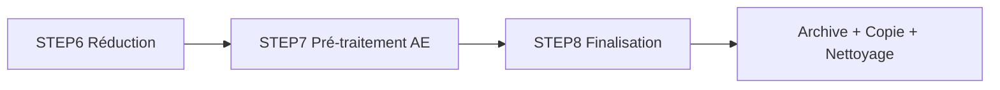
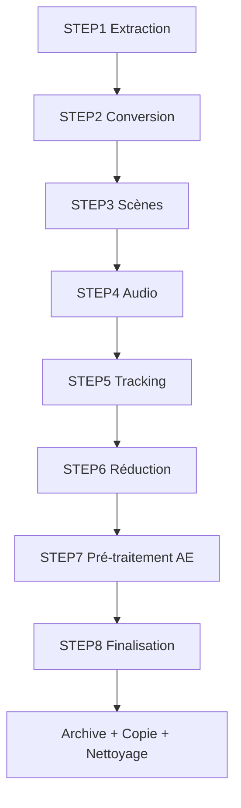

# Finalisation

**TL;DR** : Archive les résultats, copie les projets vers la destination finale, et nettoie les dossiers temporaires. Dernière étape du pipeline 8 étapes.

## Le Problème : Organisation et Nettoyage Final

Tu as terminé l'analyse complète de tes vidéos, mais les résultats sont dispersés dans plusieurs dossiers temporaires. Tu as besoin d'archiver les analyses importantes, copier les projets vers une destination finale, et nettoyer l'espace de travail pour la prochaine utilisation.

## Notre Solution : Finalisation Structurée en 3 Phases

Nous organisons la finalisation en trois phases clés : archivage des résultats, copie vers destination finale, et nettoyage sécurisé. Chaque phase est conçue pour garantir la préservation des données importantes tout en préparant le système pour le prochain traitement.

### ❌ Nettoyage brutal (anti-pattern)
```bash
# Approche dangereuse - tout supprimer
rm -rf projets_extraits/*  # Pertes de données !
cp -r * /destination/  # Pas de validation
# Résultat : projets incomplets, archives perdues
```

### ✅ Finalisation structurée (pattern recommandé)
```python
# Approche sûre - validation et préservation
def finalize_projects():
    # 1. Archivage avec métadonnées
    archive_results()
    # 2. Copie validée vers destination
    copy_to_output()
    # 3. Nettoyage sécurisé (archives protégées)
    cleanup_temporaries()
# Résultat : données préservées, système prêt
```

### Flux de Finalisation Structurée

1. **Archivage des résultats** : Sauvegarde des analyses dans `archives/` avec métadonnées complètes
2. **Copie finale** : Transfert des projets vers `OUTPUT_DIR` avec structure standardisée
3. **Nettoyage sécurisé** : Suppression des dossiers temporaires (hors `ARCHIVES_DIR`)

## Utilisation Rapide

### Lancement Automatique

```bash
# Via l'interface web
# Clique sur "Étape 8 : Finalisation" dans l'interface

# Via API
curl -X POST http://localhost:5000/run/STEP8

# Dans une séquence complète
const steps = ['STEP1', '2', '3', '4', '5', '6', '7', '8'];
await apiService.runCustomSequence(steps);
```

### Exécution Manuelle (Debug)

```bash
# Activation environnement principal
source env/bin/activate

# Exécution depuis projets_extraits
cd projets_extraits
python ../workflow_scripts/step8/finalize_and_copy.py

# Monitoring des logs
tail -f logs/step8/finalize_*.log
```

### Résultat Attendu

```
# Archives (préservation)
archives/
├── projet_camille_001_20240120_143022/
│   ├── video1.mp4
│   ├── video1.csv
│   ├── video1_audio.json
│   ├── video1_tracking.json
│   └── video1_ae.json

# Destination finale (copie)
/mnt/cache/projets_extraits/
├── projet_camille_001/
│   └── docs/
│       ├── video1.mp4
│       ├── video1.csv
│       ├── video1_audio.json
│       ├── video1_tracking.json
│       └── video1_ae.json
```

## Configuration Essentielle

### Variables d'Environnement

```bash
# Destination finale
OUTPUT_DIR=/mnt/cache/projets_extraits    # Répertoire final
FALLBACK_OUTPUT_DIR=/tmp/projets_extraits       # Repli si OUTPUT_DIR inaccessible

# Mode de finalisation
FINALIZE_MODE=lenient                 # lenient (défaut), strict, videos
RESTORE_ARCHIVES_TO_OUTPUT=1               # Inclure archives dans la copie finale

# Sécurité
ARCHIVES_DIR=archives                      # Répertoire archives (protégé)
```

### Modes de Finalisation

```bash
# Mode lenient (défaut)
FINALIZE_MODE=lenient
# - Archive tous les résultats disponibles
# - Copie tous les projets (même incomplets)
# - Nettoyage standard

# Mode strict
FINALIZE_MODE=strict
# - Archive uniquement les projets complets
# - Copie uniquement si toutes les étapes réussies
# - Erreur si projet incomplet

# Mode videos
FINALIZE_MODE=videos
# - Archive uniquement les vidéos brutes
# - Pas de copie des analyses
# - Nettoyage minimal
```

## Structure des Dossiers

### Avant Finalisation

```
projets_extraits/
├── projet_camille_001/
│   └── docs/
│       ├── video1.mp4
│       ├── video1.csv
│       ├── video1_audio.json
│       ├── video1_tracking.json
│       └── video1_ae.json
├── projet_camille_002/
│   └── docs/
│       └── video2.mov
└── archives/
```

### Après Finalisation

```
# Archives (préservation)
archives/
├── projet_camille_001_20240120_143022/
│   ├── video1.mp4
│   ├── video1.csv
│   ├── video1_audio.json
│   ├── video1_tracking.json
│   └── video1_ae.json
└── projet_camille_002_20240120_143022/
    └── docs/
        └── video2.mov

# Destination finale (copie)
/mnt/cache/projets_extraits/
├── projet_camille_001/
│   └── docs/
│       ├── video1.mp4
│       ├── video1.csv
│       ├── video1_audio.json
│       ├── video1 │       ├── video1_tracking.json
│       └── video1_ae.json
├── projet_camille_002/
│   └── docs/
│       └── video2.mov
```

## Trade-offs par Mode de Finalisation

| Mode | Préservation | Risques | Quand l'utiliser |
|------|-------------|---------|-----------------|
| **Lenient** (défaut) | Maximale | Données incomplets possibles | Développement, test |
| **Strict** | Qualité uniquement | Erreurs si projet incomplet | Production, livraison client |
| **Videos** | Médias bruts uniquement | Pertes analyses si besoin | Archivage média pur |

## Trade-offs par Destination

| Destination | Espace requis | Risques | Quand l'utiliser |
|-------------|---------------|---------|-----------------|
| **Local** | Disque local | Défaillance unique | Développement rapide |
| **NFS/Network** | Partage réseau | Latence, déconnexions | Équipe collaborative |
| **Cloud** | Illimité | Coût, bande passante | Production distribuée |

## Analogie : Bibliothécaire vs Déménageur

Pense à la finalisation comme un **bibliothécaire** vs un **déménageur**. Le **mode lenient** est le bibliothécaire : il archive tout, même les documents incomplets, pour ne rien perdre. Le **mode strict** est le déménageur professionnel : il ne déplace que les meubles complets et validés. L'**archivage** est la salle de réserves où les originaux sont conservés en sécurité, tandis que la **copie finale** est la nouvelle adresse où les projets sont installés.

## Monitoring et Logs

### Structure des Logs

```
logs/step8/
└── finalize_and_copy_20240120_143022.log
```

### Exemple de Logs

```
2024-01-20 14:30:22 - INFO - Starting finalization (lenient mode)
2024-01-20 14:30:23 - INFO - Found 2 projects to process
2024-2024-01-20 14:30:24 - INFO - Archiving project: projet_camille_001
2024-01-20 14:30:25 - INFO - Archive created: archives/projet_camille_001_20240120_143022/
2024-01-20 14:30:26 - INFO - Copying to destination: /mnt/cache/projets_extraits/
2024-01-20 14:30:27 - INFO - Cleaning up temporary directories
2024-01-20 14:30:28 - INFO - Finalization completed successfully
```

### Métriques Clés

```python
# Statistiques de traitement
logging.info(f"Projects processed: {success_count}/{total_count}")
logging.info(f"Archives created: {archive_count}")
logging.info(f"Files copied: {file_count}")
logging.info(f"Space saved: {space_saved_mb}MB")
```

## Sécurité et Contraintes

### Protection des Archives

```python
# Vérification avant suppression
def safe_cleanup(project_path: Path) -> bool:
    """Empêche la suppression du répertoire archives"""
    archives_dir = Path("archives")
    
    # Vérifie que le chemin n'est pas sous ARCHIVES_DIR
    try:
        project_path.resolve().relative_to(archives_dir)
        return False  # Chemin relatif à archives = danger
    except ValueError:
        return True   # Chemin absolu = autorisé
    
    return True
```

### Permissions NTFS/FUSE

```python
# Gestion des permissions
def copy_with_permissions(src: Path, dst: Path) -> None:
    """Copie avec gestion des permissions"""
    try:
        shutil.copy2(src, dst, preserve_metadata=True)
    except PermissionError:
        # Fallback sans préservation des permissions
        shutil.copy2(src, dst)
        logging.warning(f"Could not preserve permissions for {dst}")
```

### Validation des Données

```python
# Validation mode strict
def validate_project(project_path: Path) -> bool:
    """Validation stricte d'un projet"""
    required_files = ['*.mp4', '*.csv', '*_tracking.json']
    
    for pattern in required_files:
        if not list(project_path.glob(pattern)):
            logging.error(f"Missing required files: {pattern}")
            return False
    
    return True
```

## Résolution de Problèmes

### Permissions Insuffisantes

```bash
# Diagnostic
ls -la /mnt/cache/
sudo chown -R $USER:$USER /mnt/cache/
chmod -R 755 /mnt/cache/projets_extraits/

# Solution
# Utiliser FALLBACK_OUTPUT_DIR si OUTPUT_DIR inaccessible
FALLBACK_OUTPUT_DIR=/tmp/projets_extraits python workflow_scripts/step8/finalize_and_copy.py
```

### Espace Disque Insuffisant

```bash
# Diagnostic
df -h /mnt/cache/
du -sh projets_extraits/

# Solutions
# 1. Nettoyage des anciennes archives
find archives/ -name "*_202*" -mtime +30 -exec rm -rf {} \;

# 2. Compression des archives
find archives/ -name "*.tar.gz" -exec gzip -9 {} \;
```

### Mode Strict Trop Restrictif

```bash
# Diagnostic
# Vérifier projets incomplets
python -c "
from pathlib import Path
for project in Path('projets_extraits').iterdir():
    required = ['*.mp4', '*_tracking.json']
    missing = [p for p in required if not list(project.glob(p))]
    if missing:
        print(f'Incomplete project: {project.name} - Missing: {missing}')
"

# Solution
# Basculer vers mode lenient ou corriger les projets incomplets
FINALIZE_MODE=lenient python workflow_scripts/step8/finalize_and_copy.py
```

### Fichiers Manquants

```bash
# Comportement attendu
# Les fichiers manquants sont ignorés en mode lenient
# Erreur en mode strict

# Solution
# Vérifier la présence des fichiers requis avant finalisation
# Compléter les étapes manquantes si nécessaire
```

## Tests et Validation

### Test de Fonctionnement

```bash
# Créer projet test
mkdir -p test_final/docs
cp sample_video.mp4 test_final/docs/
cp sample_video.csv test_final/docs/
cp sample_audio.json test_final/docs/
cp sample_tracking.json test_final/docs/

# Exécuter finalisation
source env/bin/activate
cd test_final
python ../workflow_scripts/step8/feliz_and_copy.py

# Vérifier résultats
ls -la archives/
ls -la /mnt/cache/projets_extraits/
```

### Validation Automatique

```python
def validate_step8_output():
    """Vérifie que la finalisation est complète."""
    import json
    from pathlib import Path
    
    # Vérifier archives
    archives_dir = Path("archives")
    if not archives_dir.exists():
        print("❌ Répertoire archives non trouvé")
        return False
    
    # Vérifier destination
    output_dir = Path(os.getenv('OUTPUT_DIR', '/mnt/cache/projets_extraits'))
    if not output_dir.exists():
        print(f"❌ Destination {output_dir} non trouvée")
        return False
    
    # Compter les projets
    projects = list(Path('projets_extraits').iterdir())
    if not projects:
        print("❌ Aucun projet trouvé dans projets_extraits/")
        return False
    
    print(f"✅ Validation réussie: {len(projects)} projets finalisés")
    return True
```

### Test Performance

```bash
# Mesurer temps de traitement
time python workflow_scripts/step8/finalize_and_copy.py

# Comparer tailles avant/après
du -sh projets_extraits/
du -sh archives/
```

## Intégration Pipeline

### Position dans le Pipeline



### WorkflowState Integration

```python
# Intégration avec l'état centralisé
ws = get_workflow_state()
ws.update_step_status("STEP8", "running")
ws.set_step_field("STEP8", "current_project", "projet_camille_001")
ws.update_step_progress("STEP8", current=1, total=3)
```

### Flux Complet 8 Étapes



## Pièges Courants et Solutions

### Piège #1 : Permissions insuffisantes sur OUTPUT_DIR
**Solution** : Utiliser `FALLBACK_OUTPUT_DIR` ou corriger les permissions avec `chown/chmod`.

### Piège #2 : Espace disque insuffisant pour archives
**Solution** : Nettoyer les anciennes archives et compresser les plus volumineuses.

### Piège #3 : Mode strict trop restrictif
**Solution** : Basculer vers mode `lenient` ou corriger les projets incomplets avant finalisation.

### Piège #4 : Suppression accidentelle de données importantes
**Solution** : Protection du répertoire `archives/` et validation stricte en mode `strict`.

### Piège #5 : Fichiers corrompus dans les archives
**Solution** : Les fichiers corrompus sont ignorés mais journalisés, les archives restent valides.

L'étape 8 transforme l'espace de travail temporaire en une archive organisée et une copie finale propre, garantissant que toutes les analyses importantes sont préservées tout en préparant le système pour le prochain traitement. Le système offre une flexibilité maximale avec ses trois modes (lenient, strict, videos) pour s'adapter à différents cas d'usage.

---

## Golden Rule

**Archive avant de nettoyer ; sinon tu perds irrémédiablement des données importantes et tu ne pourras jamais les récupérer.**
