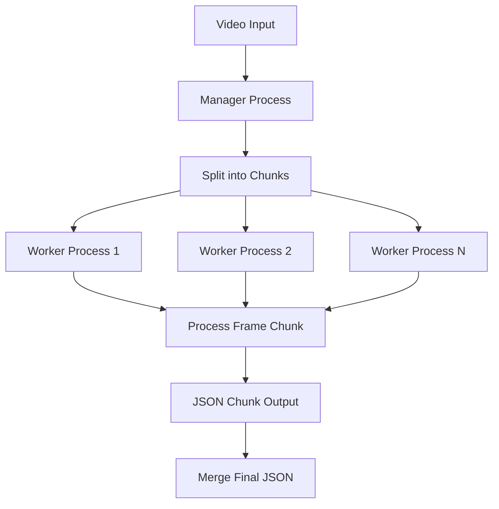

# STEP5 - Multiprocessing & Workers

> **Code-Doc Context** – Architecture multiprocessing critique avec complexité radon F. Voir `STEP5_SUIVI_VIDEO.md` pour le contexte global du pipeline.

---

## Purpose & Pipeline Role

### Objectif
Documentation de l'architecture multiprocessing de STEP5 permettant le traitement parallèle des vidéos avec plusieurs workers CPU/GPU pour des performances optimales.

### Rôle dans le Pipeline
- **Position** : Cœur de l'Étape 5 (STEP5)
- **Prérequis** : Vidéos standardisées (STEP2), configuration moteur
- **Sortie** : JSON dense traité en parallèle par chunks
- **Étape suivante** : Réduction JSON (STEP6)

---

## Architecture Multiprocessing

### Composants Principaux
```python
# workflow_scripts/step5/process_video_worker_multiprocessing.py
def process_video_multiprocessing(video_path: str, engine_name: str) -> None:
    """Point d'entrée multiprocessing principal."""
    
# workflow_scripts/step5/run_tracking_manager.py  
def launch_worker_process(engine_config: dict) -> subprocess.Popen:
    """Lancement des workers subprocess."""
```

### Flux Multiprocessing


---

## Complexité (Radon Analysis)

### Points Critiques (Score F/E/C)

#### `process_video_worker_multiprocessing.process_frame_chunk()` (Score F)
- **Complexité** : 315 lignes, gestion mémoire, synchronisation
- **Défis** : Chunking adaptatif, gestion OOM, coordination workers
- **Impact** : Performance globale du multiprocessing

#### `init_worker_process()` (Score F)
- **Complexité** : 96 lignes, initialisation worker, chargement config
- **Défis** : Chargement .env côté worker, setup moteur GPU/CPU
- **Impact** : Initialisation critique pour chaque worker

#### `process_video_multiprocessing()` (Score D)
- **Complexité** : 592 lignes, orchestration complète, gestion erreurs
- **Défis** : Coordination workers, merging JSON, timeout handling
- **Impact** : Fiabilité du traitement parallèle

#### `process_video_worker.main()` (Score F)
- **Complexité** : 399 lignes, worker principal, gestion frame par frame
- **Défis** : Boucle de traitement, logging, gestion exceptions
- **Impact** : Robustesse du worker individuel

#### `FrameProcessor.process_frame()` (Score E)
- **Complexité** : 114 lignes, traitement frame, détection faciale
- **Défis** : Appel moteur, formatage JSON, gestion erreurs
- **Impact** : Performance par frame du worker

---

## Configuration Workers

### Variables d'Environnement
```bash
# Workers CPU
TRACKING_CPU_WORKERS=15        # Nombre de workers (défaut)
TRACKING_DISABLE_GPU=1         # Forcer CPU-only (défaut v4.1)

# GPU optionnel (InsightFace uniquement)
STEP5_ENABLE_GPU=1
STEP5_GPU_ENGINES=insightface

# Profiling et Debug
STEP5_ENABLE_PROFILING=1      # Logs détaillés toutes les 20 frames
STEP5_BLENDSHAPES_THROTTLE_N=1
```

### WorkflowCommandsConfig Intégration
```python
# Configuration depuis WorkflowCommandsConfig
config = WorkflowCommandsConfig()
step5_config = config.get_step_config('step5')
workers = step5_config.get('cpu_workers', 15)
gpu_enabled = step5_config.get('enable_gpu', False)
```

---

## Pattern d'Initialisation

### Chargement .env Côté Worker
```python
def init_worker_process():
    """Initialisation worker avec configuration complète."""
    # CRITIQUE: Charger .env côté worker (processus isolé)
    from dotenv import load_dotenv
    load_dotenv()
    
    # Configuration depuis variables d'environnement
    workers = int(os.getenv('TRACKING_CPU_WORKERS', 15))
    profiling = os.getenv('STEP5_ENABLE_PROFILING', '0') == '1'
    
    # Initialisation moteur selon configuration
    engine = create_face_engine(engine_name, gpu_enabled)
```

### Lazy Import GPU
```python
def _ensure_mediapipe_loaded(required=True):
    """Évite les conflits TensorFlow dans tracking_env."""
    try:
        mediapipe = importlib.import_module("mediapipe")
        if required:
            # Configuration GPU si disponible
            if torch.cuda.is_available():
                mediapipe.solutions.face_mesh.FaceMesh(
                    max_num_faces=1,
                    refine_landmarks=True,
                    min_detection_confidence=0.5,
                    min_tracking_confidence=0.5
                )
        return mediapipe
    except ImportError as e:
        if required:
            raise
        return None
```

---

## Chunking & Performance

### Chunking Adaptatif
```python
def calculate_optimal_chunk_size(total_frames: int, num_workers: int) -> int:
    """Calcul taille optimale des chunks selon ressources."""
    # Base: 100 frames par chunk
    base_chunk = 100
    
    # Ajustement selon nombre de workers
    if num_workers > 10:
        chunk_size = max(50, base_chunk // 2)
    elif num_workers < 5:
        chunk_size = min(200, base_chunk * 2)
    else:
        chunk_size = base_chunk
    
    # Ajustement selon mémoire disponible
    available_memory = psutil.virtual_memory().available
    if available_memory < 4 * 1024**3:  # < 4GB
        chunk_size = min(chunk_size, 50)
    
    return chunk_size
```

### Synchronisation Workers
```python
def process_video_multiprocessing(video_path: str, engine_name: str):
    """Orchestration multiprocessing avec synchronisation."""
    
    # 1. Calcul chunks
    total_frames = get_video_frame_count(video_path)
    chunk_size = calculate_optimal_chunk_size(total_frames, workers)
    chunks = create_frame_chunks(total_frames, chunk_size)
    
    # 2. Lancement workers
    with multiprocessing.Pool(processes=workers) as pool:
        futures = []
        for chunk_id, (start_frame, end_frame) in enumerate(chunks):
            future = pool.apply_async(
                process_frame_chunk,
                args=(video_path, engine_name, start_frame, end_frame, chunk_id)
            )
            futures.append(future)
        
        # 3. Collecte résultats
        chunk_results = []
        for future in futures:
            try:
                result = future.get(timeout=300)  # 5min timeout
                chunk_results.append(result)
            except Exception as e:
                logger.error(f"Chunk failed: {e}")
                # Gestion erreur: fallback ou retry
```

---

## Optimisations Spécifiques

### Warmup OpenCV
```python
def warmup_video_capture(video_path: str):
    """Warmup du décodeur OpenCV avant seek."""
    cap = cv2.VideoCapture(video_path)
    
    # Warmup: lecture de quelques frames
    for _ in range(5):
        ret, frame = cap.read()
        if not ret:
            break
    
    # Reset au début
    cap.set(cv2.CAP_PROP_POS_FRAMES, 0)
    return cap
```

### Threading OpenCV
```python
def init_worker_process():
    """Configuration threading pour éviter contention."""
    # Force un seul thread OpenCV par worker
    cv2.setNumThreads(1)
    
    # Configuration PyTorch threading
    torch.set_num_threads(1)
    if torch.cuda.is_available():
        torch.cuda.set_per_process_memory_fraction(0.8)
```

### Profiling Intégré
```python
def process_frame_chunk(video_path, engine_name, start_frame, end_frame, chunk_id):
    """Traitement chunk avec profiling."""
    
    frame_count = 0
    profiling_interval = 20  # Log toutes les 20 frames
    
    for frame_num in range(start_frame, end_frame):
        start_time = time.time()
        
        # Traitement frame
        detections = engine.detect(frame, frame_num)
        
        # Profiling
        frame_count += 1
        if frame_count % profiling_interval == 0:
            elapsed = time.time() - start_time
            fps = profiling_interval / elapsed
            memory = psutil.Process().memory_info().rss / 1024**2
            
            logger.info(f"[PROFILING] Chunk {chunk_id}, "
                       f"Frame {frame_num}, "
                       f"FPS: {fps:.2f}, "
                       f"Memory: {memory:.1f}MB, "
                       f"Detections: {len(detections)}")
```

---

## Gestion des Erreurs

### Timeout & Retry
```python
def process_frame_with_timeout(engine, frame, frame_num, timeout=30):
    """Traitement frame avec timeout et retry."""
    try:
        # Timeout via signal (Unix) ou threading (Windows)
        result = call_with_timeout(engine.detect, timeout, frame, frame_num)
        return result
    except TimeoutError:
        logger.warning(f"Frame {frame_num} timeout, using empty result")
        return {"tracked_objects": []}
    except Exception as e:
        logger.error(f"Frame {frame_num} error: {e}")
        return {"tracked_objects": []}
```

### OOM Handling
```python
def handle_gpu_oom():
    """Gestion Out Of Memory GPU."""
    if torch.cuda.is_available():
        torch.cuda.empty_cache()
        logger.warning("GPU OOM detected, cache cleared")
        
        # Retry avec plus petit batch
        return retry_with_smaller_batch()
    return None
```

### Worker Crash Recovery
```python
def monitor_worker_health():
    """Surveillance santé des workers."""
    while True:
        for worker_id, process in worker_processes.items():
            if not process.is_alive():
                logger.error(f"Worker {worker_id} crashed, restarting")
                new_process = launch_worker_process(worker_config)
                worker_processes[worker_id] = new_process
        
        time.sleep(10)  # Check every 10 seconds
```

---

## Performance Monitoring

### Métriques Collectées
```python
class WorkerMetrics:
    def __init__(self):
        self.frames_processed = 0
        self.total_time = 0
        self.memory_peak = 0
        self.gpu_memory_used = 0
        self.errors_count = 0
    
    def log_frame_metrics(self, frame_time, memory_usage):
        """Enregistrement métriques par frame."""
        self.frames_processed += 1
        self.total_time += frame_time
        self.memory_peak = max(self.memory_peak, memory_usage)
        
        if torch.cuda.is_available():
            self.gpu_memory_used = max(
                self.gpu_memory_used,
                torch.cuda.memory_allocated() / 1024**2
            )
```

### Rapport de Performance
```python
def generate_performance_report(metrics: WorkerMetrics) -> dict:
    """Génération rapport de performance."""
    return {
        "total_frames": metrics.frames_processed,
        "average_fps": metrics.frames_processed / metrics.total_time,
        "peak_memory_mb": metrics.memory_peak,
        "peak_gpu_memory_mb": metrics.gpu_memory_used,
        "error_rate": metrics.errors_count / metrics.frames_processed,
        "worker_efficiency": calculate_efficiency(metrics)
    }
```

---

## Debugging & Maintenance

### Logs Spécifiques
```bash
# Logs manager multiprocessing
tail -f logs/step5/manager_tracking_*.log

# Logs workers individuels
tail -f logs/step5/worker_*_*.log

# Profiling data
grep "[PROFILING]" logs/step5/worker_*.log

# Erreurs workers
grep "ERROR\|CRASH" logs/step5/worker_*.log
```

### Tests Unitaires
```bash
# Tests multiprocessing
pytest tests/unit/test_step5_multiprocessing.py

# Tests workers
pytest tests/unit/test_process_video_worker.py

# Tests chunking
pytest tests/unit/test_frame_chunking.py

# Tests GPU/CPU switching
pytest tests/unit/test_step5_gpu_cpu_switching.py
```

### Validation Configuration
```python
def validate_multiprocessing_config():
    """Validation configuration multiprocessing."""
    workers = int(os.getenv('TRACKING_CPU_WORKERS', 15))
    
    # Vérification ressources
    cpu_count = multiprocessing.cpu_count()
    if workers > cpu_count * 2:
        logger.warning(f"Too many workers ({workers}) for CPU ({cpu_count})")
    
    # Vérification mémoire
    available_memory = psutil.virtual_memory().available
    memory_per_worker = available_memory / workers
    if memory_per_worker < 512 * 1024**2:  # < 512MB per worker
        logger.warning("Low memory per worker, consider reducing workers")
```

---

## Bonnes Pratiques

### Configuration Recommandée
```bash
# Production (CPU-only stable)
TRACKING_CPU_WORKERS=15
TRACKING_DISABLE_GPU=1
STEP5_ENABLE_PROFILING=0

# Développement (verbose)
TRACKING_CPU_WORKERS=4
STEP5_ENABLE_PROFILING=1
STEP5_BLENDSHAPES_THROTTLE_N=1

# GPU (expérimental)
STEP5_ENABLE_GPU=1
STEP5_GPU_ENGINES=insightface
STEP5_TRACKING_ENGINE=insightface
TRACKING_CPU_WORKERS=4  # Moins de workers CPU en mode GPU
```

### Monitoring Production
```bash
# Surveillance utilisation
watch -n 5 'ps aux | grep python | grep step5'

# Mémoire par worker
ps -o pid,ppid,cmd,%mem,%cpu -p $(pgrep -f step5)

# GPU usage (si activé)
nvidia-smi -l 1
```

### Performance Tips
1. **Warmup vidéo** : Toujours faire un warmup avant seek
2. **Threading limité** : `cv2.setNumThreads(1)` par worker
3. **Chunking adaptatif** : Ajuster selon mémoire disponible
4. **Profiling activé** : En développement pour identifier bottlenecks
5. **Lazy import** : Éviter les imports coûteux dans les workers tant que non nécessaires
