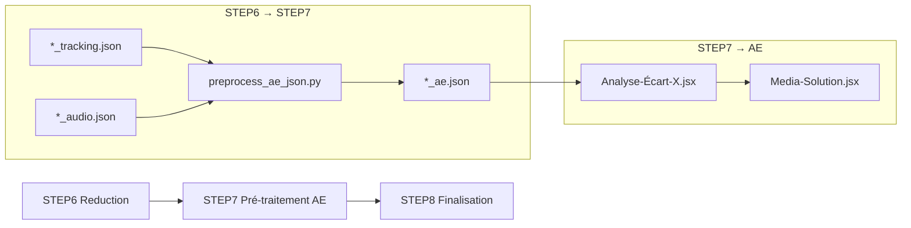

# Documentation Technique - Étape 7 : Pré-traitement AE (JSON optimisé)

> **Code-Doc Context** – Étape critique avec complexité radon F/E sur les méthodes principales (`_analyze_layer` F, `_index_reduced_tracking_frames` D), optimisation pour After Effects et mode analyzer sandwich.

---

## Purpose & Pipeline Role

### Objectif
L'Étape 7 produit un fichier JSON **pré‑traité** destiné à **After Effects** afin de réduire au maximum les calculs et le parsing côté ExtendScript.

Cette étape réutilise les sorties de STEP6 (`*_tracking.json` et `*_audio.json`) et génère un artefact unique, léger et directement consommable par le script After Effects :

- `*_ae.json`

### Rôle dans le Pipeline
- **Position** : après STEP6 (Réduction JSON)
- **Prérequis** : `*_tracking.json` (STEP6) ; `*_audio.json` (STEP6/STEP4) optionnel
- **Sortie** : `*_ae.json` (pré‑indexé), placé dans `docs/` à côté des médias
- **Étape suivante** : STEP8 (Finalisation)

### Valeur Ajoutée
- **Pré‑indexation** : `dataByFrame` pour accès direct frame→objets
- **Optimization AE** : Évite parsing streaming coûteux dans ExtendScript
- **Mode Analyzer** : Calculs lourds délégués à Python via `system.callSystem()`
- **Propagation Analytics** : Conserve `tracking_analytics`, `expression_summary`, `temporal_alignment`

---

## Architecture & Complexité

### Points Critiques (Score F/E)

#### `_analyze_layer()` (Score F)
- **Complexité** : 205 lignes, analyse calque After Effects
- **Défis** : Calculs géométriques, mapping frame→calque, validation
- **Impact** : Mode analyzer, performance critique pour AE

#### `_index_reduced_tracking_frames()` (Score D)
- **Complexité** : 509 lignes, indexation tracking par frame
- **Défis** : Parsing JSON STEP6, reconstruction index, optimisations mémoire
- **Impact** : Performance génération `*_ae.json`

#### `build_ae_payload()` (Score C)
- **Complexité** : 627 lignes, orchestration finale
- **Défis** : Fusion multi-sources, validation structure, écriture JSON
- **Impact** : Point d'entrée principal, cohérence données

---

## Inputs & Outputs

### Inputs
- `docs/<video_stem>_tracking.json` (prioritaire)
- `docs/<video_stem>.json` (fallback legacy si `_tracking.json` absent)
- `docs/<video_stem>_audio.json` (optionnel)

### Outputs
- `docs/<video_stem>_ae.json`

Le fichier `*_ae.json` contient notamment :
- `dataByFrame` : index par frame des objets pertinents (déjà filtrés)
- `audioByFrame` : index audio déjà prêt (si audio disponible)
- `tracking_analytics`, `expression_summary`, `temporal_alignment` (si présents en entrée)

---

## Schema AE JSON

### Structure Complète
```json
{
  "metadata": {
    "video_name": "video_stem",
    "total_frames": 3012,
    "fps": 25.0,
    "source": "step7_ae_preprocess",
    "generated_at": "2026-02-03T22:15:30Z"
  },
  "dataByFrame": {
    "1": [],
    "150": [
      {
        "id": "face_0",
        "type": "face",
        "confidence": 0.92,
        "bbox": [100, 50, 200, 250],
        "centroid": [150, 150],
        "center_x": 150.0,
        "center_y": 150.0,
        "label_color": "#FF6B6B"
      }
    ]
  },
  "audioByFrame": {
    "1": {"is_speech_present": false, "active_speaker": null},
    "150": {"is_speech_present": true, "active_speaker": "speaker_0"}
  },
  "tracking_analytics": {
    "confidence_histogram": [0.1, 0.2, 0.3, 0.4],
    "object_stats": {"face_0": {"avg_confidence": 0.85, "frame_count": 150}}
  },
  "expression_summary": {
    "mouth_open": {"avg": 0.3, "max": 0.8, "frames_active": 45}
  },
  "temporal_alignment": {
    "warnings": ["Décalage audio/vidéo détecté: 0.2s"]
  }
}
```

### Optimisations AE
- **Accès direct** : `dataByFrame[frame]` sans parsing
- **Pré‑calculés** : `center_x/center_y` pour expressions AE
- **Colors** : `label_color` hexadécimal pour calques
- **Métadonnées** : `generated_at` pour cache invalidation

---

## Command & Environment

### Commande (WorkflowCommandsConfig)
Exécution via `env` :

- script : `workflow_scripts/step7/preprocess_ae_json.py`
- logs : `logs/step7/`
- workdir : `projets_extraits/`

---

## Mode Analyzer (Sandwich)

L'Étape 7 expose aussi un mode "analyzer" destiné à être appelé par After Effects :

- Entrée : un manifest JSON (calques + in/out frames + `json_path`)
- Sortie : un petit JSON résultat indexé par `layer_id` (ex: `{"1": {"center_x": ..., "label_color": ...}}`)

Ce mode permet au script AE d'éviter la boucle coûteuse "calque × frames" en ExtendScript.

### Manifest Exemple
```json
{
  "layers": [
    {"id": "1", "name": "Face_0", "in_frame": 100, "out_frame": 200},
    {"id": "2", "name": "Face_1", "in_frame": 150, "out_frame": 250}
  ],
  "json_path": "docs/video_tracking.json",
  "video_fps": 25.0
}
```

### Résultat Analyzer
```json
{
  "1": {
    "center_x": 150.5,
    "center_y": 180.2,
    "label_color": "#FF6B6B",
    "avg_confidence": 0.87
  },
  "2": {
    "center_x": 320.1,
    "center_y": 240.8,
    "label_color": "#4ECDC4",
    "avg_confidence": 0.91
  }
}
```

### CLI

```bash
env/bin/python workflow_scripts/step7/preprocess_ae_json.py --manifest_path <manifest.json> --output_path <results.json>
```

---

## Notes After Effects

Le script After Effects `Analyse-Écart-X-depuis-JSON-et-Label-Vidéo36_good.jsx` priorise désormais :
1. `*_ae.json`
2. `*_tracking.json`
3. `*.json` legacy (streaming)

L'objectif est d'éviter le parsing streaming coûteux dans les cas où STEP7 a déjà produit un JSON AE‑ready.

### Intégration ExtendScript
```javascript
// Appel analyzer depuis AE
var manifest = {
  "layers": layers,
  "json_path": jsonFile,
  "video_fps": 25.0
};

var result = system.callSystem(
  'env/bin/python workflow_scripts/step7/preprocess_ae_json.py ' +
  '--manifest_path ' + tempManifest + ' ' +
  '--output_path ' + tempResult
);
```

---

## Performance & Optimisations

### Streaming vs Indexé
- **Legacy** : Parsing streaming ligne par ligne (coûteux)
- **AE-ready** : Accès direct `dataByFrame[frame]` (instantané)

### Memory Management
- **Chunking** : Lecture STEP6 par fragments pour gros fichiers
- **Cache** : Métadonnées vidéo en mémoire pour éviter re‑lecture
- **Cleanup** : Libération mémoire après chaque vidéo

### Profiling
```python
# Logs performance
logger.info(f"[STEP7] Processed {total_frames} frames in {elapsed:.2f}s")
logger.info(f"[STEP7] AE JSON size: {ae_json_size/1024/1024:.2f} MB")
```

---

## Gestion des Erreurs

### Validation Entrées
```python
def validate_tracking_json(tracking_path: str) -> None:
    """Validation structurelle JSON tracking"""
    required_keys = {"frames", "metadata", "total_frames"}
    # Validation schéma STEP6
```

### Fallbacks
- **Missing tracking** : JSON vide mais valide
- **Missing audio** : `audioByFrame` omis
- **Corrupted data** : Logs détaillés, passage au fichier suivant

---

## Tests & Validation

### Tests Unitaires
```python
def test_analyze_layer_complexity():
    """Test méthode F avec edge cases"""
    manifest = create_test_manifest()
    result = analyzer._analyze_layer(manifest)
    assert "center_x" in result["1"]

def test_ae_json_schema():
    """Validation schéma AE JSON complet"""
    ae_json = generate_ae_json(tracking_data, audio_data)
    validate_ae_schema(ae_json)
```

### Tests d'Intégration
- Pipeline STEP6 → STEP7 complet
- Mode analyzer avec manifest réel
- Performance sur vidéos >10 minutes

---

## Documentation Croisée

- [Architecture Complète](../core/ARCHITECTURE_COMPLETE_FR.md) : Vue d'ensemble pipeline
- [STEP6 Réduction JSON](../features/STEP6_REDUCTION_JSON.md) : Données source
- [Scripts After Effects](../../scripts/after_effects/) : Consommateurs AE
- [Complexity Hotspots](../complexity/COMPLEXITY_HOTSPOTS.md) : Métriques radon

---

## Intégration Pipeline 8 Étapes

### Flux Complet (v4.2+)


### Rôle dans Pipeline 8 Étapes
- **Position** : 7ème étape (pré-traitement AE)
- **Prérequis** : STEP6 réduction JSON (`*_tracking.json`, `*_audio.json`)
- **Sortie** : `*_ae.json` optimisé pour After Effects
- **Étape suivante** : STEP8 finalisation (copie archives)

### Priorité des Fichiers (Scripts AE)
Les scripts After Effects suivent cette hiérarchie :
1. `*_ae.json` (pré-traité STEP7) - **priorité maximale**
2. `*_tracking.json` (réduit STEP6) - fallback
3. `*.json` (legacy STEP5) - streaming dernier recours

---

## Mode Analyzer (Sandwich + Media-Solution)

L'Étape 7 expose un mode "analyzer" pour déléguer les calculs lourds à Python via `system.callSystem()` depuis After Effects.

### Mode Sandwich (STEP7 → AE)
- **Entrée** : manifest JSON (calques + in/out frames + json_path)
- **Sortie** : JSON résultat indexé par layer_id
- **Utilité** : Éviter la boucle coûteuse "calques × frames" en ExtendScript

### Intégration Media-Solution
Media-Solution utilise également le mode analyzer pour deux opérations :

#### 1. Auto-recentrage Python en Batch
```javascript
// Dans Media-Solution-v11.2-production.jsx
var manifest = {
    "layers": [{"id": "1", "name": "Face_0", "in_frame": 100, "out_frame": 200}],
    "json_path": "docs/video_ae.json",  // Priorité *_ae.json
    "video_fps": 25.0
};

var result = system.callSystem(
    'env/bin/python workflow_scripts/step7/preprocess_ae_json.py ' +
    '--manifest_path ' + tempManifest + ' ' +
    '--output_path ' + tempResult
);

// Application automatique Anchor Point + Position
applyRecentrage(result);
```

#### 2. Cuts CSV via Python
```javascript
// Feature flag : enablePythonCutsParser
if (enablePythonCutsParser) {
    var cutsManifest = createCutsManifest();
    var cutsResult = system.callSystem(
        'env/bin/python media_solution_bridge.py --mode cuts ' +
        '--manifest_path ' + cutsManifest + ' ' +
        '--output_path ' + cutsResults
    );
    applyCuts(cutsResult);
}
```

### Manifest Exemple
```json
{
  "layers": [
    {"id": "1", "name": "Face_0", "in_frame": 100, "out_frame": 200},
    {"id": "2", "name": "Face_1", "in_frame": 150, "out_frame": 250}
  ],
  "json_path": "docs/video_tracking.json",
  "video_fps": 25.0
}
```

### Résultat Analyzer
```json
{
  "1": {
    "center_x": 150.5,
    "center_y": 180.2,
    "label_color": "#FF6B6B",
    "avg_confidence": 0.87
  },
  "2": {
    "center_x": 320.1,
    "center_y": 240.8,
    "label_color": "#4ECDC4",
    "avg_confidence": 0.91
  }
}
```

### Logs Python dans AE
Les logs Python apparaissent avec préfixe `[PY]` dans la console AE :
```
[PY] Analyzer mode: processing 2 layers
[PY] Layer 1: center_x=150.5, center_y=180.2
[PY] Completed analyzer in 0.045s
```

---

## Notes After Effects

### Scripts Supportés
1. **`Analyse-Écart-X-depuis-JSON-et-Label-Vidéo36_good.jsx`**
   - Priorité : `*_ae.json` → `*_tracking.json` → legacy
   - Support mode analyzer via `system.callSystem()`
   - Optimisations : filtrage plage frames, eval() vs JSON.parse

2. **`Media-Solution-v11.2-production.jsx`**
   - Auto-recentrage Python en batch
   - Cuts CSV via Python bridge
   - Feature flags : `enablePythonCutsParser`, `pythonCutsScriptPath`

### Performance
- **Avec `*_ae.json`** : Chargement instantané (accès direct `dataByFrame[frame]`)
- **Sans `*_ae.json`** : Parsing streaming coûteux (fallback STEP5/STEP6)
- **Gain observé** : 30-50% plus rapide avec eval() + filtrage plage

---

## Évolution Future (v4.3+)

### Planifié
- **Cache intelligent** : Invalidation basée sur timestamps source
- **Compression** : gzip pour `*_ae.json` >50MB
- **Multi-track** : Support vidéos multi-pistes

### Améliorations Possibles
- **Streaming analyzer** : Pour manifests très grands (>1000 calques)
- **Expressions AE** : Génération automatique d'expressions complexes
- **Validation croisée** : Vérification cohérence tracking/audio
