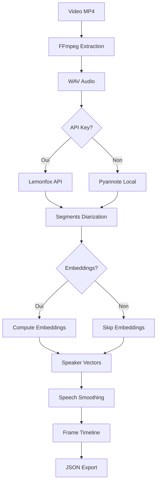

# LemonfoxAudioService - Service d'Analyse Audio SaaS

> **Code-Doc Context** – Service critique avec complexité radon F sur les embeddings. Voir `../pipeline/STEP4_ANALYSE_AUDIO.md` pour le contexte STEP4 global.

---

## Purpose & System Role

### Objectif
Service wrapper pour l'API Lemonfox Speech-to-Text avec fallback Pyannote.audio, calcul d'embeddings de locuteurs et smoothing de timeline de détection de parole.

### Rôle dans l'Architecture
- **Position** : Service backend spécialisé (`services/lemonfox_audio_service.py`)
- **Prérequis** : Fichiers audio WAV extraits, configuration API
- **Sortie** : JSON frame par frame avec diarization, embeddings et timeline
- **Dépendances** : PyTorch CUDA, API Lemonfox, WorkflowState

### Valeur Ajoutée
- **SaaS Hybrid** : API Lemonfox + fallback Pyannote local
- **Embeddings Locuteurs** : Vecteurs 256D par locuteur (optionnel)
- **Smoothing Intelligents** : Réduction du bruit de détection parole
- **Import Dynamique** : Import via importlib pour éviter conflits Flask

---

## Architecture & Dependencies

### Pattern d'Injection
```python
class LemonfoxAudioService:
    def __init__(self, 
                 filesystem_service: FilesystemService,
                 workflow_state: WorkflowState,
                 commands_config: WorkflowCommandsConfig):
        self._fs = filesystem_service
        self._state = workflow_state
        self._config = commands_config
```

### Import Dynamique (audio_env)
```python
# Import via importlib pour éviter l'exécution de services/__init__.py
import importlib.util
spec = importlib.util.spec_from_file_location(
    "lemonfox_audio_service", 
    "services/lemonfox_audio_service.py"
)
lemonfox_module = importlib.util.module_from_spec(spec)
spec.loader.exec_module(lemonfox_module)
```

---

## Complexité (Radon Analysis)

### Points Critiques (Score F/E/C)

#### `_compute_speaker_embeddings_from_audio()` (Score F)
- **Complexité** : 106 lignes, calculs GPU, gestion mémoire
- **Défis** : Extraction embeddings Pyannote, normalisation vecteurs, OOM handling
- **Impact** : Fonctionnalité premium pour After Effects, très gourmande en ressources

#### `process_video_with_lemonfox()` (Score E)
- **Complexité** : 860 lignes, orchestration complète, gestion erreurs
- **Défis** : Appel API async, fallback Pyannote, validation résultats
- **Impact** : Point d'entrée principal, robustesse critique

#### `_apply_speech_smoothing()` (Score C)
- **Complexité** : 280 lignes, algorithmes de filtrage, timeline
- **Défis** : Lissage is_speech_present, préservation frontières, optimisations
- **Impact** : Qualité de la détection parole pour post-production

#### `_call_lemonfox_api()` (Score C)
- **Complexité** : 439 lignes, gestion HTTP, parsing réponses, retry
- **Défis** : Authentification API, gestion timeouts, validation JSON
- **Impact** : Intégration SaaS, fiabilité des appels externes

#### `_build_frame_timeline()` (Score C)
- **Complexité** : 597 lignes, mapping temporel, synchronisation
- **Défis** : Alignement frames/segments, gestion gaps, cohérence JSON
- **Impact** : Sortie finale utilisée par STEP5/After Effects

---

## Flux de Données

### Pipeline Complet


### Étapes Détaillées

#### 1. Extraction Audio
```python
# Via ffmpeg subprocess (pas MoviePy)
cmd = [
    'ffmpeg', '-i', video_path, 
    '-acodec', 'pcm_s16le', 
    '-ar', '16000',  # 16kHz pour Pyannote
    '-ac', '1',      # Mono
    wav_path
]
```

#### 2. Appel API Lemonfox
```python
async def _call_lemonfox_api(self, wav_path: str) -> dict:
    """Appel asynchrone à l'API Lemonfox avec retry."""
    headers = {
        'Authorization': f'Bearer {self.api_key}',
        'Content-Type': 'audio/wav'
    }
    
    async with aiohttp.ClientSession() as session:
        async with session.post(url, headers=headers, data=audio_data) as response:
            return await response.json()
```

#### 3. Calcul Embeddings (GPU)
```python
def _compute_speaker_embeddings_from_audio(self, wav_path: str) -> dict:
    """Extraction embeddings via Pyannote sur GPU."""
    import torch
    from pyannote.audio import Model
    
    # Chargement modèle sur GPU
    device = torch.device("cuda" if torch.cuda.is_available() else "cpu")
    embedding_model = Model.from_pretrained("pyannote/embedding").to(device)
    
    # Extraction par segment de locuteur
    for speaker_label, segments in speaker_segments.items():
        embedding = embedding_model(wav_path, segments)
        normalized_embedding = embedding / torch.norm(embedding)
```

#### 4. Speech Smoothing
```python
def _apply_speech_smoothing(self, frames_analysis: List[dict]) -> List[dict]:
    """Lissage de la timeline is_speech_present pour réduire le bruit."""
    # Algorithme de lissage avec fenêtre glissante
    # Préservation des frontières parole/silence
    # Compensation des faux négatifs AMP (gpu_fp32)
```

---

## Configuration

### Variables d'Environnement
```bash
# API Lemonfox
LEMONFOX_API_KEY=votre_api_key_ici
LEMONFOX_MODEL_ID=whisper-large-v3

# Embeddings Locuteurs
AUDIO_INCLUDE_SPEAKER_EMBEDDINGS=1
AUDIO_EMBEDDING_MODEL=pyannote/embedding

# Profils GPU/CPU
AUDIO_PROFILE=gpu_fp32  # GPU FP32, AMP désactivé
PYTORCH_CUDA_ALLOC_CONF=max_split_size_mb:32

# Succès Partiel
AUDIO_PARTIAL_SUCCESS_OK=1  # Continue même si embeddings échouent
```

### WorkflowCommandsConfig Intégration
```python
# Récupération configuration STEP4
config = WorkflowCommandsConfig()
step4_config = config.get_step_config('step4')
audio_profile = step4_config.get('profile', 'gpu_fp32')
```

---

## API & Méthodes Principales

### `process_video_with_lemonfox(project_name: str, video_filename: str) -> dict`
**Complexité** : Score E (860 lignes)

**Purpose** : Point d'entrée principal pour l'analyse audio Lemonfox.

**Flux** :
1. Validation projet/video via `_validate_project_and_video()`
2. Extraction audio WAV via ffmpeg
3. Appel API Lemonfox (si clé disponible)
4. Fallback Pyannote local (si API échoue)
5. Calcul embeddings (si `AUDIO_INCLUDE_SPEAKER_EMBEDDINGS=1`)
6. Smoothing timeline parole
7. Construction JSON frame par frame
8. Écriture fichier `*_audio.json`

**Gestion des erreurs** :
- Retry automatique API (3 tentatives)
- Fallback Pyannote si API indisponible
- Continue sans embeddings si OOM GPU
- Logging détaillé pour debugging

---

## Sortie JSON

### Structure Complète
```json
{
  "video_filename": "clip.mp4",
  "total_frames": 250,
  "fps": 25.0,
  "processing_info": {
    "engine": "lemonfox",
    "model_id": "whisper-large-v3",
    "fallback_used": false,
    "embeddings_computed": true,
    "device": "cuda"
  },
  "speaker_embeddings": {
    "model_id": "pyannote/embedding",
    "embedding_dim": 256,
    "normalized": true,
    "device": "cuda",
    "vectors_by_label": {
      "SPEAKER_00": [0.1234, -0.5678, ...],
      "SPEAKER_01": [0.9876, -0.4321, ...]
    },
    "num_segments_by_label": {
      "SPEAKER_00": 12,
      "SPEAKER_01": 8
    }
  },
  "frames_analysis": [
    {
      "frame_number": 1,
      "timestamp": 0.04,
      "is_speech_present": true,
      "speaker_label": "SPEAKER_00",
      "confidence": 0.92
    }
  ]
}
```

---

## Performance & Optimisations

### Gestion Mémoire GPU
```python
# Éviter OOM avec gros fichiers
torch.cuda.empty_cache()  # Entre fichiers

# Profils GPU
if audio_profile == "gpu_fp32":
    # AMP désactivé pour éviter faux négatifs
    model = model.float()  # FP32 forcé
```

### Smoothing Algorithmes
- **Fenêtre glissante** : 5 frames (200ms à 25fps)
- **Seuil détection** : 0.3 (configurable)
- **Préservation frontières** : Détection des transitions parole/silence

### Import Optimisé
```python
# Import dans audio_env uniquement
# Évite les dépendances Flask dans le service
# Compatible avec multiprocessing STEP4
```

---

## Debugging & Maintenance

### Logs Spécifiques
```bash
# Logs Lemonfox
tail -f logs/step4/lemonfox_*.log

# Vérification embeddings
grep "Embedding computed" logs/step4/worker_*.log
grep "OOM detected" logs/step4/worker_*.log

# Smoothing statistics
grep "Smoothing applied" logs/step4/worker_*.log
```

### Tests Unitaires
```bash
# Tests service Lemonfox
pytest tests/unit/test_lemonfox_audio_service.py

# Tests embeddings
pytest tests/unit/test_step4_speaker_embeddings.py

# Tests fallback Pyannote
pytest tests/unit/test_step4_pyannote_fallback.py
```

### Validation GPU
```python
# Vérification disponibilité CUDA
import torch
print(f"CUDA available: {torch.cuda.is_available()}")
print(f"GPU memory: {torch.cuda.get_device_properties(0).total_memory / 1e9:.1f}GB")
```

---

## Nouvelles Capacités (Janvier 2026)

### Interactions STEP6 & After Effects

#### Enrichissements STEP6
Les embeddings locuteurs extraits par Lemonfox sont désormais préservés et enrichis dans STEP6 :

- **`tracking_analytics`** : Histogramme des scores de confidence, statistiques par objet
- **`expression_summary`** : Résumé léger des blendshapes (gated par `STEP6_INCLUDE_EXPRESSION_SUMMARY`)
- **`temporal_alignment`** : Warnings de désalignement audio/vidéo

#### Pondération par Confidence (After Effects)
Les scripts AE peuvent maintenant pondérer les sélections par confidence moyenne :

```javascript
// Script After Effects avec pondération confidence
const trackingData = JSON.parse footage("project_tracking.json");
const analytics = trackingData.tracking_analytics;

// Pondération automatique des cibles
if (analytics && analytics.confidence_histogram) {
    const avgConfidence = analytics.confidence_by_object.mean;
    const weight = Math.max(0.1, avgConfidence); // Evite zéro
    // Appliquer poids aux sélections AE
}
```

#### Variables d'Activation
```bash
# STEP6 - Analytics et expressions
STEP6_INCLUDE_TRACKING_ANALYTICS=1      # Active tracking_analytics
STEP6_INCLUDE_EXPRESSION_SUMMARY=1      # Active expression_summary
STEP6_EXPRESSION_KEYS=lipFunnel,jawOpen  # Clés blendshapes à inclure

# After Effects - Pondération
ENABLE_CONFIDENCE_WEIGHTING=1            # Active pondération confidence
CONFIDENCE_WEIGHT=0.8                     # Poids global (défaut: 1.0)
```

---

## Intégration After Effects

### Utilisation des Embeddings
Les embeddings sont disponibles dans `*_audio.json` et `*_tracking.json` (après STEP6) pour :

- **Clustering locuteurs** : Regroupement automatique dans After Effects
- **Sélection par locuteur** : Isoler les segments de chaque personne
- **Analyse相似** : Comparaison de locuteurs entre projets

### Format After Effects
```javascript
// Script After Effects utilisant les embeddings
const audioData = JSON.parse footage("project_audio.json");
const embeddings = audioData.speaker_embeddings.vectors_by_label;

// Clustering simple basé sur distance cosine
for (const [speaker, vector] of Object.entries(embeddings)) {
    // Utilisation des embeddings pour regrouper les locuteurs
}
```
