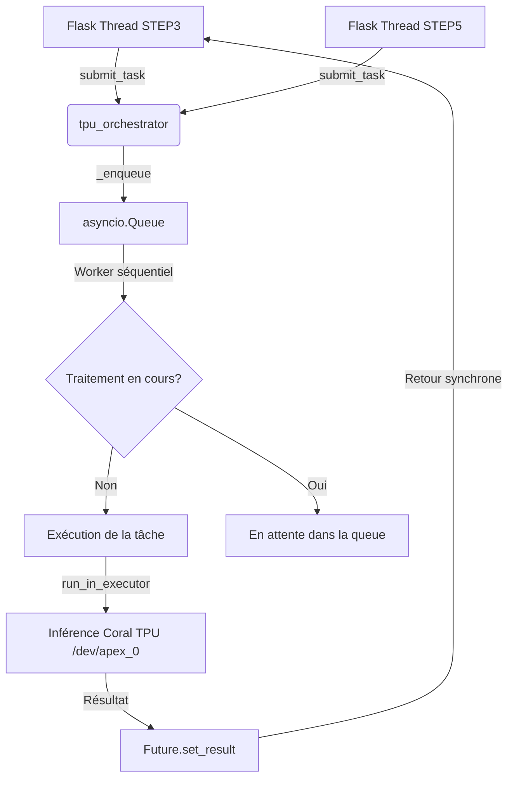

# Coral TPU Orchestrator

**TL;DR**: Service d'orchestration qui sérialise toutes les exécutions de tâches sur le Coral Edge TPU via une file d'attente asynchrone thread-safe. **Empêche les crashs matériels et les goulots d'étranglement du bus PCIe dus aux accès concurrents.**

## Le Problème: Blocage Matériel et Éviction de Cache de la SRAM

Vous lancez le pipeline complet pour traiter plusieurs vidéos en parallèle. L'application Flask tente d'exécuter la détection de scènes (STEP3) et le tracking (STEP5) simultanément sur le module Google Coral TPU. Le système se fige soudainement; le noyau Linux génère des erreurs de pilote Gasket (`gasket: apex: driver error`) et le périphérique `/dev/apex_0` devient indisponible.

La puce Google Coral Edge TPU possède une mémoire SRAM extrêmement restreinte (seulement 8 Mo). Contrairement à un GPU de production, elle n'est pas conçue pour la multi-programmation ou le contexte partagé :
1. **Saturation de la SRAM** : Le chargement simultané de plusieurs modèles (ex: YAMNet et BlazeFace/FaceMesh) dépasse la capacité de stockage physique du cache rapide de la puce.
2. **Éviction de cache coûteuse** : Le bus PCIe s'engorge lors du swapping incessant des poids des modèles, ralentissant drastiquement les performances globales.
3. **Erreur de pilote fatale** : L'accès direct concurrent de plusieurs processus à la libedgetpu provoque des conditions de course au niveau du pilote de périphérique Linux.

### ❌ Accès direct concurrent (anti-pattern)
```python
# Approche instable : lancement parallèle non contrôlé
# Provoque l'éviction de cache SRAM et des crashs de périphérique
def run_tpu_step(step_key):
    # Lancement direct en sous-processus sans synchronisation
    process = subprocess.Popen(["python", f"run_{step_key}_tpu.py"])
```

### ✅ Utilisation de l'orchestrateur (pattern recommandé)
```python
# Approche robuste : routage thread-safe via l'orchestrateur TPU
from services.coral_tpu_orchestrator import tpu_orchestrator

def run_tpu_step(step_key):
    # L'exécution est placée dans une queue sérialisée
    tpu_orchestrator.submit_task(
        lambda: _run_process_async_internal(step_key)
    )
```

## Solution Technique: Le routeur asynchrone sérialisé

Le service `CoralTPUOrchestrator` résout ces contraintes grâce à une architecture découplée :
- **Patron Singleton** : Garantit une instance unique contrôlant l'accès matériel global.
- **Boucle d'événements asynchrone dédiée** : Une boucle `asyncio` s'exécute dans un thread d'arrière-plan démon (`CoralTPU_AsyncLoop`) pour gérer la file d'attente.
- **Micro-lots et sérialisation** : Les exécutions de processus ou fonctions soumises sont empilées dans un `asyncio.Queue` et dépilées séquentiellement, garantissant qu'une seule inférence TPU tourne à un instant $T$.
- **Thread Executor** : Le worker asynchrone exécute la tâche synchrone bloquante (lancement du sous-processus) via `loop.run_in_executor(None, func)` pour ne pas geler la boucle de l'orchestrateur.

### Diagramme de flux d'orchestration



## Configuration

Le routage vers l'orchestrateur dépend des variables d'environnement définies dans le fichier `.env` :

```bash
# Activation de l'accélération Edge TPU
ENABLE_CORAL_TPU_ACCELERATION=true

# Contrôle du routage par étape
STEP3_ENABLE_CORAL_TPU=true
STEP4_ENABLE_CORAL_TPU=true
STEP5_ENABLE_CORAL_TPU=true
```

## Analyse des Trade-offs

| Critère | Sans Orchestrateur (Direct) | Avec Orchestrateur (Sérialisé) |
| :--- | :--- | :--- |
| **Parallélisme** | ❌ Concurrence non gérée (Crash matériel) | 🟢 Sérialisation thread-safe (Stabilité) |
| **Swapping Modèles** | ❌ Incessant (Performance dégradée) | 🟢 Limité aux changements de phases |
| **Complexité** | 🟢 Faible (Appel système direct) | ❌ Moyenne (Queue asynchrone + Threading) |
| **Résilience** | ❌ Nulle (Périphérique bloqué) | 🟢 Maximale (Traitement garanti) |

## The Golden Rule

**Ne laisse jamais plusieurs threads Flask ou processus système appeler le Coral TPU en même temps; passe par l'orchestrateur pour garantir la survie matérielle de la puce.**
