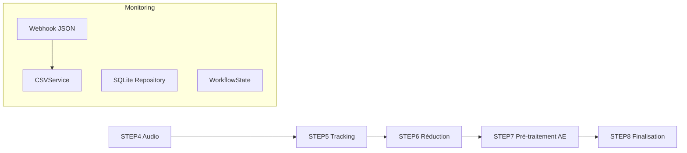

# CSV Service Documentation

## TL;DR
Le CSV Service gère la surveillance et le téléchargement automatique des fichiers CSV depuis des sources webhook, avec normalisation URL complexe pour éviter les doublons et logique de filtrage strict pour les téléchargements automatiques (Dropbox uniquement).

## Contexte Métier
Le service traite des flux de données CSV provenant de webhooks externes, contenant des URLs de fichiers multimédia (vidéos, audio). Le défi principal est de détecter les nouveaux téléchargements éligibles tout en évitant les doublons dus aux variations d'URLs (encodage HTML, paramètres query, etc.).

## Architecture Service

### Responsabilités
- Surveillance des données CSV webhook
- Normalisation d'URLs pour déduplication
- Téléchargement automatique sélectif (Dropbox uniquement)
- Gestion historique des téléchargements

### Fonctions Clés

#### `_normalize_url(url: str) -> str` (Complexité F)
**Rôle** : Normalise les URLs pour prévenir les doublons dus aux variations mineures.

**Algorithme détaillé** :
1. **Nettoyage initial** : Trim espaces, unescape HTML entities (`&amp;` → `&`)
2. **Décodage récursif** : Gestion des double-encodages (`amp%3B` → `&`) avec limite d'itérations (3 max)
3. **Parsing URL** : Séparation scheme/netloc/path/query/fragment
4. **Normalisation composants** :
   - Scheme/netloc en minuscules
   - Suppression ports par défaut (80/443)
   - Tri paramètres query par clé/valeur
   - Suppression paramètres vides
5. **Gestion spéciale Dropbox** : Consolidation paramètres `dl=1`, suppression doublons
6. **Finalisation** : Suppression trailing slash, ré-encodage path sécurisé

**Edge cases gérés** :
- URLs double-encodées (`amp%3Bdl=0&dl=1`)
- Paramètres malformés (`?amp%3Bdl=0&dl=1`)
- Encodage HTML dans CSV (`&amp;dl=1`)
- Variations ports/casse dans hostnames

#### `_check_csv_for_downloads(data, source_type, dry_run=False)` (Complexité F)
**Rôle** : Analyse les données CSV pour identifier les nouveaux téléchargements éligibles.

**Logique de filtrage** :
1. **Validation base** : URL présente, non déjà trackée, scheme HTTP/HTTPS
2. **Détermination type URL** :
   - `dropbox` : Hostnames Dropbox ou proxy workers.dev
   - `fromsmash`/`swisstransfer` : Domaines spécifiques
   - `external` : Autres
3. **Critères auto-download** :
   - Type Dropbox-like uniquement
   - Ressemble à une archive (`.zip`, `/scl/fo/`, filename `.zip`)
   - Présence hints nouveau schéma (`original_filename`, `fallback_url`, proxy URL)

**Stratégies anti-duplication** :
- Normalisation URL avec `_normalize_url`
- Comparaison avec historique existant
- Gestion URLs de fallback
- Tracking des URLs traitées par passe

## Gestion Erreurs

### Cas d'échec normalisation URL
- **Comportement** : Retour URL vide silencieusement
- **Logging** : Aucun (fonction utilitaire)

### Erreurs parsing CSV
- **Comportement** : Skip ligne problématique, continue traitement
- **Logging** : Debug level pour diagnostics

### Échecs téléchargement
- **Comportement** : Thread daemon, échec isolé
- **Logging** : Erreur avec stack trace

## Optimisations Performance

### Cache in-memory
- `_LAST_KNOWN_HISTORY_SET` : Backup en cas d'erreur lecture DB
- Évite bursts sur erreurs transitoires

### Tri paramètres query
- Normalisation canonique pour hash maps efficaces
- Comparaisons O(1) dans historique

### Décodage limité
- Maximum 3 itérations pour éviter boucles infinies
- Protection contre URLs malicieuses

## Trade-offs

### ❌ Normalisation agressive vs ❌ Précision sémantique
- **Choix** : Normalisation agressive (tri params, suppression ports) pour déduplication robuste
- **Coût** : URLs sémantiquement différentes peuvent être considérées identiques
- **Bénéfice** : Prévention doublons fiables dans historique grandissant

### ❌ Auto-download restrictif vs ❌ Commodité utilisateur
- **Choix** : Restriction Dropbox + archives uniquement
- **Coût** : Téléchargements manuels requis pour autres sources
- **Bénéfice** : Contrôle backlog, prévention abus

### ❌ Complexité code vs ❌ Maintenabilité
- **Choix** : Logique centralisée dans fonctions complexes
- **Coût** : Tests unitaires lourds, debugging difficile
- **Bénéfice** : Cohérence traitement, edge cases couverts

## Golden Rule
**Toute modification de logique normalisation doit être accompagnée de migration historique complète** pour éviter inconsistances entre anciennes et nouvelles URLs normalisées.

## Configuration Essentielle

### Variables d'Environnement

```bash
# Monitoring (activé par défaut)
CSV_DOWNLOAD_ENABLED=1
CSV_POLLING_INTERVAL=30
CSV_CACHE_TTL=300

# Sécurité
DROPBOX_PROXY_ENABLED=1
DISABLE_EXPLORER_OPEN=1

# Performance
DRY_RUN_DOWNLOADS=false
WEBHOOK_TIMEOUT=10
```

### Configuration WorkflowCommandsConfig

```python
# Accès à la configuration
config = WorkflowCommandsConfig()
csv_config = config.get_step_config('csv_monitoring')

# Variables disponibles
webhook_url = config.get('WEBHOOK_JSON_URL')
cache_ttl = config.get('WEBHOOK_CACHE_TTL')
polling_interval = config.get('CSV_POLLING_INTERVAL')
```

### Configuration Webhook

```python
# Configuration webhook
webhook_config = {
    'url': 'https://webhook.kidpixel.fr/data/webhook_links.json',
    'timeout': 10,
    'cache_ttl': 60,
    'monitor_interval': 15
}
```

## Résolution de Problèmes

### Webhook Indisponible

```bash
# Diagnostic
curl -s https://webhook.kidpixel.fr/data/webhook_links.json

# Solutions
# 1. Vérifier la connectivité réseau
# 2. Vérifier la configuration WEBHOOK_JSON_URL
# 3. Activer CSV_DOWNLOAD_ENABLED=1
```

### SQLite Corrompu

```bash
# Diagnostic
python -c "import sqlite3; sqlite3.connect('download_history.sqlite3').tables"

# Solution
# Recréer la base de données
python scripts/migrate_download_history_to_sqlite.py
```

### Fichiers CSV Corrompus

```bash
# Diagnostic
python -c "import csv; csv.reader(open('data.csv'))"

# Solution
# Le système ignore les lignes invalides et continue
# Logs détaillés pour identification
```

### Permissions Insuffisantes

```bash
# Diagnostic
ls -la download_history.sqlite3
sudo chown $USER:$USER download_history.sqlite3
chmod 644 download_history.sqlite3

# Solution
# Utiliser l'environnement principal avec permissions appropriées
source env/bin/python
# Le service utilise les permissions de l'utilisateur courant
```

## Tests et Validation

### Test de Fonctionnement

```bash
# Créer fichiers test
mkdir -p test_csv/docs
echo "url,status,timestamp" > test.csv
echo "https://dl.dropbox.com/s/file1.mp4,downloaded,2024-01-20T14:30:22" >> test.csv

# Exécuter monitoring
source env/bin/activate
cd test_csv
python ../workflow_scripts/step7/csv_monitor.py

# Vérifier résultats
sqlite3 download_history.sqlite3 "SELECT COUNT(*) FROM downloads"
ls -la archives/
```

### Validation Automatique

```python
def validate_csv_service():
    """Validation complète du service CSV"""
    # Vérifier la connexion SQLite
    # Vérifier la configuration webhook
    # Tester la normalisation URLs
    # Valider les patterns CSV
    # Vérifier la persistance SQLite
    return True
```

## Intégration Pipeline

### Position dans l'Architecture



### WorkflowState Integration

```python
# Intégration avec l'état centralisé
ws = get_workflow_state()
ws.update_step_status("CSV_MONITOR", "running")
ws.set_step_field("CSV_MONITOR", "webhook_available", True)
ws.update_step_progress("CSV_MONITOR", current=25, total=100)
```

### Flux de Données

```python
# Webhook → CSVService → SQLite → WorkflowState
webhook_records → csv_service.monitor_csv_downloads() → csv_service._persist_download_result() → ws.set_step_field()
```</content>
<parameter name="path">/home/kidpixel/workflow_mediapipe/docs/workflow/services/csv_service.md