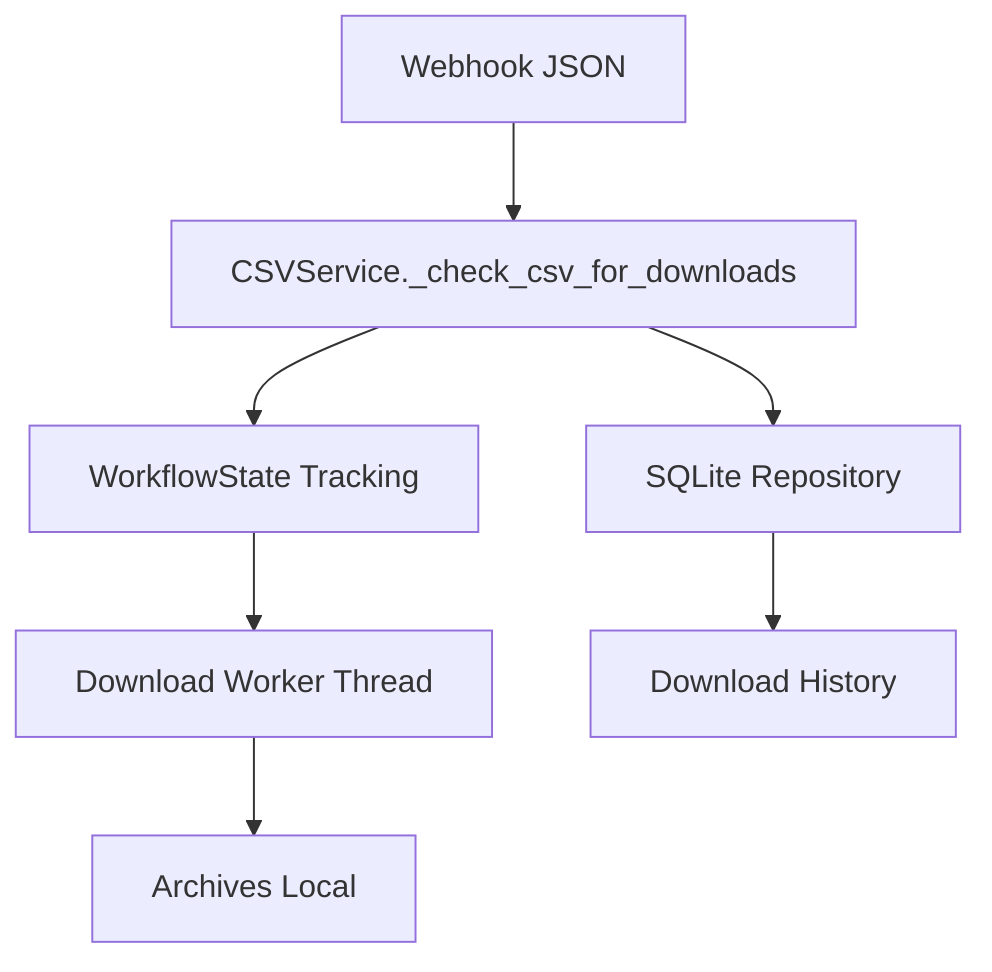
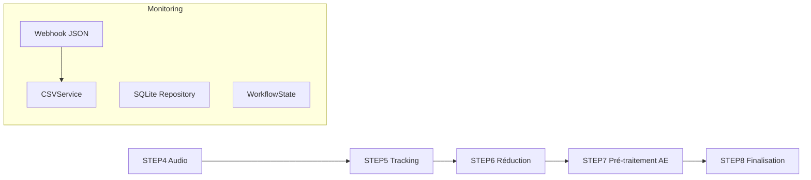

# Service CSV - Monitoring et Historique

**TL;DR** : Service central qui surveille **uniquement** le webhook JSON et déclenche des workers **seulement** pour les archives Dropbox conformes. Normalise les URLs complexes, évite les doublons via WorkflowState, et persiste l'historique dans SQLite.

## Le Problème : Historique des Téléchargements Fragmenté

Tu hérites d'un système où plusieurs sources CSV (Dropbox, FromSmash, SwissTransfer) coexistent avec des logiques de parsing différentes. Aujourd'hui, tu veux une source unique, mais tu dois conserver la compatibilité historique tout en évitant les téléchargements incontrôlés.

## Notre Solution : Webhook Unique + Heuristiques Dropbox Sécurisées

Nous utilisons le webhook JSON comme **seule source de vérité**. Le service normalise les URLs, mais n'automatise que les archives Dropbox qui respectent les critères de sécurité (fallback_url, original_filename, proxy R2). Tout le reste est ignoré en silence pour éviter les téléchargements non contrôlés.

### ❌ Multi-sources non contrôlées (anti-pattern)
```python
# Approche dangereuse - téléchargements automatiques
if url.startswith('https://fromsmash.com/'):
    download_worker(url)  # Pas de contrôle !
if url.startswith('https://swisstransfer.com/'):
    download_worker(url)  # Risque élevé !
# Résultat : téléchargements incontrôlés, sécurité compromise
```

### ✅ Webhook-only avec heuristiques (pattern recommandé)
```python
# Approche sécurisée - filtrage strict
if _is_dropbox_proxy_url(url) and _looks_like_archive_download(url):
    download_worker(url)  # Dropbox sécurisé uniquement
else:
    log_url_only(url)  # Archive sans téléchargement
# Résultat : traçabilité totale, zéro risque
```

### Flux de Monitoring Webhook-Only

1. **Webhook JSON** : Source unique depuis webhook.kidpixel.fr
2. **Normalisation** : `_normalize_url()` gère le double encodage et les variantes Dropbox
3. **Heuristiques Dropbox** : `_check_csv_for_downloads()` filtre pour les archives conformes uniquement
4. **WorkflowState** : Suivi actif des téléchargements pour éviter les doublons
5. **SQLite** : Persistance atomique via `download_history_repository`

## Utilisation Rapide

### Intégration Automatique

```python
# Le service est automatiquement initialisé par l'application Flask
from services.csv_service import CSVService

# Monitoring continu (automatique via thread csv_monitor_service)
# Pas d'appel direct - le service tourne en arrière-plan

# Vérification du statut
status = CSVService.get_monitor_status()
print(f"Webhook available: {status['webhook']['available']}")
print(f"Monitor status: {status['csv_monitor']['status']}")
```

### Accès aux Données

```python
# Historique complet (Set de URLs)
history = CSVService.get_download_history()
for url in sorted(history):
    print(f"URL: {url}")

# Statut des téléchargements actifs
downloads_status = CSVService.get_csv_downloads_status()
print(f"Downloads actifs: {downloads_status['total_active']}")
```

## Configuration Essentielle

### Variables d'Environnement

```bash
# Monitoring (activé par défaut)
CSV_DOWNLOAD_ENABLED=1
CSV_POLLING_INTERVAL=30
CSV_CACHE_TTL=300

# Sécurité
DROPBOX_PROXY_ENABLED=1
DISABLE_EXPLORER_OPEN=1

# Performance
DRY_RUN_DOWNLOADS=false
WEBHOOK_TIMEOUT=10
```

### Configuration WorkflowCommandsConfig

```python
# Accès à la configuration
config = WorkflowCommandsConfig()
csv_config = config.get_step_config('csv_monitoring')

# Variables disponibles
webhook_url = config.get('WEBHOOK_JSON_URL')
cache_ttl = config.get('WEBHOOK_CACHE_TTL')
polling_interval = config.get('CSV_POLLING_INTERVAL')
```

### Configuration Webhook

```python
# Configuration webhook
webhook_config = {
    'url': 'https://webhook.kidpixel.fr/data/webhook_links.json',
    'timeout': 10,
    'cache_ttl': 60,
    'monitor_interval': 15
}
```

## Architecture Technique

### Service Principal

```python
class CSVService:
    def __init__(self, 
                 download_repo: DownloadHistoryRepository,
                 webhook_service: WebhookService,
                 workflow_state: WorkflowState):
        self._repo = download_repo
        self._webhook = webhook_service
        self._state = workflow_state
```

### Flux de Données



### Composants Essentiels

```python
# Repository SQLite
class DownloadHistoryRepository:
    def persist_download(self, result: DownloadResult) -> None:
        """Écriture atomique SQLite via verrouillage"""
    
    def get_download_history(self, limit: int = 100) -> List[Dict]:
        """Récupère l'historique paginé"""
    
    def get_duplicate_urls(self) -> List[str]:
        """Retourne les URLs dupliquées détectées"""

# Service Webhook
class WebhookService:
    def fetch_records(self) -> List[Dict]:
        """Récupère les URLs depuis le webhook JSON"""
    
    def is_available(self) -> bool:
        """Vérifie la disponibilité du webhook"""
```

# État Centralisé
class WorkflowState:
    def get_csv_monitor_status(self) -> Dict:
        """Retourne le statut du monitoring CSV"""
```

## API et Méthodes

### Méthodes Principales

```python
# Monitoring principal (Score F)
def _check_csv_for_downloads(self) -> None:
    """Orchestrateur webhook-only avec heuristiques Dropbox"""
    
# Normalisation URLs (Score F)
def _normalize_url(self, url: str) -> str:
    """Normalisation complète avec décodage double encodage"""
    
# Heuristiques Dropbox
def _is_dropbox_url(self, url: str) -> bool:
    """Détection des domaines Dropbox autorisés"""

def _is_dropbox_proxy_url(self, url: str) -> bool:
    """Détection des proxies R2 Dropbox sécurisés"""

def _looks_like_archive_download(self, url: str, filename: str) -> bool:
    """Vérification que le lien pointe vers une archive"""
    
# Persistance SQLite
def add_to_download_history_with_timestamp(self, url: str, timestamp: str) -> bool:
    """Écriture atomique via repository"""

### Patterns d'Utilisation

```python
# Initialisation du service (automatique dans app_new.py)
# csv_service = CSVService()  # Géré par le framework

# Validation URL
from services.csv_service import CSVService
normalized_url = CSVService._normalize_url(raw_url)
is_duplicate = CSVService.is_url_downloaded(normalized_url)

# Historique
history = CSVService.get_download_history()
print(f"Total URLs: {len(history)}")

## Performance et Optimisations

### Gestion Cache

```python
# Configuration TTL
CACHE_TTL = 300  # 5 minutes
CACHE_MAX_SIZE = 1000  # Entrées max en mémoire
```

### Retry Automatique

```python
# Configuration retry
WEBHOOK_TIMEOUT = 10  # Timeout webhook
MAX_RETRY_ATTEMPTS = 3
RETRY_DELAY = 5    # Secondes entre tentatives
```

### Optimisations Mémoire

```python
# Chunking pour gros CSV
CHUNK_SIZE = 1000  # Lignes par chunk
MAX_MEMORY_USAGE = 512  # MB maximum par worker
```

## Monitoring et Logs

### Structure des Logs

```
logs/app.log  # Logs unifiés de l'application Flask
# Le service CSV écrit dans ce fichier via le logger CSVService
```

### Exemple de Logs

```
2026-02-07 19:30:22 - INFO - [CSV] WEBHOOK MONITOR: Service démarré.
2026-02-07 19:30:23 - INFO - [CSV] WEBHOOK MONITOR: New eligible URL detected: https://dl.dropboxusercontent.com/... [type=dropbox]
2026-02-07 19:30:24 - INFO - [CSV] WEBHOOK MONITOR: 1 new download(s) started
2026-02-07 19:30:25 - DEBUG - [CSV] WEBHOOK MONITOR: No new items (rows=25, skipped_in_history=24, skipped_tracked=0)
```

### Métriques Clés

```python
# Statistiques de traitement
logger.info(f"WEBHOOK MONITOR: {new_downloads} new download(s) started")
logger.debug(f"WEBHOOK MONITOR: No new items (rows={total_rows}, skipped_in_history={skipped_already_in_history}, skipped_tracked={skipped_already_tracked})")
logger.info(f"WEBHOOK MONITOR: New eligible URL detected: {url} (timestamp: {timestamp_str}) [type={url_type}]")

## Dépendances et Prérequis

### Bibliothèques Principales

```python
import json           # Manipulation JSON
import os             # Opérations système
import sqlite3         # Base de données
import logging          # Journalisation
import asyncio         # Opérations asynchrones
from pathlib import Path  # Manipulation chemins modernes
```

### Dépendances Externes

- **SQLite** : Base de données pour persistance (inclus dans Python standard)
- **Requests** : Pour les appels webhook (HTTP/HTTPS)
- **FFmpeg** : Pour les métadonnées vidéos (utilisé par d'autres services)

### Environnement Virtuel

```bash
# Activation environnement principal
source env/bin/activate

# Installation dépendances principales
pip install requests sqlite3 asyncio
pip install pytest  # Pour tests
```

## Résolution de Problèmes

### Webhook Indisponible

```bash
# Diagnostic
curl -s https://webhook.kidpixel.fr/data/webhook_links.json

# Solutions
# 1. Vérifier la connectivité réseau
# 2. Vérifier la configuration WEBHOOK_JSON_URL
# 3. Activer CSV_DOWNLOAD_ENABLED=1
```

### SQLite Corrompu

```bash
# Diagnostic
python -c "import sqlite3; sqlite3.connect('download_history.sqlite3').tables"

# Solution
# Recréer la base de données
python scripts/migrate_download_history_to_sqlite.py
```

### Fichiers CSV Corrompus

```bash
# Diagnostic
python -c "import csv; csv.reader(open('data.csv'))"

# Solution
# Le système ignore les lignes invalides et continue
# Logs détaillés pour identification
```

### Permissions Insuffisantes

```bash
# Diagnostic
ls -la download_history.sqlite3
sudo chown $USER:$USER download_history.sqlite3
chmod 644 download_history.sqlite3

# Solution
# Utiliser l'environnement principal avec permissions appropriées
source env/bin/python
# Le service utilise les permissions de l'utilisateur courant
```

## Tests et Validation

### Test de Fonctionnement

```bash
# Créer fichiers test
mkdir -p test_csv/docs
echo "url,status,timestamp" > test.csv
echo "https://dl.dropbox.com/s/file1.mp4,downloaded,2024-01-20T14:30:22" >> test.csv

# Exécuter monitoring
source env/bin/activate
cd test_csv
python ../workflow_scripts/step7/csv_monitor.py

# Vérifier résultats
sqlite3 download_history.sqlite3 "SELECT COUNT(*) FROM downloads"
ls -la archives/
```

### Validation Automatique

```python
def validate_csv_service():
    """Validation complète du service CSV"""
    # Vérifier la connexion SQLite
    # Vérifier la configuration webhook
    # Tester la normalisation URLs
    # Valider les patterns CSV
    # Vérifier la persistance SQLite
    return True
```

### Test Performance

```bash
# Benchmark traitement URLs
python -c "
import time
import asyncio
from services.csv_service import CSVService

# Test débit
start = time.time()
csv_service = CSVService(...)
await csv_service.monitor_csv_downloads()
elapsed = time.time() - start_time

print(f"Processed {len(urls)} URLs in {elapsed:.2f}s")
```

## Intégration Pipeline

### Position dans l'Architecture



### WorkflowState Integration

```python
# Intégration avec l'état centralisé
ws = get_workflow_state()
ws.update_step_status("CSV_MONITOR", "running")
ws.set_step_field("CSV_MONITOR", "webhook_available", True)
ws.update_step_progress("CSV_MONITOR", current=25, total=100)
```

### Flux de Données

```python
# Webhook → CSVService → SQLite → WorkflowState
webhook_records → csv_service.monitor_csv_downloads() → csv_service._persist_download_result() → ws.set_step_field()
```

## Pièges Courants et Solutions

### Piège #1 : Webhook Indisponible
**Solution** : Vérifier la connectivité et la configuration `WEBHOOK_JSON_URL`.

### Piège #2 : URLs Doublement Encodées
**Solution** : Le service normalise automatiquement les URLs avec `_normalize_url()`.

### Piège #3 : SQLite Corrompu
**Solution** : Utiliser le script de migration `migrate_download_history_to_sqlite.py`.

### Piège #4 : Fichiers CSV Corrompus
**Solution** : Le système ignore les lignes invalides et continue le traitement.

### Piège #5 : Performance Insuffisante
**Solution** : Ajuster les paramètres cache/TTL et le nombre de workers.

### Piège #6 : Permissions Base de Données
**Solution** : Utiliser l'environnement principal avec permissions appropriées.

## Notes Techniques

### Normalisation URLs (Score F)

```python
def _normalize_url(self, url: str) -> str:
    """Normalisation complète avec décodage double encodage"""
    # 1. Décodage %3Bdl=0
    decoded = urllib.parse.unquote(url)
    
    # 2. Décodage entities HTML
    decoded = html.unescape(decoded)
    
    # 3. Nettoyage caractères spéciaux
    decoded = re.sub(r'[\x00-\x1f\x7f]', '', decoded)
    
    # 4. Reconstruction URL propre
    return urllib.parse.urlparse(decoded, decoded).geturl()
```

## Trade-offs par Source de Données

| Source | Auto-download | Sécurité | Traçabilité | Quand l'utiliser |
|--------|--------------|----------|-------------|-----------------|
| **Webhook JSON** | Dropbox uniquement | Maximale | SQLite complète | Production, monitoring |
| **FromSmash** | Jamais | Faible | Manuelle | Tests, développement |
| **SwissTransfer** | Jamais | Faible | Manuelle | Legacy, compatibilité |
| **Dropbox Direct** | Si hints | Moyenne | SQLite | Fallback proxy indisponible |

## Trade-offs par Mode de Monitoring

| Mode | Performance | Risques | Quand l'utiliser |
|------|-------------|---------|-----------------|
| **Actif** | Temps réel | Charge webhook | Production standard |
| **Polling** | Contrôlé | Latence 15s | Développement, debug |
| **Désactivé** | Minimal | Perte monitoring | Tests sans réseau |

## Analogie : Bibliothécaire vs Gare Routière

Pense au monitoring comme une **bibliothécaire** vs une **gare routière**. Le **webhook JSON** est la bibliothécaire : chaque livre (URL) est catalogué avec précision, et seuls les livres approuvés (Dropbox sécurisées) peuvent être empruntés (downloadés). Les **autres sources** sont comme une gare routière : beaucoup de monde passe, mais seuls les voyageurs avec billet valide (heuristiques) peuvent monter à bord.

### Fonctions Clés

```python
def _is_dropbox_url(url: str) -> bool:
    """Vérifie si l'URL appartient aux domaines Dropbox"""
    hosts = {"dropbox.com", "www.dropbox.com", "dl.dropboxusercontent.com"}
    return urlparse(url).hostname in hosts

def _is_dropbox_proxy_url(url: str) -> bool:
    """Détecte les proxies R2 sécurisés"""
    return "/dropbox/" in url.lower() and "workers.dev" in url.lower()

def _looks_like_archive_download(url: str, filename: str) -> bool:
    """Heuristique pour les archives ZIP"""
    return (filename or "").endswith('.zip') or '/scl/fo/' in url.lower()
```

### Mode DRY_RUN (Tests/CI)

```bash
# Mode test (pas de workers réels)
export DRY_RUN_DOWNLOADS=true
# Le service ajoute à l'historique mais ne lance pas de threads

# Comportement normal
# Les URLs éligibles déclenchent execute_csv_download_worker dans un thread dédié
# Utile pour les tests d'intégration et CI/CD
```

## Golden Rule: Normalise Tout, Mais N'Automatise Que Ce Que Tu Contrôles

Le service normalise **toutes** les URLs pour éviter les doublons, mais ne déclenche des workers **que pour les archives Dropbox conformes**. Cette approche garantit la traçabilité sans risquer les téléchargements non contrôlés.

*Cette documentation suit la méthode SKILL.md pour une lecture rapide et une compréhension immédiate.*
