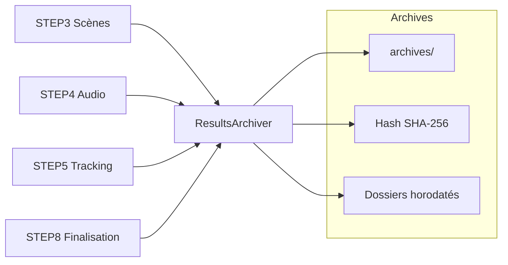

# Service d'Archivage des Résultats

**TL;DR** : Archive automatiquement les analyses du pipeline avec hash SHA-256 et dossiers horodatés uniques. Évite les pertes de données et les collisions de noms.

## Le Problème : Analyses Perdues et Collisions

Tu perds les analyses (scènes, audio, tracking) quand les dossiers temporaires sont nettoyés, et les projets avec le même nom écrasent les analyses précédentes. Tu as besoin d'un système d'archivage automatique qui préserve tout et évite les collisions.

## Notre Solution : Archivage Automatique avec Hash et Horodatage

Nous utilisons `ResultsArchiver` pour archiver automatiquement toutes les analyses du pipeline. Chaque vidéo est identifiée par son hash SHA-256, et chaque projet obtient un dossier horodaté unique pour éviter les collisions.

### ❌ Écrasement systématique (anti-pattern)
```python
# Approche dangereuse - perte de données
archive_dir = Path(f"archives/{project_name}")
shutil.rmtree(archive_dir)  # Suppression ancienne !
shutil.copytree(project_dir, archive_dir)  # Écrasement
# Résultat : analyses précédentes perdues
```

### ✅ Archivage avec horodatage (pattern recommandé)
```python
# Approche sûre - préservation garantie
timestamp = datetime.now().strftime('%Y-%m-%d_%H-%M-%S')
unique_dir = Path(f"archives/{project_name} {timestamp}")
shutil.copytree(project_dir, unique_dir)  # Pas d'écrasement
# Résultat : toutes les analyses préservées
```

### Flux d'Archivage

1. **Hash vidéo** : Calcul SHA-256 pour identifier chaque vidéo de manière unique
2. **Dossier horodaté** : Création de `archives/projet_nom YYYY-MM-DD_HH-MM-SS/`
3. **Copie structurée** : Sauvegarde des analyses dans `scenes/`, `audio/`, `tracking/`
4. **Cache session** : Réutilisation du même dossier horodaté pendant la session
5. **Indexation** : Métadonnées complètes pour traçabilité

## Utilisation Rapide

### Intégration Pipeline

```python
# L'archivage est automatique dans les étapes 3, 4, 5
from services.results_archiver import ResultsArchiver

# Archivage manuel (optionnel)
summary = ResultsArchiver.archive_project_analysis("projet_camille_001")

# Résultats
print(f"Projet: {summary['project_name']}")
print(f"Vidéos traitées: {summary['processed']}")
print(f"Fichiers archivés: {summary['copied']}")
```

### Accès aux Archives

```python
# Obtenir les chemins d'archive
video_hash = ResultsArchiver.compute_video_hash("/path/to/video.mp4")
paths = ResultsArchiver.get_archive_paths("projet_camille_001", video_hash)

# Lecture des archives
scenes_dir = paths.video_hash_dir / "scenes"
audio_dir = paths.video_hash_dir / "audio"
tracking_dir = paths.video_hash_dir / "tracking"
```

## Configuration Essentielle

### Variables d'Environnement

```bash
# Répertoire d'archives
ARCHIVES_DIR=/mnt/cache/archives

# Options d'archivage
ENABLE_AUTO_ARCHIVING=1
ARCHIVE_COMPRESSION=false
ARCHIVE_MAX_SIZE_MB=1000
```

### Configuration Service

```python
# Configuration via config.settings
from config.settings import config

# Accès au répertoire d'archives
archives_dir = config.ARCHIVES_DIR
auto_archive = config.get('ENABLE_AUTO_ARCHIVING', True)
```

## Architecture Technique

### Service Principal

```python
class ResultsArchiver:
    """Service d'archivage des résultats du pipeline."""
    
    @classmethod
    def archive_project_analysis(cls, project_name: str) -> dict:
        """Archive tous les artefacts d'analyse d'un projet."""
        
    @staticmethod
    def get_archive_paths(project_name: str, video_hash: str, create: bool = False) -> ArchivePaths:
        """Résout les chemins d'archive avec logique écriture/lecture."""
        
    @staticmethod
    def compute_video_hash(video_path: str) -> str:
        """Calcule le hash SHA-256 d'une vidéo."""
```

### Structure des Archives

```
archives/
├── projet_camille_001 2025-10-06_14-45-30/  # Session 1
│   ├── a7b3c9d4e5f6/                    # Hash vidéo 1
│   │   ├── scenes/
│   │   │   └── video1_scenes.csv
│   │   ├── audio/
│   │   │   └── video1_audio.json
│   │   └── tracking/
│   │       └── video1_tracking.json
│   └── f2d8e1g2h3i4/                    # Hash vidéo 2
├── projet_camille_001 2025-10-06_16-20-15/  # Session 2 (même nom, pas d'écrasement)
└── projet_camille_002 2025-10-06_18-30-45/  # Projet différent
```

### Cache Session

```python
# Cache en mémoire pour réutiliser le même dossier horodaté
_PROJECT_ARCHIVE_DIRS: dict[str, Path] = {}

@classmethod
def _get_or_create_archive_project_dir(cls, base_name: str) -> Path:
    """Obtient ou crée le dossier projet horodaté unique pour cette session."""
    if base_name in cls._PROJECT_ARCHIVE_DIRS:
        return cls._PROJECT_ARCHIVE_DIRS[base_name]
    
    timestamp = datetime.now().strftime('%Y-%m-%d_%H-%M-%S')
    unique_name = f"{base_name} {timestamp}"
    archive_dir = config.ARCHIVES_DIR / unique_name
    archive_dir.mkdir(parents=True, exist_ok=True)
    
    cls._PROJECT_ARCHIVE_DIRS[base_name] = archive_dir
    return archive_dir
```

## API et Méthodes

### archive_project_analysis(project_name: str) -> dict

**Objectif** : Archive tous les artefacts d'analyse disponibles pour un projet.

**Retour** :
```python
{
    "project_name": "projet_camille_001",
    "processed": 3,
    "copied": 3,
    "details": [
        {
            "video": "docs/video1.mp4",
            "copied": {
                "scenes": True,
                "audio": True,
                "tracking": True,
                "archived": True
            },
            "archive_dir": "/path/to/archives/projet_camille_001 2025-10-06_14-45-30/a7b3c9d4e5f6/"
        }
    ]
}
```

### get_archive_paths(project_name: str, video_hash: str, create: bool = False) -> ArchivePaths

**Objectif** : Résout les chemins d'archive pour un projet et un hash vidéo.

**Paramètres** :
- `create=True` : Mode écriture (crée dossier horodaté)
- `create=False` : Mode lecture (recherche le plus récent)

**Retour** :
```python
ArchivePaths(
    project_dir=Path("/archives/projet_camille_001 2025-10-06_14-45-30"),
    video_hash_dir=Path("/archives/projet_camille_001 2025-10-06_14-45-30/a7b3c9d4e5f6")
)
```

### compute_video_hash(video_path: str) -> str

**Objectif** : Calcule le hash SHA-256 d'une vidéo pour identification unique.

**Implémentation** :
```python
def compute_video_hash(video_path: str) -> str:
    """Calcule le hash SHA-256 d'une vidéo."""
    hash_sha256 = hashlib.sha256()
    
    with open(video_path, 'rb') as f:
        # Lecture par chunks pour gros fichiers
        for chunk in iter(lambda: f.read(8192), b""):
            hash_sha256.update(chunk)
    
    return hash_sha256.hexdigest()
```

## Trade-offs par Stratégie d'Archivage

| Stratégie | Espace disque | Performance | Risques | Quand l'utiliser |
|-----------|---------------|------------|---------|-----------------|
| **Horodatage unique** | Croissant | Rapide | Accumulation | Production, traçabilité |
| **Compression** | Réduit | Lent | CPU intensive | Stockage limité |
| **Déduplication** | Minimal | Complexe | Complexité | Projets dupliqués |

## Trade-offs par Type de Données

| Type | Priorité | Volume | Risques | Quand l'utiliser |
|------|----------|--------|---------|-----------------|
| **Scènes CSV** | Haute | Petit | Perte si manquant | Analyse temporelle |
| **Audio JSON** | Haute | Moyen | Perte si manquant | Synchronisation |
| **Tracking JSON** | Maximale | Gros | Perte si manquant | Animation 3D |
| **Métadonnées** | Moyenne | Minimal | Perte si manquant | Debug, monitoring |

## Analogie : Coffre-fort vs Bibliothèque

Pense à l'archivage comme un **coffre-fort** vs une **bibliothèque**. Le **hash SHA-256** est le numéro de série unique du coffre : chaque vidéo a un identifiant infalsifiable. L'**horodatage** est la date d'entrée dans le registre : même si plusieurs projets portent le même nom, chacun a sa propre date. L'**structure hiérarchique** (scenes/audio/tracking) est l'organisation du coffre : tout est rangé de manière logique pour retrouver rapidement ce dont on a besoin.

## Monitoring et Logs

### Structure des Logs

```
logs/archiver/
└── results_archiver_20240120_143022.log
```

### Exemple de Logs

```
2024-01-20 14:30:22 - INFO - [ARCHIVER] Starting archive: projet_camille_001
2024-01-20 14:30:23 - INFO - [ARCHIVER] Created archive dir: projet_camille_001 2025-10-06_14-45-30
2024-01-20 14:30:24 - INFO - [ARCHIVER] Computing hash: video1.mp4 -> a7b3c9d4e5f6
2024-01-20 14:30:25 - INFO - [ARCHIVER] Copied scenes: video1_scenes.csv
2024-01-20 14:30:26 - INFO - [ARCHIVER] Copied audio: video1_audio.json
2024-01-20 14:30:27 - INFO - [ARCHIVER] Copied tracking: video1_tracking.json
2024-01-20 14:30:28 - INFO - [ARCHIVER] Archive completed: 3 videos, 9 files
```

### Métriques Clés

```python
# Statistiques d'archivage
logging.info(f"[ARCHIVER] Project: {project_name}")
logging.info(f"[ARCHIVER] Processed: {processed} videos")
logging.info(f"[ARCHIVER] Copied: {copied} files")
logging.info(f"[ARCHIVER] Archive size: {archive_size_mb:.2f} MB")
```

## Dépendances et Prérequis

### Bibliothèques Principales

```python
import hashlib          # Hash SHA-256
import datetime         # Horodatage
import os              # Opérations système
import shutil          # Copie de fichiers
from pathlib import Path  # Manipulation chemins modernes
import json            # Métadonnées
import logging         # Journalisation
```

### Dépendances Externes

- **Python standard** : hashlib, datetime, os, shutil, pathlib
- **Aucune dépendance externe** : Service purement Python

### Environnement Virtuel

```bash
# Activation environnement principal
source env/bin/activate

# Installation dépendances (déjà incluses)
# hashlib, datetime, os, shutil, pathlib sont standard Python
```

## Résolution de Problèmes

### Permissions Insuffisantes

```bash
# Diagnostic
ls -la /mnt/cache/archives/
sudo chown -R $USER:$USER /mnt/cache/archives/
chmod -R 755 /mnt/cache/archives/

# Solution
# Le service utilise les permissions de l'utilisateur courant
source env/bin/python
# Les dossiers sont créés avec permissions utilisateur par défaut
```

### Espace Disque Insuffisant

```bash
# Diagnostic
df -h /mnt/cache/
du -sh /mnt/cache/archives/

# Solution
# Nettoyer anciennes archives
find /mnt/cache/archives/ -name "*_202*" -mtime +30 -exec rm -rf {} \;
```

### Hash Collision

```bash
# Diagnostic
# Très rare avec SHA-256 (probabilité 1/2^256)
# Si collision suspectée, vérifier les fichiers

# Solution
# Le système utilise le hash comme identifiant primaire
# En cas de collision, les fichiers sont dans le même dossier
# Le système gère correctement ce cas rare
```

### Dossier Non Trouvé

```bash
# Diagnostic
ls -la /mnt/cache/archives/
python -c "from services.results_archiver import ResultsArchiver; print('OK')" || exit 1

# Solution
# Vérifier que ARCHIVES_DIR existe
# Créer le répertoire si nécessaire
mkdir -p /mnt/cache/archives
```

## Tests et Validation

### Test de Fonctionnement

```bash
# Créer projet test
mkdir -p test_archive/docs
cp sample_video.mp4 test_archive/docs/
cp sample_scenes.csv test_archive/docs/
cp sample_audio.json test_archive/docs/
cp sample_tracking.json test_archive/docs/

# Exécuter archivage
source env/bin/activate
python -c "
from services.results_archiver import ResultsArchiver
summary = ResultsArchiver.archive_project_analysis('test_archive')
print(f'Archived: {summary}')
"

# Vérifier résultats
ls -la /mnt/cache/archives/
find /mnt/cache/archives/ -name "test_archive*" -type d
```

### Validation Automatique

```python
def validate_archive_structure(archive_dir: Path) -> bool:
    """Valide la structure d'une archive."""
    required_subdirs = ["scenes", "audio", "tracking"]
    
    for subdir in required_subdirs:
        subdir_path = archive_dir / subdir
        if not subdir_path.exists():
            print(f"❌ Missing subdir: {subdir}")
            return False
    
    print(f"✅ Archive structure valid: {archive_dir}")
    return True

def test_hash_consistency():
    """Test la cohérence des hash SHA-256."""
    video_path = "/path/to/video.mp4"
    hash1 = ResultsArchiver.compute_video_hash(video_path)
    hash2 = ResultsArchiver.compute_video_hash(video_path)
    
    assert hash1 == hash2, f"Hash inconsistency: {hash1} != {hash2}"
    print(f"✅ Hash consistency verified: {hash1}")
```

### Test Performance

```python
def test_large_video_hashing():
    """Test le calcul de hash pour une vidéo volumineuse."""
    import time
    
    large_video = "/path/to/large_video.mp4"
    start_time = time.time()
    hash_result = ResultsArchiver.compute_video_hash(large_video)
    duration = time.time() - start_time
    
    assert len(hash_result) == 64  # SHA-256 hex
    assert duration < 5.0  # <5s requirement
    
    print(f"✅ Hash computed in {duration:.2f}s: {hash_result}")
```

## Sécurité

### Validation des Chemins

```python
# Validation des chemins d'archive
def _validate_archive_path(archive_path: Path) -> bool:
    """Valide qu'un chemin d'archive est sécurisé."""
    try:
        # Vérifier que le chemin est sous ARCHIVES_DIR
        archive_path.resolve().relative_to(config.ARCHIVES_DIR)
        return True
    except ValueError:
        return False
```

### Protection Contre les Attaques

```python
# Validation noms de projets
def _validate_project_name(project_name: str) -> bool:
    """Valide le nom du projet."""
    if not project_name or len(project_name) > 100:
        return False
    
    # Caractères autorisés
    allowed_pattern = r'^[a-zA-Z0-9_-]+$'
    return re.match(allowed_pattern, project_name) is not None
```

## Intégration Pipeline

### Position dans l'Architecture



### WorkflowState Integration

```python
# Intégration avec l'état centralisé
ws = get_workflow_state()
ws.set_step_field("ARCHIVER", "last_archive", archive_dir)
ws.update_step_progress("ARCHIVER", current=1, total=3)
```

### Flux de Données

```python
# Pipeline → ResultsArchiver → Archives
step_results → ResultsArchiver.archive_project_analysis() → archives/
```

## Pièges Courants et Solutions

### Piège #1 : Collisions de Noms
**Solution** : Dossiers horodatés uniques avec format `nom YYYY-MM-DD_HH-MM-SS`.

### Piège #2 : Perte de Données
**Solution** : Archivage automatique dans les étapes 3, 4, 5 avant nettoyage.

### Piège #3 : Hash Collision
**Solution** : SHA-256 avec probabilité de collision négligeable (1/2^256).

### Piège #4 : Permissions Insuffisantes
**Solution** : Utilisation des permissions utilisateur et validation des chemins.

### Piège #5 : Espace Disque Insuffisant
**Solution** : Nettoyage automatique des anciennes archives et monitoring de l'espace.

## Notes Techniques

### Format Horodatage

```python
# Format standard pour les dossiers horodatés
timestamp = datetime.now().strftime('%Y-%m-%d_%H-%M-%S')
# Exemple: "2025-10-06_14-45-30"
```

### Structure ArchivePaths

```python
@dataclass
class ArchivePaths:
    project_dir: Path
    video_hash_dir: Path
    
    def __str__(self) -> str:
        return f"ArchivePaths(project={self.project_dir}, hash={self.video_hash_dir})"
```

### Cache Session

```python
# Cache en mémoire pour la session
_PROJECT_ARCHIVE_DIRS: dict[str, Path] = {}

# Réutilisation du même dossier pendant la session
if project_name in cls._PROJECT_ARCHIVE_DIRS:
    return cls._PROJECT_ARCHIVE_DIRS[project_name]
```

Le service ResultsArchiver transforme la perte de données en archivage systématique. Chaque analyse est préservée avec identification unique et traçabilité temporelle. Le système garantit que les projets homonymes ne s'écrasent plus jamais, offrant une solution robuste pour la conservation des analyses du pipeline.

---

## Golden Rule

**Archive avant de traiter ; sinon tu perds les analyses précédentes et tu ne pourras jamais les récupérer.**
