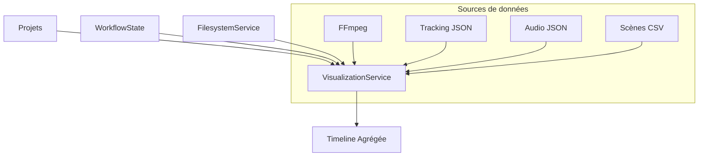
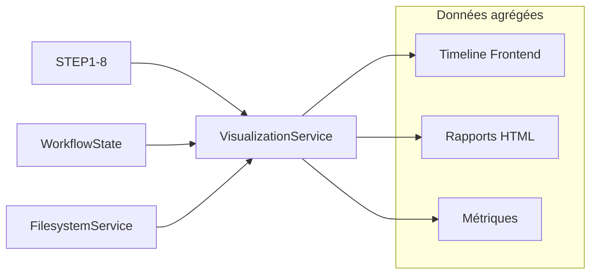

# Service Visualisation - Métriques et Rapports

**TL;DR** : Service spécialisé dans la génération de métriques, visualisations et rapports pour le monitoring et l'analyse des projets du pipeline.

## Le Problème : Données Hétérogènes Difficiles à Visualiser

Tu as des données dispersées dans différents formats (métadonnées vidéo, tracking JSON, analyses audio) mais aucun moyen unifié de les visualiser. Tu as besoin d'un service qui agrège toutes ces données en timelines cohérentes pour le frontend et les rapports.

## Notre Solution : Service d'Agrégation Multi-Sources

Nous utilisons `VisualizationService` comme couche d'abstraction qui agrège les données de toutes les étapes du pipeline. Le service extrait les métadonnées vidéo, charge les données de tracking, synchronise l'audio, et génère des timelines complètes pour le frontend.

### ❌ Parsing manuel (anti-pattern)
```python
# Approche inefficace - données dispersées
def get_project_data(project_name):
    # Parsing manuel de chaque fichier
    scenes = parse_csv(f"{project}/scenes.csv")
    audio = parse_json(f"{project}/audio.json")
    tracking = parse_json(f"{project}/tracking.json")
    # Résultat : code répétitif, pas de validation
```

### ✅ Agrégation centralisée (pattern recommandé)
```python
# Approche optimisée - service unifié
timeline = viz_service.get_project_timeline(project_name)
# Le service gère tout : parsing, validation, agrégation
# Résultat : timeline complète, cohérente, optimisée
```

### Flux d'Agrégation

1. **Découverte projets** : Scan filesystem avec cache mémoire
2. **Extraction métadonnées** : FFmpeg avec timeout et fallback
3. **Chargement tracking** : Parsing JSON optimisé pour gros fichiers
4. **Synchronisation audio** : Support Lemonfox/Pyannote
5. **Agrégation finale** : Timeline complète avec validation cohérence

## Utilisation Rapide

### Intégration Frontend

```python
# Dans routes/api_routes.py
viz_service = VisualizationService(filesystem, workflow_state)

# Timeline complète pour le frontend
@app.route('/api/project/<project_name>/timeline')
def get_project_timeline(project_name):
    timeline = viz_service.get_project_timeline(project_name)
    return jsonify(timeline)

# Liste des projets disponibles
@app.route('/api/projects')
def get_projects():
    projects = viz_service.get_available_projects()
    return jsonify(projects)
```

### Méthodes Principales

```python
# Initialisation avec injection de dépendances
viz_service = VisualizationService(filesystem_service, workflow_state)

# Timeline complète
timeline = viz_service.get_project_timeline("projet_camille_001")

# Métadonnées vidéo
metadata = viz_service._get_video_metadata("/path/to/video.mp4")

# Données tracking
tracking = viz_service._load_tracking_data("/path/to/project")

# Données audio
audio = viz_service._load_audio_data("/path/to/project")
```

## Configuration Essentielle

### Variables d'Environnement

```bash
# Performance et timeouts
FFMPEG_TIMEOUT=10
VIZ_CACHE_TTL=3600
MAX_JSON_SIZE_MB=500

# Sécurité
MAX_PROJECT_NAME_LENGTH=100
ALLOWED_PROJECT_CHARS=^[a-zA-Z0-9_-]+$
```

### Configuration Service

```python
# Injection des dépendances
viz_service = VisualizationService(
    filesystem_service=FilesystemService(),
    workflow_state=get_workflow_state()
)
```

## Architecture Technique

### Service Principal

```python
class VisualizationService:
    def __init__(self, 
                 filesystem_service: FilesystemService,
                 workflow_state: WorkflowState):
        self._fs = filesystem_service
        self._state = workflow_state
```

### Flux de Données



### Patterns d'Injection

```python
# Injection de dépendances
def create_visualization_service() -> VisualizationService:
    """Crée une instance avec toutes les dépendances injectées."""
    return VisualizationService(
        filesystem_service=FilesystemService(),
        workflow_state=get_workflow_state()
    )
```

## API et Méthodes

### get_project_timeline(project_name: str) -> dict

**Objectif** : Génère une timeline complète du projet avec toutes les données agrégées.

**Retour** :
```python
{
    "project_name": "projet_camille_001",
    "duration": 120.5,
    "fps": 25.0,
    "resolution": [1920, 1080],
    "video_metadata": {
        "codec": "h264",
        "bitrate": 5000000,
        "size": 125829120
    },
    "scenes": [
        {
            "start_frame": 1,
            "end_frame": 150,
            "timecode_in": "00:00:00:00",
            "timecode_out": "00:00:05:23"
        }
    ],
    "audio_analysis": {
        "total_frames": 3012,
        "is_speech_present": [True, False, ...],
        "active_speaker_labels": ["SPEAKER_00", "SPEAKER_01"],
        "lemonfox_available": True
    },
    "tracking_data": {
        "frames_count": 3012,
        "tracked_objects": [...],
        "face_engines": ["mediapipe"],
        "blendshapes_available": True
    }
}
```

### Méthodes Supportées

```python
# Découverte projets
def get_available_projects() -> List[str]:
    """Retourne la liste des projets disponibles avec cache."""

# Métadonnées vidéo
def _get_video_metadata(video_path: str) -> dict:
    """Extrait métadonnées via FFmpeg avec timeout et fallback."""

# Données tracking
def _load_tracking_data(project_path: str) -> dict:
    """Charge les données tracking avec optimisations mémoire."""

# Données audio
def _load_audio_data(project_path: str) -> dict:
    """Charge les analyses audio avec support Lemonfox/Pyannote."""
```

## Trade-offs par Source de Données

| Source | Performance | Risques | Quand l'utiliser |
|--------|-------------|---------|-----------------|
| **FFmpeg métadonnées** | Rapide | Timeout sur vidéos corrompues | Base de toute timeline |
| **Tracking JSON** | Variable | OOM sur gros fichiers | Animation 3D |
| **Audio JSON** | Rapide | Format multiple | Synchronisation |
| **Scènes CSV** | Instantané | Structure simple | Segmentation |

## Trade-offs par Mode de Cache

| Mode | Performance | Mémoire | Risques | Quand l'utiliser |
|------|-------------|--------|---------|-----------------|
| **LRU Cache** | Très rapide | Limité | Cache invalide | Développement, tests |
| **No Cache** | Lent | Minimal | Toujours frais | Production, données dynamiques |
| **TTL Court** | Rapide | Modéré | Données périmées | Monitoring temps réel |

## Analogie : Chef d'Orchestre vs Chef de Partie

Pense à la visualisation comme un **chef d'orchestre** vs un **chef de partie**. Le **VisualizationService** est le chef d'orchestre : il coordonne tous les musiciens (étapes du pipeline) pour créer une symphonie parfaite (timeline). Les **données brutes** sont les musiciens individuels : chacun joue sa partition correctement, mais seul le chef peut les assembler en une œuvre cohérente. Le **cache** est la partition : une fois que tout est synchronisé, les prochaines exécutions sont instantanées.

## Monitoring et Logs

### Structure des Logs

```
logs/visualization/
└── viz_service_20240120_143022.log
```

### Exemple de Logs

```
2024-01-20 14:30:22 - INFO - [VIZ] Loading project timeline: projet_camille_001
2024-01-20 14:30:23 - INFO - [VIZ] Extracting metadata: video1.mp4 (120.5s @ 25fps)
2024-01-20 14:30:24 - INFO - [VIZ] Loading tracking data: 3012 frames
2024-01-20 14:30:25 - INFO - [VIZ] Loading audio data: Lemonfox available
2024-01-20 14:30:26 - INFO - [VIZ] Timeline generated in 4.2s
```

### Métriques Clés

```python
# Statistiques de traitement
logging.info(f"[VIZ] Projects discovered: {len(projects)}")
logging.info(f"[VIZ] Timeline generated in {elapsed:.2f}s")
logging.info(f"[VIZ] Cache hit rate: {cache_hits}/{total_requests}")
```

## Dépendances et Prérequis

### Bibliothèques Principales

```python
# Services injectés
from services.workflow_state import WorkflowState
from services.filesystem_service import FilesystemService
from config.settings import config

# Bibliothèques externes
import ffmpeg          # Métadonnées vidéo
import json            # Parsing JSON
import os              # Accès fichiers
import functools      # Cache décorateurs
```

### Dépendances Externes

- **FFmpeg** : Extraction métadonnées vidéo
- **Python 3.10+** : Optimisations mémoire JSON
- **WorkflowState** : État centralisé du pipeline

### Environnement Virtuel

```bash
# Activation environnement principal
source env/bin/activate

# Installation dépendances
pip install ffmpeg-python
pip install python-json-logger
```

## Résolution de Problèmes

### FFmpeg Timeout

```bash
# Diagnostic
ffmpeg -i video.mp4 -f null - 2>&1 | head -20

# Solution
# Augmenter timeout FFMPEG_TIMEOUT=30
# Ou utiliser fallback valeurs par défaut
```

### JSON Trop Volumineux

```bash
# Diagnostic
du -sh project/*/*_tracking.json

# Solution
# Le service utilise streaming pour gros fichiers
# Limite MAX_JSON_SIZE_MB configurable
```

### Projet Non Trouvé

```bash
# Diagnostic
ls -la projets_extraits/
python -c "from services.visualization_service import VisualizationService; print('OK')" || exit 1

# Solution
# Vérifier que le projet existe dans projets_extraits/
# Valider le nom du projet (alphanumérique + _-)
```

### Données Incohérentes

```bash
# Diagnostic
# Vérifier alignement frames/audio
# Valider cohérence résolution vidéo/tracking

# Solution
# Le service utilise des fallbacks automatiques
# Logs détaillés pour identifier les incohérences
```

## Tests et Validation

### Test de Fonctionnement

```python
def test_visualization_service():
    """Test complet du service de visualisation."""
    # Initialisation
    viz_service = create_visualization_service()
    
    # Test découverte projets
    projects = viz_service.get_available_projects()
    assert len(projects) > 0
    
    # Test timeline
    timeline = viz_service.get_project_timeline(projects[0])
    assert "video_metadata" in timeline
    assert "tracking_data" in timeline
    assert "audio_analysis" in timeline
    
    # Test métadonnées
    metadata = viz_service._get_video_metadata("/path/to/video.mp4")
    assert "duration" in metadata
    assert "fps" in metadata
```

### Test Performance

```python
def test_large_tracking_performance():
    """Test parsing gros JSON >100MB."""
    start_time = time.time()
    tracking = viz_service._load_tracking_data("large_project")
    duration = time.time() - start_time
    assert duration < 2.0  # <2s requirement
```

### Test Fallback

```python
def test_ffmpeg_fallback():
    """Test fallback FFmpeg échoue."""
    with patch('ffmpeg.probe', side_effect=ffmpeg.Error):
        metadata = viz_service._get_video_metadata("fake.mp4")
        assert metadata["duration"] == 0.0  # valeur par défaut
```

## Sécurité

### Validation des Entrées

```python
# Validation noms projets
def _validate_project_name(project_name: str) -> bool:
    pattern = r'^[a-zA-Z0-9_-]+$'
    return re.match(pattern, project_name) is not None

# Validation chemins
video_path = self._fs.validate_and_resolve_path(video_path)
if not self._fs.path_exists(video_path):
    raise FileNotFoundError(f"Video not found: {video_path}")
```

### Protection Contre les Attaques

```python
# Validation JSON avant parsing
def _safe_json_load(file_path: str) -> dict:
    try:
        with open(file_path, 'r', encoding='utf-8') as f:
            return json.load(f)
    except json.JSONDecodeError as e:
        logger.error(f"Invalid JSON in {file_path}: {e}")
        return {}
```

## Intégration Pipeline

### Position dans l'Architecture



### WorkflowState Integration

```python
# Accès à l'état depuis le service
ws = get_workflow_state()
projects = ws.get_all_projects()
step_status = ws.get_step_status("STEP5")
```

### Flux de Données

```python
# Pipeline → VisualizationService → Frontend
step_results → viz_service.get_project_timeline() → API → Frontend
```

## Pièges Courants et Solutions

### Piège #1 : FFmpeg Timeout
**Solution** : Augmenter `FFMPEG_TIMEOUT` ou utiliser fallback valeurs par défaut.

### Piège #2 : JSON Trop Volumineux
**Solution** : Le service utilise streaming et limite `MAX_JSON_SIZE_MB`.

### Piège #3 : Données Incohérentes
**Solution** : Validation automatique et fallbacks pour chaque source.

### Piège #4 : Cache Invalide
**Solution** : Cache TTL configurable et invalidation automatique.

### Piège #5 : Sécurité Chemins
**Solution** : Validation via `FilesystemService` et sanitization noms projets.

## Notes Techniques

### Optimisations Mémoire

```python
# Cache mémoire intelligent
@functools.lru_cache(maxsize=128)
def _get_cached_metadata(video_path: str) -> dict:
    """Cache TTL 1h pour métadonnées vidéo."""
    return _get_video_metadata(video_path)
```

### Validation Cohérence

```python
# Alignement temporel frames/audio
def _validate_temporal_alignment(video_fps: float, audio_frames: int) -> bool:
    expected_frames = int(audio_duration * video_fps)
    return abs(audio_frames - expected_frames) < 5  # Tolérance 5 frames
```

### Fallbacks Robustes

```python
# Stratégie de fallback
def _load_with_fallback(primary_loader, fallback_loader, data_path: str):
    try:
        return primary_loader(data_path)
    except Exception as e:
        logger.warning(f"Primary loader failed: {e}, using fallback")
        return fallback_loader(data_path)
```

Le service VisualizationService transforme les données hétérogènes du pipeline en visualisations cohérentes et performantes. Il offre une interface unifiée pour le frontend tout en optimisant la mémoire et la performance. Le système dispose maintenant d'une couche de présentation robuste et extensible pour tous les rapports et métriques.

---

## Golden Rule

**Agrège avant de visualiser ; sinon tu obtiens des données fragmentées qui ne racontent pas la même histoire et qui déroutent l'utilisateur.**
