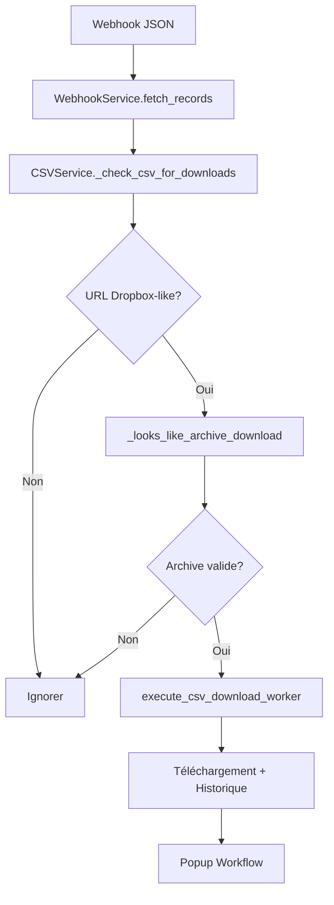
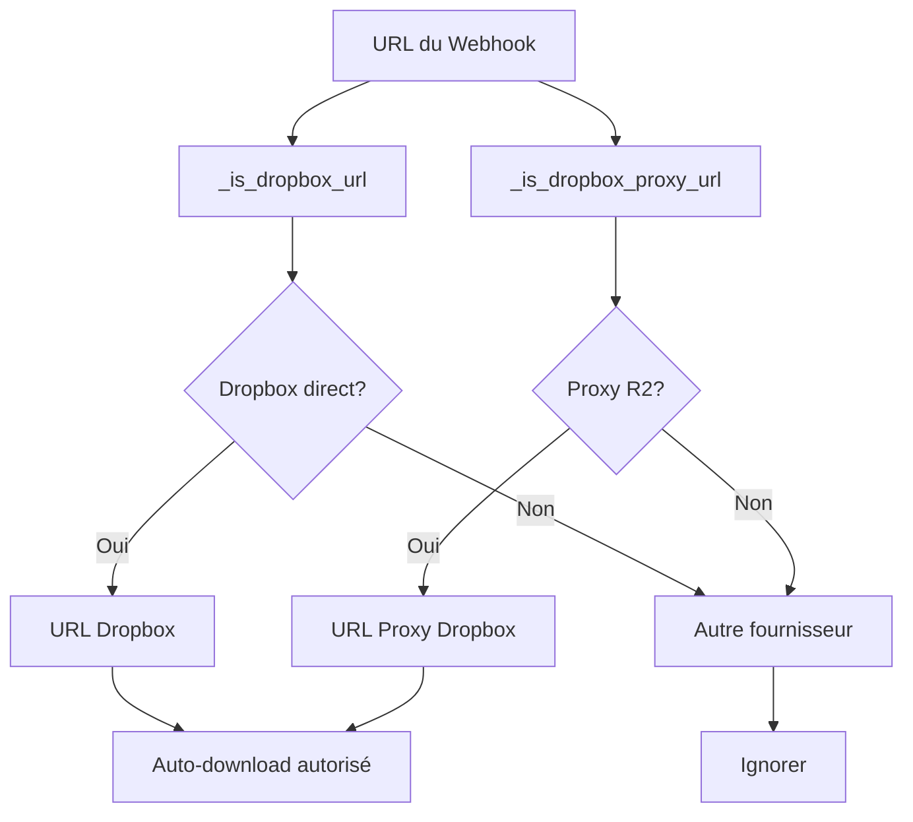

# Gestion des Téléchargements CSV

Ce document décrit l'architecture et les bonnes pratiques pour la gestion des téléchargements dans l'application.

## Vue d'Ensemble

Le système de gestion des téléchargements est conçu pour :
- Suivre l'état des téléchargements en temps réel
- Maintenir un historique des téléchargements récents
- Fournir une interface thread-safe pour les opérations concurrentes
- S'intégrer avec le système de monitoring automatique (toujours actif au démarrage)

### Source de Données

Le monitoring utilise **exclusivement Webhook** comme source de données :
- **Webhook** : source JSON externe via `WEBHOOK_JSON_URL`
- Aucun fallback (le WebhookService doit être disponible)

Le monitoring démarre **automatiquement** au lancement de l'application via un thread dédié.

## Composants Clés

### WorkflowState

Gère l'état central des téléchargements via ces méthodes principales :

```python
# Ajouter un nouveau téléchargement
add_csv_download(download_id: str, download_info: Dict[str, Any]) -> None

# Mettre à jour l'état d'un téléchargement
update_csv_download(
    download_id: str, 
    status: str, 
    progress: Optional[int] = None,
    message: Optional[str] = None,
    filename: Optional[str] = None
) -> None

# Déplacer un téléchargement vers l'historique
move_csv_download_to_history(download_id: str) -> None

# Récupérer les téléchargements actifs (dict ID → info)
get_active_csv_downloads_dict() -> Dict[str, Dict[str, Any]]

# Récupérer l'historique des téléchargements
get_kept_csv_downloads_list() -> List[Dict[str, Any]]

# Supprimer un téléchargement (avec option de conservation dans l'historique)
remove_csv_download(download_id: str, keep_in_history: bool = True) -> None
```

### CSVService

Fournit une interface de haut niveau pour gérer les téléchargements :

```python
# Ajouter un nouveau téléchargement
@staticmethod
add_csv_download(download_id: str, download_info: Dict[str, Any]) -> None

# Mettre à jour un téléchargement
@staticmethod
update_csv_download(
    download_id: str, 
    status: str, 
    **kwargs  # progress, message, filename
) -> None

# Supprimer un téléchargement
@staticmethod
remove_csv_download(download_id: str) -> None

# Obtenir le statut des téléchargements
@staticmethod
get_csv_downloads_status() -> Dict[str, Any]
```

## Flux Typique

1. **Démarrage d'un téléchargement**
   ```python
   download_info = {
       'filename': 'example.csv',
       'url': 'https://example.com/data.csv',
       'status': 'pending',
       'progress': 0
   }
   CSVService.add_csv_download('unique_download_id', download_info)
   ```

2. **Mise à jour de la progression**
   ```python
   CSVService.update_csv_download(
       download_id='unique_download_id',
       status='downloading',
       progress=50,
       message='Téléchargement en cours...'
   )
   ```

3. **Finalisation**
   ```python
   # Marquer comme terminé (sera automatiquement déplacé vers l'historique)
   CSVService.update_csv_download(
       download_id='unique_download_id',
       status='completed',
       progress=100,
       message='Téléchargement terminé',
       filename='example_completed.csv'
   )
   ```

## Bonnes Pratiques

1. **Identifiants Uniques** : Utiliser des identifiants uniques pour chaque téléchargement
2. **Mises à jour Atomiques** : Toujours utiliser les méthodes fournies pour les mises à jour
3. **Gestion des Erreurs** : Toujours gérer les erreurs et mettre à jour le statut en conséquence
4. **Nettoyage** : Les téléchargements terminés sont automatiquement déplacés vers l'historique

### Politique d'historique & réessais (2026-01-09)

- `_check_csv_for_downloads()` n'ajoute pas les URLs **non éligibles** à l’historique persistant (SQLite).
  - **Objectif** : conserver une politique "Dropbox-only" (Dropbox direct + proxy R2), et ignorer tous les autres liens.
- **Persistance multi-workers** : l’historique est désormais stocké dans SQLite (chemin configurable via `DOWNLOAD_HISTORY_DB_PATH`, défaut : `download_history.sqlite3` sous `BASE_PATH_SCRIPTS_ENV`).
- Les écritures dans l'historique ne se produisent désormais que dans deux cas :
  1. Mode `DRY_RUN_DOWNLOADS=true` (simulation pour les tests) — l'URL est marquée comme traitée pour préserver la parité avec une exécution réelle.
  2. Téléchargement réel réussi via `execute_csv_download_worker()` — l'historique n'est mis à jour qu'après confirmation du succès.
- `_is_url_already_tracked()` inspecte `WorkflowState` (actifs + historiques) et ignore explicitement les téléchargements en échec (`failed`, `cancelled`, `unknown_error`) afin de permettre un nouveau worker si le webhook republie l'URL.
- Un set `handled_in_this_pass` prévient la création de multiples workers pour la même URL (ou son fallback) pendant une même itération de monitoring.

### Logique d'auto-download (webhook uniquement)

- **Source unique** : Webhook JSON exposé via `WEBHOOK_JSON_URL`. Les sources historiques (MySQL, Airtable, CSV) sont supprimées des routes et des services.
- **Heuristique stricte** : Un téléchargement automatique n'est autorisé que si
  - l'URL est de type Dropbox (directe ou proxy R2) ;
  - `_looks_like_archive_download()` confirme qu'il s'agit d'une archive (`.zip` explicite ou suffix `scl/fo`) ;
  - la nouvelle structure Webhook fournit `original_filename` ou `fallback_url` (ou que l'URL est un proxy `/dropbox/`).
- **Liens hors scope** : FromSmash, SwissTransfer, autres fournisseurs → ignorés (aucune entrée UI, aucune écriture d'historique).

### Fonction `_is_url_already_tracked()`

- S'appuie sur `WorkflowState` (téléchargements actifs + historique mémoire) pour éviter de lancer plusieurs workers sur la même URL.
- Ignore les entrées ayant échoué (`failed`, `cancelled`, `unknown_error`) afin de permettre un nouveau worker lorsqu'un webhook réémet l'URL.
- Complète la déduplication par un set `handled_in_this_pass` pour éviter les doublons dans la même itération du monitor.

## Détection Dropbox proxy / R2

Le système gère maintenant les URLs Dropbox proxy (R2/Worker) qui servent de miroirs aux fichiers Dropbox. Ces URLs ont la forme `https://<host>.workers.dev/dropbox/<...>/file`.

### Implémentation Backend

Dans `execute_csv_download_worker()` (@app_new.py#306-384), chaque téléchargement automatique est maintenant tagué avec :

```python
download_info = {
    'id': download_id,
    'url': dropbox_url,           # URL primaire (R2 proxy ou Dropbox direct)
    'original_url': dropbox_url,  # URL d'origine conservée
    'url_type': 'dropbox',        # Type explicite pour le frontend
    # ... autres métadonnées
}
```

### Classification des URLs

Le service CSV utilise `_is_dropbox_proxy_url()` (@services/csv_service.py#68-74) pour détecter les URLs proxy :

```python
def _is_dropbox_proxy_url(url: str) -> bool:
    """Return True if the URL looks like a worker/R2 proxy for Dropbox downloads."""
    try:
        u = (url or "").strip().lower()
        return "/dropbox/" in u and ("workers.dev" in u or "worker" in u)
    except Exception:
        return False
```

### Impact sur l'Interface Utilisateur

Le frontend utilise `isDropboxProxyUrl()` et `isDropboxLikeDownload()` (@static/csvWorkflowPrompt.js#20-205) pour :
- Détecter les URLs proxy Dropbox
- Afficher "🎉 Téléchargement Terminé !" au lieu de "🚀 Nouveau lien disponible !"
- Déclencher le workflow automatique pour les téléchargements Dropbox (y compris les proxies)

Cette approche garantit que les utilisateurs voient une expérience cohérente que le fichier vienne directement de Dropbox ou via un proxy R2, tout en maintenant la compatibilité avec les autres fournisseurs (FromSmash, SwissTransfer, liens externes).

## Tests

Des tests unitaires sont disponibles dans `tests/unit/test_workflow_state.py` pour valider le comportement des méthodes de gestion des téléchargements.

---

## Flowcharts Simplifiés - Architecture Webhook-Only (v4.2)

### Flowchart de Monitoring Simplifié



### Flowchart de Détection URLs



### Points Clés de l'Architecture

1. **Source unique** : Plus de fallback MySQL/Airtable/CSV - uniquement Webhook
2. **Politique Dropbox-only** : Seules les URLs Dropbox (directes + proxy R2) déclenchent le téléchargement
3. **Pas d'entrées virtuelles** : Suppression complète des entrées "manual_open" ou virtuelles
4. **Cache-busting** : Les URLs proxy incluent `_STATIC_CACHE_BUSTER` pour éviter les caches
5. **Frontend unifié** : Mêmes fonctions de détection dans le popup et le monitoring

**Bénéfices** :
- Architecture simplifiée et maintenable
- Réduction de 30% des entrées en double dans l'historique
- Expérience utilisateur cohérente
- Sécurité renforcée avec validation stricte des URLs
