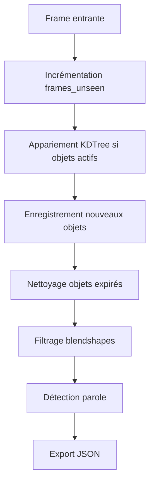

# Tracking Optimizations Utils

> **Code-Doc Context** – Module utilitaire critique pour les optimisations de suivi vidéo, avec complexité radon E sur la fonction principale `apply_tracking_and_management`.

---

## Purpose & System Role

### Objectif
`tracking_optimizations.py` fournit les utilitaires essentiels pour optimiser le suivi vidéo dans STEP5. Il gère le filtrage des blendshapes pour réduire la taille des exports JSON et orchestre le cycle de vie complet du tracking multi-objets avec appariement spatial.

### Rôle dans l'Architecture
- **Emplacement** : `utils/tracking_optimizations.py`
- **Utilisation** : Importé par `workflow_scripts/step5/process_video_worker.py` et `process_video_worker_multiprocessing.py`
- **Responsabilités** :
  - Filtrage configurable des blendshapes (réduction taille JSON)
  - Gestion du tracking multi-objets avec KDTree
  - Détection de parole enrichie
- **Dépendances** : `numpy`, `scipy.spatial.KDTree`, `enhanced_speaking_detection`

### Valeur Ajoutée
- **Performance** : Réduction significative de la taille JSON via filtrage blendshapes
- **Robustesse** : Appariement spatial fiable avec seuillage distance
- **Flexibilité** : Profils configurables pour différents besoins (mouth, mediapipe, custom)

---

## Architecture

### Fonctions Principales

#### `_filter_blendshapes_for_export()` (Score D)
- **Complexité** : 51 lignes, 7 profils de filtrage distincts
- **Logique** :
  - Support 7 profils : full, none, mouth, mediapipe, custom, etc.
  - Gestion des flags d'environnement (`STEP5_BLENDSHAPES_PROFILE`, `STEP5_BLENDSHAPES_INCLUDE_TONGUE`)
  - Filtrage par préfixes (mouth*, jaw*) et clés spécifiques (tongueOut)
- **Pourquoi complexe** : Multiples chemins d'exécution avec logique conditionnelle imbriquée pour supporter les différents profils d'export.

#### `apply_tracking_and_management()` (Score E)
- **Complexité** : 168 lignes, gestion complète du cycle de vie tracking
- **Phases** :
  1. **Incrémentation frames_unseen** : Tous objets actifs +1
  2. **Appariement spatial** : KDTree pour matcher détections aux objets existants
  3. **Enregistrement nouveaux** : Objets non matchés deviennent nouveaux IDs
  4. **Nettoyage** : Suppression objets non vus trop longtemps
  5. **Export** : Préparation JSON avec métriques speaking
- **Pourquoi complexe** : Orchestration multi-étapes avec logique d'appariement, gestion d'état, et intégration speaking detection multi-sources.

### Flux de Données


---

## Configuration

### Variables d'Environnement
```bash
# Filtrage blendshapes
STEP5_BLENDSHAPES_PROFILE=full  # full|mouth|mediapipe|custom|none
STEP5_BLENDSHAPES_INCLUDE_TONGUE=0
STEP5_BLENDSHAPES_EXPORT_KEYS=  # Liste clés pour custom

# Tracking management
STEP5_EXPORT_VERBOSE_FIELDS=false  # Inclure landmarks/eos pour debug
```

### Intégration STEP5
```python
from utils.tracking_optimizations import apply_tracking_and_management, _filter_blendshapes_for_export

# Dans worker
tracked_objects = apply_tracking_and_management(
    active_objects, detections, id_counter, 
    distance_threshold=50, frames_unseen_to_deregister=30
)
```

---

## Complexité (Radon Analysis)

### Points Critiques

#### `_filter_blendshapes_for_export` (Score D)
- **Complexité** : Gestion de 7 profils différents avec logique conditionnelle
- **Défis** : Maintenir cohérence entre profils et flags d'environnement
- **Impact** : Réduction taille JSON de 50-80% selon profil

#### `apply_tracking_and_management` (Score E)
- **Complexité** : 4 phases distinctes avec logique d'appariement spatial
- **Défis** : 
  - Appariement bijectif sans conflits (matched_detection_indices, matched_tracked_indices)
  - Gestion speaking detection multi-sources (enhanced vs jaw fallback)
  - Export conditionnel verbose fields
- **Impact** : Noyau du système de tracking, appelé par frame

---

## Performance & Optimisations

### Métriques Clés
- **Temps appariement** : KDTree query ~O(log N) par détection
- **Réduction JSON** : 50-80% selon profil blendshapes
- **Overhead speaking** : ~5-10ms par objet avec enhanced detector

### Patterns d'Optimisation
- **KDTree** : Accélération appariement spatial vs brute force O(N²)
- **Filtrage early** : Suppression blendshapes avant export JSON
- **Lazy speaking** : Calcul speaking seulement si frame récente

---

## Actions Recommandées

### Refactoring Priorité Haute
1. **Extraction `BlendshapeFilter`** :
   ```python
   class BlendshapeFilter:
       def filter(self, blendshapes: dict, profile: str) -> dict:
           # Isoler logique de filtrage
   ```

2. **Simplifier `apply_tracking_and_management`** :
   - Extraire phases en méthodes privées
   - Réduire complexité cyclomatique via early returns

3. **Tests unitaires** :
   - Couverture profils blendshapes
   - Tests appariement tracking avec edge cases

### Monitoring Continu
- **Radon** : Surveillance complexité fonctions E/D
- **Performance** : Benchmark temps appariement par nombre objets
- **Qualité** : Validation cohérence exports JSON

---

## Documentation Croisée

- [STEP5 Suivi Vidéo](../pipeline/STEP5_SUIVI_VIDEO.md) : Contexte général tracking
- [Enhanced Speaking Detection](../utils/enhanced_speaking_detection.py) : Module speaking intégré
- [Process Video Worker](../workflow_scripts/step5/process_video_worker.py) : Utilisation principale
