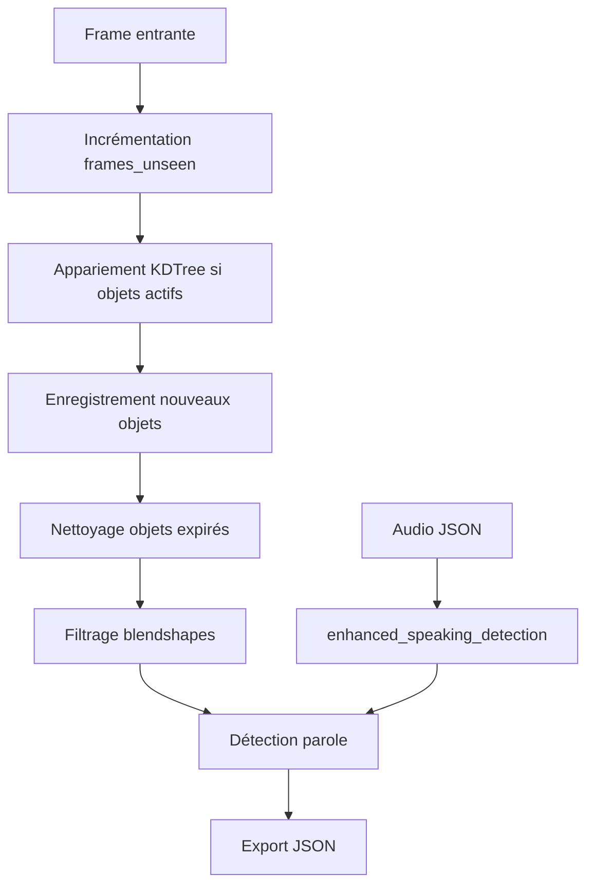

# Speaking Detection & Tracking Utils

> **Code-Doc Context** – Modules utilitaires critiques pour le tracking vidéo et la détection de parole, avec complexité radon E/D sur les fonctions principales.

---

## Purpose & System Role

### Objectif
Les modules `utils/` fournissent les utilitaires essentiels pour optimiser le suivi vidéo dans STEP5 et enrichir les données avec de la détection de parole multi-sources.

### Rôle dans l'Architecture
- **Emplacement** : `utils/tracking_optimizations.py`, `utils/enhanced_speaking_detection.py`
- **Utilisation** : Importés par `workflow_scripts/step5/process_video_worker.py` et `process_video_worker_multiprocessing.py`
- **Responsabilités** :
  - Filtrage configurable des blendshapes (réduction taille JSON)
  - Gestion du tracking multi-objets avec KDTree
  - Détection de parole enrichie (Pyannote + fallback jaw)
- **Dépendances** : `numpy`, `scipy.spatial.KDTree`, `enhanced_speaking_detection`

### Valeur Ajoutée
- **Performance** : Réduction significative de la taille JSON via filtrage blendshapes
- **Robustesse** : Appariement spatial fiable avec seuillage distance
- **Flexibilité** : Profils configurables pour différents besoins (mouth, mediapipe, custom)

---

## Modules Principaux

### `tracking_optimizations.py` (Score E)

#### `_filter_blendshapes_for_export()` (Score D)
- **Complexité** : 51 lignes, 7 profils de filtrage distincts
- **Logique** :
  - Support 7 profils : full, none, mouth, mediapipe, custom, etc.
  - Gestion des flags d'environnement (`STEP5_BLENDSHAPES_PROFILE`, `STEP5_BLENDSHAPES_INCLUDE_TONGUE`)
  - Filtrage par préfixes (mouth*, jaw*) et clés spécifiques (tongueOut)
- **Pourquoi complexe** : Multiples chemins d'exécution avec logique conditionnelle imbriquée pour supporter les différents profils d'export.

#### `apply_tracking_and_management()` (Score E)
- **Complexité** : 168 lignes, gestion complète du cycle de vie tracking
- **Phases** :
  1. **Incrémentation frames_unseen** : Tous objets actifs +1
  2. **Appariement spatial** : KDTree pour matcher détections aux objets existants
  3. **Enregistrement nouveaux** : Objets non matchés deviennent nouveaux IDs
  4. **Nettoyage** : Suppression objets non vus trop longtemps
  5. **Export** : Préparation JSON avec métriques speaking
- **Pourquoi complexe** : Orchestration multi-étapes avec logique d'appariement, gestion d'état, et intégration speaking detection multi-sources.

### `enhanced_speaking_detection.py` (Score C)

#### `detect_speaking()` (Score C)
- **Complexité** : 182 lignes, détection de parole multi-sources
- **Logique** :
  - Détection Pyannote (embeddings locuteurs + seuil)
  - Fallback jaw movement (ouverture bouche)
  - Intégration timeline frame-by-frame
- **Pourquoi complexe** : Gestion multi-sources avec validation et fallbacks

#### `_load_audio_analysis()` (Score C)
- **Complexité** : 119 lignes, chargement et parsing audio JSON
- **Défis** : Support multiples formats audio (STEP4, legacy)
- **Impact** : Source de données principale pour speaking detection

---

## Flux de Données



---

## Configuration

### Variables d'Environnement
```bash
# Filtrage blendshapes
STEP5_BLENDSHAPES_PROFILE=full  # full|mouth|mediapipe|custom|none
STEP5_BLENDSHAPES_INCLUDE_TONGUE=0
STEP5_BLENDSHAPES_EXPORT_KEYS=  # Liste clés pour custom

# Tracking management
STEP5_EXPORT_VERBOSE_FIELDS=false  # Inclure landmarks/eos pour debug

# Audio speaking detection
AUDIO_INCLUDE_SPEAKER_EMBEDDINGS=1
AUDIO_SPEAKER_EMBEDDINGS_MODEL_ID=pyannote/embedding
```

### Intégration STEP5
```python
from utils.tracking_optimizations import apply_tracking_and_management, _filter_blendshapes_for_export
from utils.enhanced_speaking_detection import EnhancedSpeakingDetector

# Dans worker
speaking_detector = EnhancedSpeakingDetector(audio_json_path)
tracked_objects = apply_tracking_and_management(
    active_objects, detections, id_counter, 
    distance_threshold=50, frames_unseen_to_deregister=30,
    speaking_detector=speaking_detector
)
```

---

## Complexité (Radon Analysis)

### Points Critiques

#### `_filter_blendshapes_for_export` (Score D)
- **Complexité** : Gestion de 7 profils différents avec logique conditionnelle
- **Défis** : Maintenir cohérence entre profils et flags d'environnement
- **Impact** : Réduction taille JSON de 50-80% selon profil

#### `apply_tracking_and_management` (Score E)
- **Complexité** : 4 phases distinctes avec logique d'appariement spatial
- **Défis** : 
  - Appariement bijectif sans conflits (matched_detection_indices, matched_tracked_indices)
  - Gestion speaking detection multi-sources (enhanced vs jaw fallback)
  - Export conditionnel verbose fields
- **Impact** : Noyau du système de tracking, appelé par frame

#### `detect_speaking` (Score C)
- **Complexité** : Multi-sources avec validation et fallbacks
- **Défis** : Gestion embeddings Pyannote + jaw movement
- **Impact** : Enrichissement tracking avec données parole

---

## Performance & Optimisations

### Métriques Clés
- **Temps appariement** : KDTree query ~O(log N) par détection
- **Réduction JSON** : 50-80% selon profil blendshapes
- **Overhead speaking** : ~5-10ms par objet avec enhanced detector

### Patterns d'Optimisation
- **KDTree** : Accélération appariement spatial vs brute force O(N²)
- **Filtrage early** : Suppression blendshapes avant export JSON
- **Lazy speaking** : Calcul speaking seulement si frame récente

### Profiling
```python
# Logs performance
logger.info(f"[TRACKING] Frame {frame_num}, objects: {len(tracked_objects)}, "
            f"speaking: {speaking_count}, blendshapes_filtered: {filtered_count}")
```

---

## Actions Recommandées

### Refactoring Priorité Haute
1. **Extraction `BlendshapeFilter`** :
   ```python
   class BlendshapeFilter:
       def __init__(self, profile: str, include_tongue: bool):
           self.profile = profile
           self.include_tongue = include_tongue
       
       def filter(self, blendshapes: dict) -> dict:
           # Isoler logique de filtrage
   ```

2. **Simplifier `apply_tracking_and_management`** :
   - Extraire phases en méthodes privées
   - Réduire complexité cyclomatique via early returns

3. **Créer `SpeakingDetector` interface** :
   ```python
   class SpeakingDetector:
       def detect_speaking(self, frame_num: int, objects: List[Dict]) -> Dict:
           # Interface commune pour Pyannote/jaw
   ```

### Tests Unitaires
- Couverture profils blendshapes
- Tests appariement tracking avec edge cases
- Validation speaking detection multi-sources

### Monitoring Continu
- **Radon** : Surveillance complexité fonctions E/D
- **Performance** : Benchmark temps appariement par nombre objets
- **Qualité** : Validation cohérence exports JSON

---

## Cas d'Usage

### Pipeline STEP5 Complet
```python
# Configuration blendshapes
blendshape_filter = BlendshapeFilter(
    profile=os.getenv('STEP5_BLENDSHAPES_PROFILE', 'full'),
    include_tongue=os.getenv('STEP5_BLENDSHAPES_INCLUDE_TONGUE', '0') == '1'
)

# Speaking detection
speaking_detector = EnhancedSpeakingDetector(audio_json_path)

# Tracking avec optimisations
for frame_num, frame in enumerate(video_frames):
    # Détection visages
    detections = face_engine.detect(frame)
    
    # Tracking management
    tracked_objects = apply_tracking_and_management(
        active_objects, detections, id_counter,
        distance_threshold=50, frames_unseen_to_deregister=30,
        speaking_detector=speaking_detector
    )
    
    # Filtrage blendshapes
    for obj in tracked_objects:
        if 'blendshapes' in obj:
            obj['blendshapes'] = blendshape_filter.filter(obj['blendshapes'])
```

### Profils Blendshapes
```python
# Profil 'mouth' - optimisé pour animation bouche
mouth_filter = BlendshapeFilter(profile='mouth', include_tongue=False)
# Conserve seulement : mouthOpen, mouthClose, jawOpen, etc.

# Profil 'mediapipe' - compatibilité MediaPipe
mediapipe_filter = BlendshapeFilter(profile='mediapipe', include_tongue=True)
# Conserve les 52 blendshapes ARKit standards

# Profil 'custom' - sur mesure
custom_filter = BlendshapeFilter(
    profile='custom', 
    include_tongue=True,
    export_keys=['mouthOpen', 'jawOpen', 'eyeBlinkLeft', 'eyeBlinkRight']
)
```

---

## Documentation Croisée

- [STEP5 Suivi Vidéo](../pipeline/STEP5_SUIVI_VIDEO.md) : Contexte général tracking
- [STEP4 Analyse Audio](../pipeline/STEP4_ANALYSE_AUDIO.md) : Source données audio
- [Process Video Worker](../workflow_scripts/step5/process_video_worker.py) : Utilisation principale
- [Complexity Hotspots](../complexity/COMPLEXITY_HOTSPOTS.md) : Métriques radon

---

## Évolution Future

### v4.3 (Planifié)
- **Cache blendshapes** : Pré-calcul des filtres par profil
- **GPU speaking** : Accélération détection parole sur GPU
- **Multi-speaker** : Support plusieurs locuteurs simultanés

### Améliorations Possibles
- **Streaming speaking** : Détection en temps réel
- **Adaptive thresholds** : Seuils dynamiques par locuteur
- **Export compressed** : Compression blendshapes pour gros projets

---

*Généré avec Code-Doc protocol – voir `../cloc_stats.json` et `../complexity_report.txt`.*
